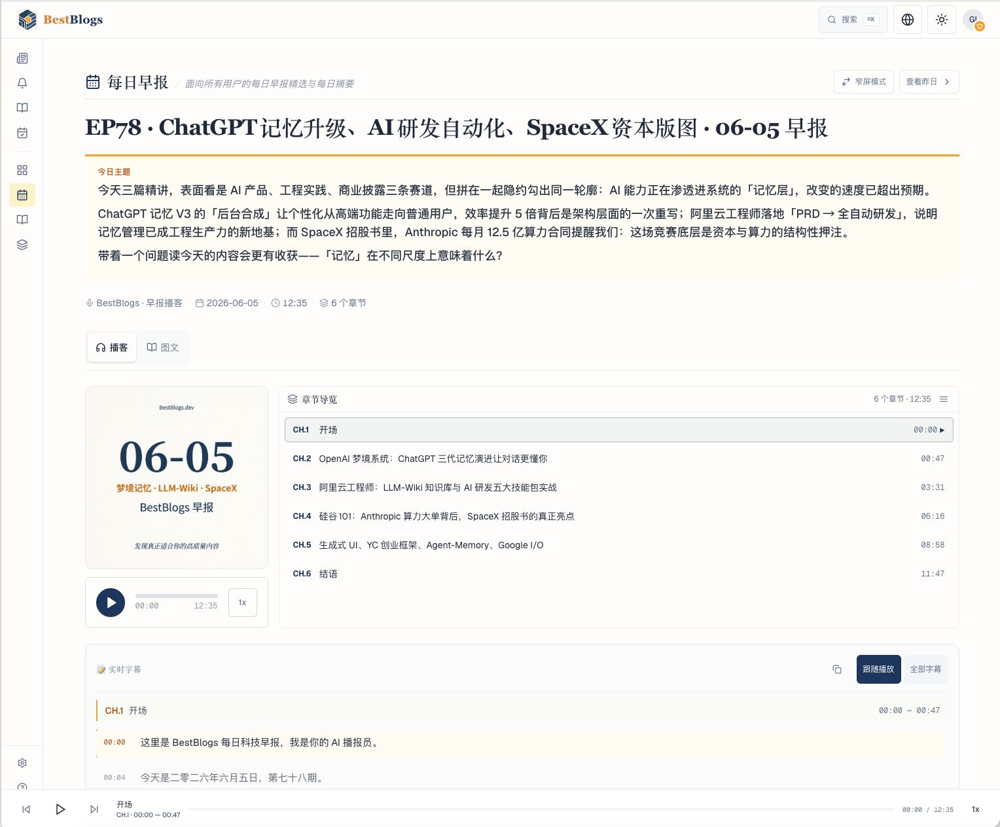
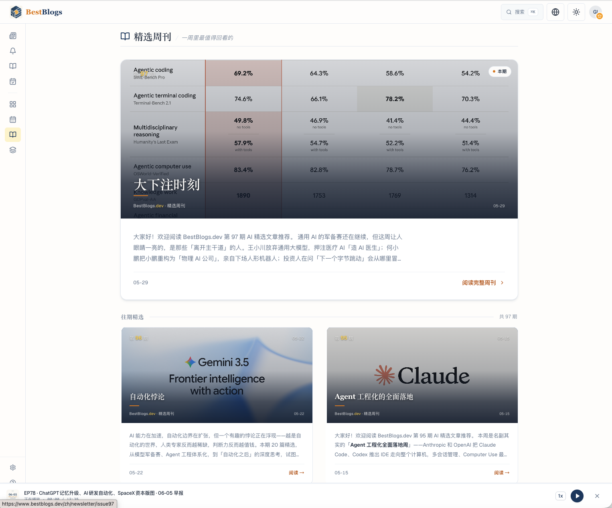

# [BestBlogs.dev](https://bestblogs.dev?utm_source=github&utm_medium=readme&utm_campaign=hero-title)

> **Discover content truly worth your time.**  
> BestBlogs is an AI-powered personal reading assistant.

It judges what's worth reading, helps you read faster and deeper, and learns your preferences over time. Natively supports RSS, Newsletter, Twitter, YouTube, and Podcast — bridging a bilingual (Chinese/English) quality pool. Over **20,000 registered users** and growing.

**v2.4.0 highlights**: Your first personalized Pro brief arrives within 15 minutes after activation. Paste a link to auto-detect and add YouTube, Xiaoyuzhou, or WeChat sources. My Reading and My Follows are now unified into a streamlined workspace.

<p align="center">
  <a href="https://bestblogs.dev/?utm_source=github&utm_medium=readme&utm_campaign=hero-cta-primary"><b>🚀 Try BestBlogs.dev →</b></a> &nbsp;·&nbsp;
  <a href="https://bestblogs.dev/newsletter?utm_source=github&utm_medium=readme&utm_campaign=hero-cta-secondary"><b>📬 Subscribe Newsletter</b></a> &nbsp;·&nbsp;
  <a href="https://bestblogs.dev/pro?utm_source=github&utm_medium=readme&utm_campaign=hero-cta-pro"><b>⭐ Try Pro (7-day free)</b></a> &nbsp;·&nbsp;
  <a href="./README.md"><b>中文</b></a>
</p>


---

## 1. Why BestBlogs

If you've ever subscribed to 200 RSS feeds but dread opening your reader every day, these three kinds of fatigue will sound familiar:

| Pain point with self-managed RSS | BestBlogs response |
|---|---|
| **Information overload**: 200+ articles a day, impossible to keep up | AI filters at the source with **six-dimensional scoring** — only high-scoring content surfaces each day |
| **Can't find the good stuff**: clickbait, reposts, machine-translated spam all mixed in | AI pre-screening + editorial curation forms a shared **quality pool** — everyone benefits from the same signal |
| **No signal on depth**: no way to tell what's worth a slow read | Every piece gets scored across **Topic / Content / Depth / Practicality / Innovation / Expression** |
| **Language barrier**: English originals are hard; waiting for Chinese summaries means delay and distortion | Bidirectional immersive translation + AI reading copilot — read originals directly |
| **Repetitive coverage**: the same story washed across five feeds | Topic pages aggregate fragments into a panoramic view across four lenses: Event / Domain / Person / Product Comparison |

> **BestBlogs doesn't promise more content. It promises content more suited to you.**

---

## 2. What It Is

BestBlogs.dev is an **AI-powered personal reading assistant**. The product has two sides:

- **Public Curation Layer** — high-quality content curated for all visitors, no login required
- **My Space** — a personalized reading flow for logged-in and Pro users

Both are powered by the same shared quality pool (AI pre-screening + editorial curation).

### Core Features

**Public Curation Layer (available to everyone, no login)**

| Feature | Description |
|---|---|
| **Daily Brief** | Bilingual (Chinese/English) digest + 10–15 min podcast (Apple / Spotify / Xiaoyuzhou) + distributed via poster, Telegram, X, and RSS |
| **Featured Weekly** | A weekly hand-curated collection of the most valuable content, refined further from the public quality pool |
| **Topic Pages** | Editorial deep-dives around key events, domains, people, and product comparisons — fragments assembled into a full-picture view |
| **Explore** | The main browsing hub for all public BestBlogs content — "Featured / Latest" dual views, no personalization |

**My Space (login required; Pro unlocks the full workflow)**

| Feature | Description |
|---|---|
| **My Brief** | Personalized daily digest (text + email) based on your follows, interest tags, and reading behavior — Pro only; **first brief arrives within 15 min of Pro activation** |
| **My Follows** | Three-column workspace for five source types (RSS / Newsletter / Twitter / YouTube / Podcast); paste a URL to auto-detect and add YouTube, Xiaoyuzhou, or WeChat sources |
| **My Reading** | AI reading copilot (summary / translation / Q&A / chapter navigation) + library (bookmarks / highlights / history) — all in one unified page |
| **My Review** | An evening recap page that organizes your day's reading footprint into a daily reading summary — Pro only |

**Cross-feature Capabilities**

| Capability | Description |
|---|---|
| **AI Content Analysis** | Six-dimensional scoring (Topic / Content / Depth / Practicality / Innovation / Expression) + summary + key insights + quotes |
| **Immersive Translation** | Bidirectional Chinese ↔ English, across articles / tweets / podcasts / videos |
| **Explainable Profile** | Interests driven by explicit behavior (follows, reading, domain-level custom counts) — no manual weight tuning |

### Screenshots

**Public Curation Layer**




**My Space (Pro)**


---

## 3. Free vs Pro

Free is a complete, standalone high-quality reading product. Pro is the full personal reading assistant workflow.

| Feature | Free | Pro |
|---|---|---|
| **Full Public Curation Layer** | ✅ | ✅ |
| Daily Brief / Featured Weekly / Topic Pages / Explore | ✅ | ✅ |
| **My Brief (personalized)** | ❌ | ✅ Text + email, daily delivery |
| **My Review** | ❌ | ✅ Evening reading summary |
| **Custom Views** | ❌ | ✅ Filter by topic / tag / source |
| **Source follow limit** | Capped | **10× higher** |
| **AI Reading Copilot** | 3/day | **30/day (10×)** |
| **Immersive Translation** | 3/day | **30/day (10×)** |
| **Basic Reading Library** (bookmarks / highlights / history) | ✅ | ✅ |
| **OpenAPI v2** | ✅ | ✅ |

**Pro Trial**: 7 days free for new users, 14 days for returning users — full access to the personal reading assistant workflow → [Start Free Trial](https://bestblogs.dev/pro?utm_source=github&utm_medium=readme&utm_campaign=free-vs-pro)

> Quotas are adjusted dynamically by the backend. BestBlogs has no aggressive upgrade popups or forced upsells — the motivation to upgrade comes from actually hitting the ceiling on capabilities you use.

---

## 4. Quick Start

**Browse directly**: Visit [bestblogs.dev](https://bestblogs.dev/?utm_source=github&utm_medium=readme&utm_campaign=quickstart-web) — all public content is free to read.

**Command line** (for developers and AI agents):

```bash
npm install -g @bestblogs/cli
bestblogs auth login           # Enter your API Key (generate in Settings)
bestblogs discover today       # Today's most worth-reading content
bestblogs read deep <id>       # Deep-read one article
```

**Agent Skills** (Claude Code / Codex / Cursor, etc.):

```bash
npx @bestblogs/skills           # Install all Skills in one step
# After install, just say: "What's worth reading on BestBlogs today?"
```

---

## 5. Newsletter

Every Friday, the **Featured Weekly Newsletter** delivers a hand-curated collection of the week's best content — AI pre-screened and editorially refined, available as text, email, annotated read, and podcast → [Browse past issues](https://www.bestblogs.dev/newsletter?utm_source=github&utm_medium=readme&utm_campaign=newsletter-section)



---

## 6. RSS Feeds

BestBlogs.dev offers flexible RSS subscriptions:

| Scope | URL |
|---|---|
| All content | `https://www.bestblogs.dev/zh/feeds/rss` |
| Featured only | `https://www.bestblogs.dev/zh/feeds/rss?featured=y` |
| Programming articles | `https://www.bestblogs.dev/zh/feeds/rss?category=programming&type=article` |
| High-score AI content (English) | `https://www.bestblogs.dev/en/feeds/rss?category=ai&minScore=90` |
| Featured Weekly (Newsletter) | `https://www.bestblogs.dev/zh/feeds/rss/newsletter` |
| Daily Brief | `https://www.bestblogs.dev/zh/feeds/rss/daily-brief` |

Full parameter reference: [BestBlogs_RSS_Doc.md](./BestBlogs_RSS_Doc.md)

### BestBlogs Quality Pool OPML

OPML files of the sources currently tracked by BestBlogs — import into any RSS reader:

- **All (400)**: [BestBlogs_RSS_ALL.opml](./BestBlogs_RSS_ALL.opml)
- **Articles (170)**: [BestBlogs_RSS_Articles.opml](./BestBlogs_RSS_Articles.opml)
- **Podcasts (30)**: [BestBlogs_RSS_Podcasts.opml](./BestBlogs_RSS_Podcasts.opml)
- **Videos (40)**: [BestBlogs_RSS_Videos.opml](./BestBlogs_RSS_Videos.opml)
- **Twitter (160)**: [BestBlogs_RSS_Twitters.opml](./BestBlogs_RSS_Twitters.opml)

> 💡 After importing, try following these sources on [BestBlogs.dev](https://bestblogs.dev/?utm_source=github&utm_medium=readme&utm_campaign=opml-followup) — let the AI filter them for you. The question isn't "what did I subscribe to?" but "what's actually worth reading?"

### Curated Source Collection (opml/)

The BestBlogs team is systematically curating high-quality RSS sources by type. **551 sources** are published so far (375 WeChat + 57 podcasts + 119 YouTube channels), with more types coming — stay tuned.

**Published so far:**

| File | Type | Count | Notes |
|---|---|---|---|
| [opml/bestblogs_wechat2rss_opml_all.opml](./opml/bestblogs_wechat2rss_opml_all.opml) | WeChat Public Accounts | 375 | RSS via [wechat2rss](https://github.com/ttttmr/Wechat2RSS); [companion post](./posts/bestblogs_sources_wechat_part1.md) |
| [opml/bestblogs_podcast_opml_all.opml](./opml/bestblogs_podcast_opml_all.opml) | Podcasts (Xiaoyuzhou) | 57 | Xiaoyuzhou podcast RSS; [companion post](./posts/bestblogs_sources_part2_podcasts_videos.md) |
| [opml/bestblogs_youtube_opml_all.opml](./opml/bestblogs_youtube_opml_all.opml) | YouTube | 119 | YouTube channel RSS; [companion post](./posts/bestblogs_sources_part2_podcasts_videos.md) |

Have a quality RSS source to recommend? [Open an Issue](https://github.com/ginobefun/BestBlogs/issues).

---

## 7. OpenAPI v2

BestBlogs v2 API is open to developers, providing content discovery, reading, and personal data management.

**Base URL**: `https://api.bestblogs.dev/openapi/v2`  
**Auth**: Header `X-API-KEY: <your_key>` (generate in [Settings](https://bestblogs.dev/settings?utm_source=github&utm_medium=readme&utm_campaign=openapi))

| Module | Description |
|---|---|
| [openapi/01-auth.md](./openapi/01-auth.md) | Authentication and identity, common conventions |
| [openapi/02-intake.md](./openapi/02-intake.md) | Interest profile setup, cold-start onboarding |
| [openapi/03-discover.md](./openapi/03-discover.md) | Content discovery: briefs / recommendations / search |
| [openapi/04-read.md](./openapi/04-read.md) | Content reading: full text / Markdown / metadata |
| [openapi/05-capture.md](./openapi/05-capture.md) | Bookmarks / highlight notes / reading history |
| Topics | `GET /openapi/v2/topics` (list) + `GET /openapi/v2/topics/{slug}` (detail, with four typed fields, references, and further reading) — same auth; standalone docs in progress |

Typical flow: Auth → Intake (build profile) → Discover (find content) → Read (deep read) → Capture (save notes)

> v1 API is deprecated. Historical docs: [archive/v1-openapi.md](./archive/v1-openapi.md)

---

## 8. CLI & Agent Skills

### @bestblogs/cli

The official command-line tool, built on OpenAPI v2. All commands support `--json` for direct AI agent consumption.

```bash
npm install -g @bestblogs/cli
bestblogs auth login
bestblogs intake setup           # Cold start: pick interest tags
bestblogs discover today --limit 20
bestblogs read deep <resourceId>
bestblogs capture bookmark add <resourceId> --note "Worth re-reading"
```

- Docs: [cli/README.md](./cli/README.md)
- Changelog: [cli/CHANGELOG.md](./cli/CHANGELOG.md)
- Source: [cli/src/](./cli/src/) (TypeScript, MIT license)

### BestBlogs Skills

A set of SKILL.md files that let Claude Code, Codex, Cursor, OpenClaw, and other agents actively invoke BestBlogs capabilities (25 stable primitives).

```bash
npx @bestblogs/skills             # Install to Claude Code and Codex by default
npx @bestblogs/skills --client codex
npx @bestblogs/skills upgrade     # Upgrade to the latest version
```

After install, just say:
- "What's worth reading today?" → `bestblogs-discover`
- "Deep-read this article" → `bestblogs-read`
- "Bookmark this with a note" → `bestblogs-capture`
- "Why was this recommended to me?" → `bestblogs-explain`
- "Show me BestBlogs topic pages / show topic X" → `bestblogs-topic`

- Docs: [skills/README.md](./skills/README.md)
- Install guide: [skills/INSTALL.md](./skills/INSTALL.md)
- Source: [skills/](./skills/)

---

## 9. Build in Public

BestBlogs is built entirely in public. Here are some behind-the-scenes posts on product decisions and technical implementation:

| Post | Date | Summary |
|---|---|---|
| [BestBlogs 2.0 Beta: Building a Reading Product That Actually Fits Me](./posts/20260412_bestblogs_v2_beta.mdx) | Apr 2026 | What the v2.0 beta launch taught me about what the product should really solve |
| [Why BestBlogs Is Going Agent Native](./posts/20260420_bestblogs_agent_native_next_step.mdx) | Apr 2026 | Opening OpenAPI / CLI / Skills: organizing reading capabilities into composable workflow primitives |
| [Inside the BestBlogs Daily Brief AI System](./posts/20260307_bestblogs_daily_digest_behind_the_scenes.mdx) | Mar 2026 | How the AI agent workflow behind the daily brief actually works — Skills, Agents, and automation |
| [AI Content Analysis with Dify Workflow at BestBlogs.dev](./posts/20240714_bestblogs_use_dify_workflow.mdx) | Jul 2024 | Full walkthrough: from article pre-screening to deep analysis to multilingual translation |
| [BestBlogs Source Curation Vol. 1: WeChat Public Accounts](./posts/bestblogs_sources_wechat_part1.md) | Jun 2026 | 375 actively updated WeChat public account RSS feeds, organized by category |
| [BestBlogs Source Curation Vol. 2: Podcasts & Videos](./posts/bestblogs_sources_part2_podcasts_videos.md) | Jun 2026 | 57 Xiaoyuzhou podcasts + 119 YouTube channels, organized by category |

---

## 10. Docs & Resources

### Product and Technical Docs

| Document | Description |
|---|---|
| [docs/1-VISION.md](./docs/1-VISION.md) | Vision and long-term direction |
| [docs/2-PRODUCT.md](./docs/2-PRODUCT.md) | Product strategy, capability matrix, execution roadmap |
| [docs/3-BRAND.md](./docs/3-BRAND.md) | Brand guidelines and expression standards |
| [docs/4-ARCHITECTURE.md](./docs/4-ARCHITECTURE.md) | System boundaries, technical pipeline, and feature flags |
| [docs/5-DESIGN.md](./docs/5-DESIGN.md) | Visual and interaction guidelines |
| [docs/6-UI-SPEC.md](./docs/6-UI-SPEC.md) | UI component and interaction specs |
| [docs/7-CONVENTIONS.md](./docs/7-CONVENTIONS.md) | Development conventions and code style |
| [docs/8-CURRENT_STATE.md](./docs/8-CURRENT_STATE.md) | Current state, milestones, and roadmap |
| [docs/9-TESTING.md](./docs/9-TESTING.md) | Test layering and coverage requirements |
| [docs/10-TERMINOLOGY.md](./docs/10-TERMINOLOGY.md) | Chinese/English terminology reference |
| [docs/11-OPERATIONS.md](./docs/11-OPERATIONS.md) | Operations, monitoring, and rollback SOP |
| [docs/12-WORKFLOW.md](./docs/12-WORKFLOW.md) | Development workflow overview |

### Version History

Full bilingual changelogs in [changelog/](./changelog/) (from v2.0.0). Each minor release (v2.x.0) is also published as a [GitHub Release](https://github.com/ginobefun/BestBlogs/releases).

### Roadmap & Community

- 🗺️ **Roadmap**: See the "Three-Phase Roadmap" section in [docs/8-CURRENT_STATE.md](./docs/8-CURRENT_STATE.md)
- 💬 **GitHub Discussions**: Roadmap discussions, feature requests, monthly updates → [Join the discussion](https://github.com/ginobefun/BestBlogs/discussions)

### Historical Archive

[archive/](./archive/) contains v1 API docs, early Dify implementation documents, and other historical materials for reference only.

---

## 11. How It Works

### AI Content Processing Pipeline

```
RSS crawl → pre-filter → AI deep analysis → multilingual translation → index → personalized recommendation
```

**1. Content Crawl**: RSS + headless browser full-text extraction; sources support custom CSS selectors.

**2. Pre-filter**: Language detection, quality signal scoring, filtering of low-value content.

**3. AI Deep Analysis**: LLM generates six-dimensional scores + summary + key insights + quotes + tags.

**4. Multilingual Translation**: Terminology detection → initial translation → review → idiomatic refinement; bilingual Chinese/English.

**5. Personalized Recommendation**: Six-dimensional interest tag matching + daily brief intelligent curation.

Detailed implementation docs and Dify DSLs:

- [BestBlogs.dev AI Content Analysis (Chinese)](./flows/Dify/BestBlogs.dev%20基于%20Dify%20Workflow%20的文章智能分析实践.md)
- [Intelligent Article Analysis at BestBlogs.dev (English)](./flows/Dify/Intelligent%20Article%20Analysis%20at%20BestBlogs.dev%3A%20A%20Case%20Study%20Using%20Dify%20Workflow.md)
- Workflow DSLs: [flows/Dify/dsl/](./flows/Dify/dsl/)

---

## 12. Community & Support

If BestBlogs.dev has been useful to you:

- ⭐ Star this repo — help others discover it
- 🚀 [Sign up at BestBlogs.dev](https://bestblogs.dev/?utm_source=github&utm_medium=readme&utm_campaign=support-cta) — experience the full AI reading assistant
- 📧 Email feedback: [hi@gino.bot](mailto:hi@gino.bot)
- 🐛 File an issue: [GitHub Issues](https://github.com/ginobefun/BestBlogs/issues)
- 💬 Join the discussion: [GitHub Discussions](https://github.com/ginobefun/BestBlogs/discussions)

---

## Acknowledgements

Thanks to the following open-source projects:

- [RSSHub](https://github.com/DIYgod/RSSHub) — RSS for everything
- [wechat2rss](https://github.com/ttttmr/Wechat2RSS) — WeChat public accounts → RSS
- [Dify](https://github.com/langgenius/dify) — LLM application development platform
- [XGo.ing](https://xGo.ing) — Twitter/X RSS feeds
- [Bark](https://github.com/Finb/Bark) — iOS push notifications
- [Uptime Kuma](https://github.com/louislam/uptime-kuma) — self-hosted monitoring
