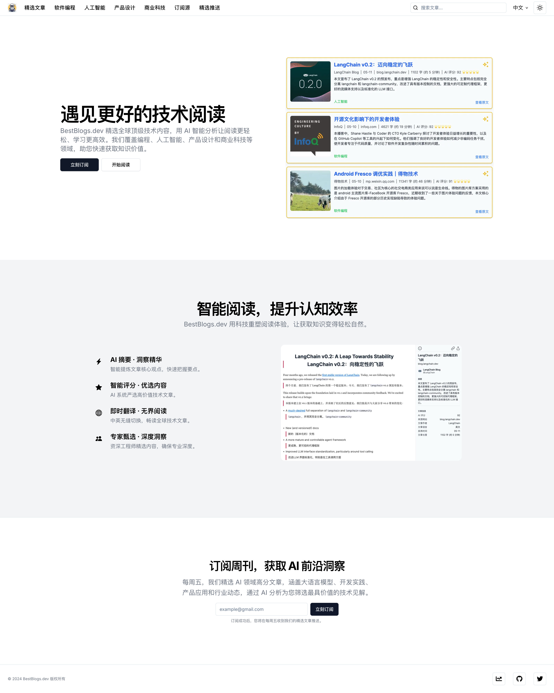
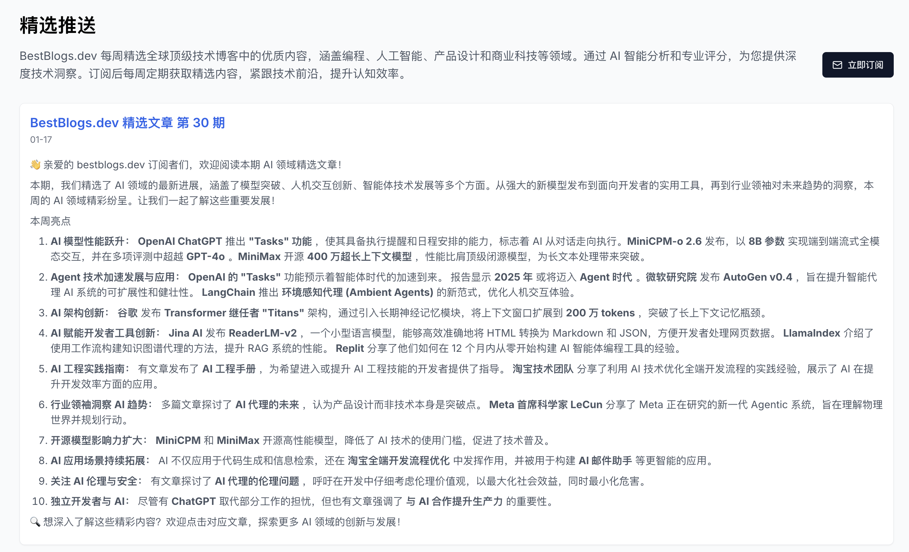
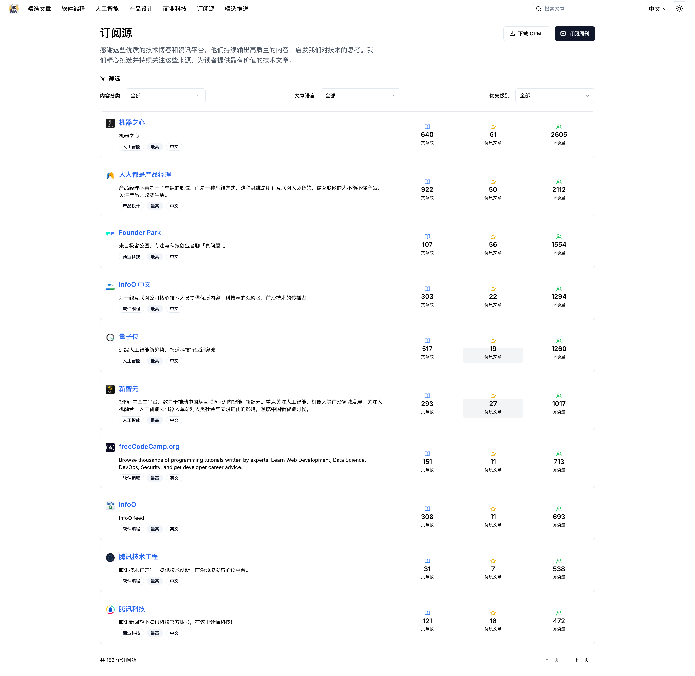

# [BestBlogs.dev](https://bestblogs.dev)

汇集顶级编程、人工智能、产品、科技文章，大语言模型摘要评分辅助阅读，探索编程和技术未来。

## 1. 介绍

bestblogs.dev 为您提供独特的编程、人工智能、产品设计、商业科技和个人成长领域的价值导向内容，汇集自顶级技术公司和社区。我们利用先进语言模型，为您摘要、评分和翻译这些文章，节省您的阅读时间。我们了解数据筛选的痛点，致力于为您呈现精选内容。立即订阅，探索未来技术的无限可能！

## 2. 订阅

网站订阅地址：[https://www.bestblogs.dev/#subscribe](https://www.bestblogs.dev/#subscribe)

每周五将推送本周最新的[精选推送](https://www.bestblogs.dev/newsletter)，让您第一时间了解最新人工智能开发技术和动态。

## 3. RSS 源

网站文章来源于以下所有 RSS 订阅源（160个）：

[https://github.com/ginobefun/BestBlogs/blob/main/BestBlogsRSS.opml](https://github.com/ginobefun/BestBlogs/blob/main/BestBlogs_RSS_V2.opml)

其中微信公众号转 RSS 采用 wewe-rss 项目搭建，目前已支持的微信公众号 RSS 订阅源（160个）整理如下：

[https://github.com/ginobefun/BestBlogs/blob/main/WeWeRSS.opml](https://github.com/ginobefun/BestBlogs/blob/main/WeWeRSS.opml)

你可以在网页 [https://www.bestblogs.dev/sources](https://www.bestblogs.dev/sources) 上浏览所有 RSS 订阅源信息，包括订阅源最近 3 个月的文章数量、精选文章数量和阅读数。

你可以使用 RSS 阅读器进行导入阅读，如有优质的 RSS 订阅源需要添加，可以提 Issue 补充。

## 4. 本站 RSS 订阅指南

BestBlogs.dev 提供了灵活的 RSS 订阅功能，让您可以根据自己的需求订阅感兴趣的技术文章。

- 全站订阅：[https://www.bestblogs.dev/zh/feeds/rss](https://www.bestblogs.dev/zh/feeds/rss)
- 精选文章订阅：[https://www.bestblogs.dev/zh/feeds/rss?featured=y](https://www.bestblogs.dev/zh/feeds/rss?featured=y)
- 编程技术类文章订阅：[https://www.bestblogs.dev/zh/feeds/rss?category=programming](https://www.bestblogs.dev/zh/feeds/rss?category=programming)
- 人工智能高分文章订阅：[https://www.bestblogs.dev/en/feeds/rss?category=ai&minScore=90](https://www.bestblogs.dev/en/feeds/rss?category=ai&minScore=90)

参数说明及更多用法请参考 [BestBlogs.dev RSS 订阅指南](./BestBlogs_RSS_Doc.md)

## 5. 实现原理

[BestBlogs.dev 基于 Dify Workflow 的文章智能分析实践](./flows/Dify/BestBlogs.dev%20基于%20Dify%20Workflow%20的文章智能分析实践.md)

1. 文章爬取流程：基于 RSS 协议，爬取所有订阅源的文章信息，包括标题、链接、发布时间等，通过链接和无头浏览器爬取文章内容。通过订阅源上定义的文章正文选择器等提取正文，并对正文的 HTML、图片等进行处理，放入待处理文章列表。
2. 文章初评流程：通过语言、文章内容等特征，对文章进行初次评分，剔除低质量文章，减少后续步骤处理。使用 Dify Workflow 项目进行文章初评，详细说明参见 [BestBlogs 文章初评流程](./flows/Dify/ArticleFIlterFlow.md)
3. 文章分析流程：通过大语言模型（如 GPT-4o）对文章进行摘要、分类和评分，生成一句话总结、文章摘要、主要观点、文章金句、所属领域、标签列表和评分等，便于读者快速过滤筛选及了解全文主要内容，判断是否继续阅读。使用 Dify Workflow 项目进行文章分析，包括 *分段分析 - 汇总分析 - 领域划分和标签生成 - 文章评分 - 检查反思 - 优化改进* 等环节，详细说明参见 [BestBlogs 文章分析流程](./flows/Dify/ArticleAnalysisFlow.md)
4. 文章分析结果翻译流程：通过大语言模型（如 GPT-4o）对文章分析结果进行翻译，目前网站支持中英两种语言，根据原文的语言生成目标语言的摘要、主要观点、文章金句、标签列表等。使用 Dify Workflow 项目进行文章分析结果翻译，包括 *识别专业术语 - 初次翻译 - 检查翻译 - 意译* 等环节，详细说明参见 [BestBlogs 文章分析结果翻译流程](./flows/Dify/ArticleAnalysisResultTranslateFlow.md)

## 6. 鸣谢

- [RSS Hub](https://github.com/DIYgod/RSSHub)
- [wewe-rss](https://github.com/cooderl/wewe-rss)
- [Dify](https://github.com/langgenius/dify)
