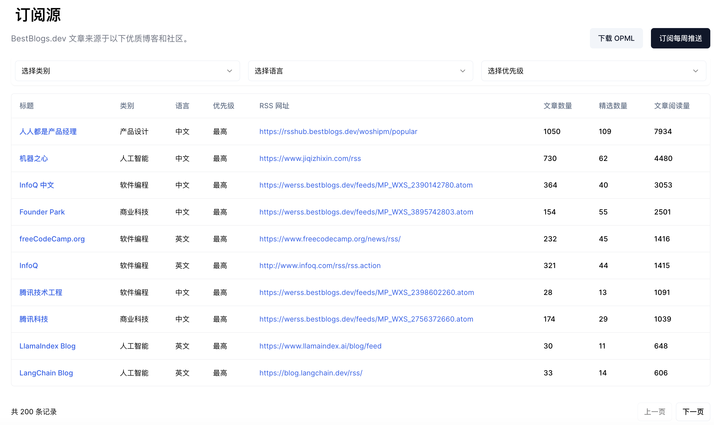
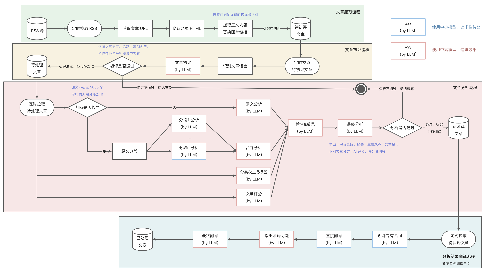

# [BestBlogs.dev](https://bestblogs.dev)
汇集顶级编程、人工智能、产品、科技文章，大语言模型摘要评分辅助阅读，探索编程和技术未来。

## 介绍

bestblogs.dev 为您提供独特的编程、人工智能、产品设计、商业科技和个人成长领域的价值导向内容，汇集自顶级技术公司和社区。我们利用先进语言模型，为您摘要、评分和翻译这些文章，节省您的阅读时间。我们了解数据筛选的痛点，致力于为您呈现精选内容。立即订阅，探索未来技术的无限可能！

## 订阅

网站订阅地址：https://www.bestblogs.dev/#subscribe

## RSS 源

网站文章来源于以下所有 RSS 订阅源（205个）：

https://github.com/ginobefun/BestBlogs/blob/main/BestBlogsRSS.opml

其中微信公众号转 RSS 采用 wewe-rss 项目搭建，目前已支持的微信公众号 RSS 订阅源（187个）整理如下：

https://github.com/ginobefun/BestBlogs/blob/main/WeWeRSS.opml

你可以在网页 https://www.bestblogs.dev/sources 上浏览所有 RSS 订阅源信息，包括订阅源最近 3 个月的文章数量、精选文章数量和阅读数。

你可以使用 RSS 阅读器进行导入阅读，如有优质的 RSS 订阅源需要添加，可以提 Issue 补充。

## 实现原理

## 依赖的项目

- [RSS Hub](https://github.com/DIYgod/RSSHub)
- [wewe-rss](https://github.com/cooderl/wewe-rss)
- [Dify](https://github.com/langgenius/dify)