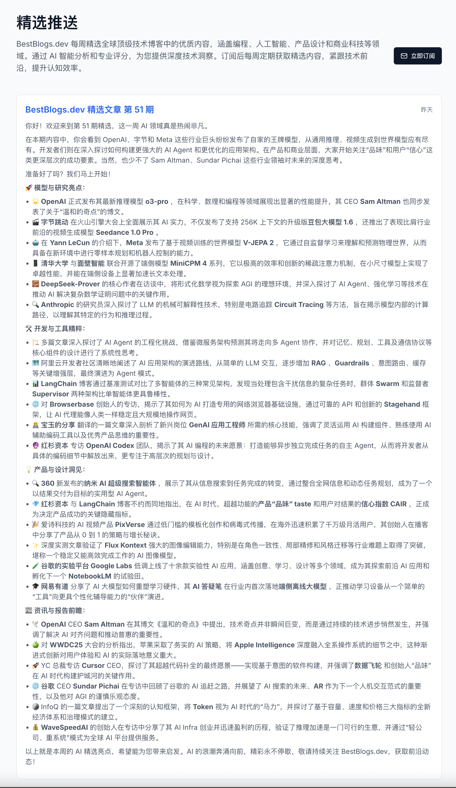

# [BestBlogs.dev](https://bestblogs.dev)

遇见更好的技术阅读，汇集顶级软件编程、人工智能、产品设计、商业科技、自我成长类文章，使用大语言模型进行评分、摘要、翻译等，让阅读更轻松、学习更高效。

## 1. 介绍

BestBlogs.dev 为您提供编程、人工智能、产品设计、商业科技和个人成长领域的精选内容，汇集自顶级技术公司和社区。我们利用先进的大语言模型，为每篇文章提供智能摘要、评分和翻译服务，帮助您快速筛选高价值内容，节省阅读时间。立即订阅，探索未来技术的无限可能！

## 2. 订阅

网站订阅地址：[https://www.bestblogs.dev/#subscribe](https://www.bestblogs.dev/#subscribe)

每周五推送最新的[精选推送](https://www.bestblogs.dev/newsletter)，包含本周最具价值的技术文章、人工智能动态、产品设计洞察等优质内容。

## 3. RSS 源

网站内容来源于以下 RSS 订阅源（共 380 个）：

**所有订阅源：** [BestBlogs_RSS_ALL.opml](./BestBlogs_RSS_ALL.opml)

- **文章类**（200 个订阅源）：[BestBlogs_RSS_Articles.opml](./BestBlogs_RSS_Articles.opml)
- **播客类**（30 个订阅源）：[BestBlogs_RSS_Podcasts.opml](./BestBlogs_RSS_Podcasts.opml)  
- **Twitter 类**（150 个订阅源，持续添加中）：[BestBlogs_RSS_Twitters.opml](./BestBlogs_RSS_Twitters.opml)

您可以在 [订阅源页面](https://www.bestblogs.dev/sources) 浏览所有 RSS 订阅源信息，包括最近 3 个月的文章数量、精选文章数量和阅读数统计。

您可以直接导入这些 OPML 文件到您的 RSS 阅读器中。如有优质的 RSS 订阅源推荐，欢迎提 Issue 补充。

## 4. 本站 RSS 订阅指南

BestBlogs.dev 提供灵活的 RSS 订阅功能，支持按需订阅：

- **全站订阅：** [https://www.bestblogs.dev/zh/feeds/rss](https://www.bestblogs.dev/zh/feeds/rss)
- **精选文章订阅：** [https://www.bestblogs.dev/zh/feeds/rss?featured=y](https://www.bestblogs.dev/zh/feeds/rss?featured=y)
- **编程技术类文章：** [https://www.bestblogs.dev/zh/feeds/rss?category=programming](https://www.bestblogs.dev/zh/feeds/rss?category=programming)
- **人工智能高分文章：** [https://www.bestblogs.dev/en/feeds/rss?category=ai&minScore=90](https://www.bestblogs.dev/en/feeds/rss?category=ai&minScore=90)

更多参数说明和用法请参考：[BestBlogs.dev RSS 订阅指南](./BestBlogs_RSS_Doc.md)

另外网站还添加了每周精选推送周刊的 RSS 订阅支持，订阅地址：[https://www.bestblogs.dev/zh/feeds/rss/newsletter](https://www.bestblogs.dev/zh/feeds/rss/newsletter)

## 5. 开放 API

BestBlogs.dev 提供开放 API 接口，支持文章、播客、推文等内容的智能分析和获取。

API 文档：[BestBlogs_OpenAPI_Doc.md](./BestBlogs_OpenAPI_Doc.md)

## 6. 实现原理

### 6.1 文章智能分析

详细实践文档：[BestBlogs.dev 基于 Dify Workflow 的文章智能分析实践](./flows/Dify/BestBlogs.dev%20基于%20Dify%20Workflow%20的文章智能分析实践.md)

**1. 文章爬取流程**
基于 RSS 协议爬取所有订阅源的文章信息（标题、链接、发布时间等），通过无头浏览器获取完整文章内容。利用订阅源配置的正文选择器提取文章正文，并对 HTML、图片等进行标准化处理。

**2. 文章初评流程**  
通过语言类型、内容质量等特征对文章进行初步评分，过滤低质量内容，提高后续处理效率。使用 Dify Workflow 实现，DSL 参见：[BestBlogs 文章初评流程](./flows/Dify/dsl/BestBlogs%20文章初评流程.yml)

**3. 文章深度分析流程**  
通过大语言模型（GPT-4o）对文章进行全面分析，生成一句话总结、详细摘要、主要观点、文章金句、领域分类、标签列表和质量评分等。包含 *分段分析 → 汇总分析 → 领域划分和标签生成 → 文章评分 → 检查反思 → 优化改进* 等环节。DSL 参见：[BestBlogs 文章分析流程](./flows/Dify/dsl/BestBlogs%20文章分析流程.yml)

**4. 多语言翻译流程**  
支持中英双语，自动识别原文语言并生成目标语言的分析结果。包含 *识别专业术语 → 初次翻译 → 检查翻译 → 意译优化* 等环节。DSL 参见：[BestBlogs 文章分析结果翻译流程](./flows/Dify/dsl/BestBlogs%20文章分析结果翻译.yml)

### 6.2 播客智能分析

实现方案详见：[BestBlogs.dev 基于通义听悟和 Dify 实现播客智能分析](./docs/BestBlogs.dev%20基于通义听悟和%20Dify%20实现播客智能分析.md)

### 6.3 推文智能分析

实现方案详见：[BestBlogs.dev 基于 XGo.ing 和 Dify 实现推文智能分析](./docs/BestBlogs.dev%20基于%20XGo.ing%20和%20Dify%20实现推文智能分析.md)

### 6.4 视频智能分析

方案开发中，敬请期待 🎬

## 7. 支持与交流

如果您觉得 BestBlogs.dev 对您有帮助，欢迎：

- ⭐ 给项目点个 Star
- 💝 赞赏支持项目发展  
- 👥 加入读者交流群讨论
- 📧 邮件反馈建议：[hi@gino.bot](mailto:hi@gino.bot)

| 赞赏支持项目发展 | &nbsp;&nbsp;&nbsp;&nbsp;&nbsp;&nbsp;&nbsp;&nbsp;&nbsp;&nbsp; | 添加作者微信加入群聊 |
|:---:|:---:|:---:|
|  | |  |

## 8. 致谢

感谢以下开源项目的支持：

- [RSSHub](https://github.com/DIYgod/RSSHub) - 万物皆可 RSS
- [wechat2rss](https://github.com/ttttmr/Wechat2RSS) - 微信公众号转 RSS
- [Dify](https://github.com/langgenius/dify) - LLM 应用开发平台
- [Gemini Balancer](https://github.com/snailyp/gemini-balance) - Gemini 轮询代理服务
- [Bark](https://github.com/Finb/Bark) - iOS 推送通知工具
- [Uptime Kuma](https://github.com/louislam/uptime-kuma) - 自建监控服务
- [XGo.ing](https://xGo.ing) - 推文 RSS
