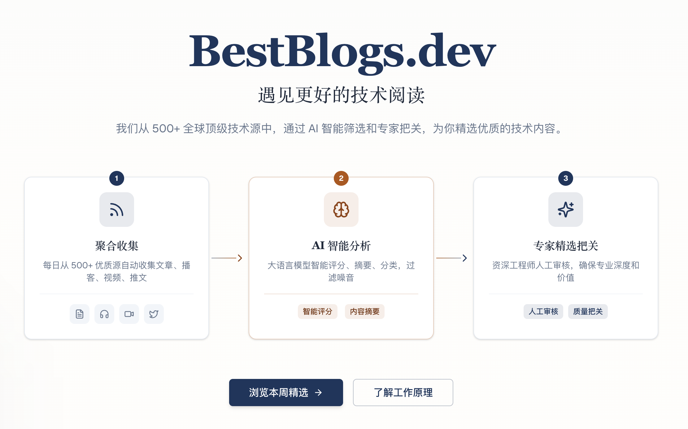
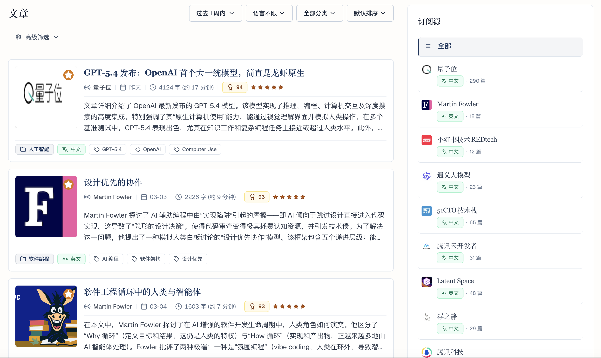
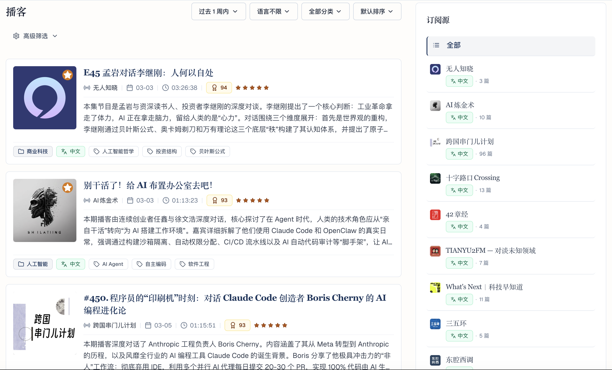
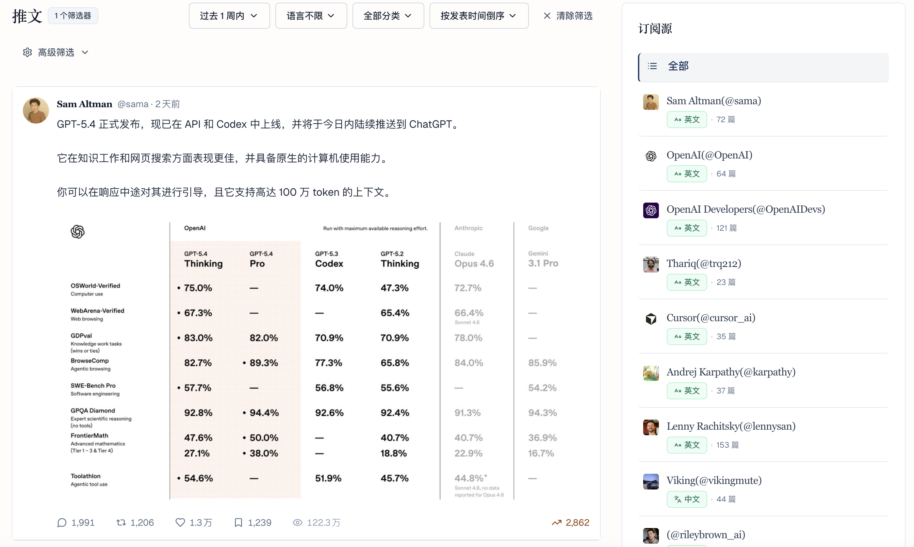

# [BestBlogs.dev](https://bestblogs.dev)

遇见更好的技术阅读 — 汇集顶级软件工程、人工智能、产品设计、商业科技、个人成长内容，由 AI 评分筛选，按兴趣个性化推送。



## 1. 是什么

BestBlogs.dev 是 AI 驱动的内容聚合与阅读平台。每天从 600+ 订阅源自动抓取文章、播客、视频与推文（日均 1000+ 篇），经大语言模型六维评分、摘要、翻译后，按每位用户的兴趣标签生成早报，让阅读更高效、学习更轻松。目前已有 13000+ 注册用户。

### 核心能力

| 能力 | 说明 |
|---|---|
| **AI 内容分析** | 六维评分（选题 / 内容 / 深度 / 实用 / 创新 / 表达）+ 摘要 + 关键观点 + 金句 |
| **多语言支持** | 中英双语，自动识别原文语言并翻译分析结果 |
| **六维兴趣标签** | 编程技术 / AI / 产品设计 / 商业科技 / 个人成长 / 综合，支持多选与权重调节 |
| **早报** | 每日个性化摘要（文字 / 音频 / 邮件），Pro 专属深度版 + 公开版 |
| **Pro 订阅** | 无限阅读 + 个性化 For You 信息流 + 高级分析 |

### 内容类型








---

## 2. 快速上手

**直接浏览**：访问 [bestblogs.dev](https://bestblogs.dev)，免费阅读所有公开内容。

**命令行**（开发者 / Agent 用户）：

```bash
npm install -g @bestblogs/cli
bestblogs auth login           # 输入 API Key（在设置页生成）
bestblogs discover today       # 今天最值得读的内容
bestblogs read deep <id>       # 深度阅读一篇
```

**Agent Skills**（Claude Code / Cursor 等）：

```bash
npx @bestblogs/skills           # 一键安装所有 Skills
# 安装后在 Claude Code 中直接说：「今天 BestBlogs 有什么值得读的？」
```

---

## 3. 订阅

每周五发送精选 Newsletter，包含本周最有价值的内容 → [浏览往期](https://www.bestblogs.dev/newsletter)


---

## 4. RSS 订阅

BestBlogs.dev 支持灵活的 RSS 订阅：

| 订阅范围 | 地址 |
|---|---|
| 全站 | `https://www.bestblogs.dev/zh/feeds/rss` |
| 仅精选内容 | `https://www.bestblogs.dev/zh/feeds/rss?featured=y` |
| 编程类文章 | `https://www.bestblogs.dev/zh/feeds/rss?category=programming&type=article` |
| AI 高分内容（英文） | `https://www.bestblogs.dev/en/feeds/rss?category=ai&minScore=90` |
| 每周精选 Newsletter | `https://www.bestblogs.dev/zh/feeds/rss/newsletter` |
| 每日早报 | `https://www.bestblogs.dev/zh/feeds/rss/daily-brief` |

更多参数说明见 [BestBlogs_RSS_Doc.md](./BestBlogs_RSS_Doc.md)。

### RSS 订阅源 OPML

以下为 BestBlogs 公开分享的 RSS 订阅源 OPML 文件，可导入到任意 RSS 阅读器：

- **全部（400 个）**：[BestBlogs_RSS_ALL.opml](./BestBlogs_RSS_ALL.opml)
- **文章（170 个）**：[BestBlogs_RSS_Articles.opml](./BestBlogs_RSS_Articles.opml)
- **播客（30 个）**：[BestBlogs_RSS_Podcasts.opml](./BestBlogs_RSS_Podcasts.opml)
- **视频（40 个）**：[BestBlogs_RSS_Videos.opml](./BestBlogs_RSS_Videos.opml)
- **Twitter（160 个）**：[BestBlogs_RSS_Twitters.opml](./BestBlogs_RSS_Twitters.opml)

有优质 RSS 源推荐？欢迎提 [Issue](https://github.com/ginobefun/BestBlogs/issues)。

---

## 5. 开放 API（v2）

BestBlogs v2 API 面向开发者开放，提供内容发现、阅读与个人数据管理能力。

**Base URL**：`https://api.bestblogs.dev/openapi/v2`  
**鉴权**：Header `X-API-KEY: <your_key>`（在 [Settings](https://bestblogs.dev/settings) 生成

| 模块 | 说明 |
|---|---|
| [openapi/01-auth.md](./openapi/01-auth.md) | 认证与身份，公共规范 |
| [openapi/02-intake.md](./openapi/02-intake.md) | 兴趣画像建立，冷启动引导 |
| [openapi/03-discover.md](./openapi/03-discover.md) | 内容发现：早报 / 推荐 / 搜索 |
| [openapi/04-read.md](./openapi/04-read.md) | 内容阅读：全文 / Markdown / 元数据 |
| [openapi/05-capture.md](./openapi/05-capture.md) | 书签 / 划线笔记 / 阅读历史 |

典型使用路径：认证 → Intake 建立画像 → Discover 发现内容 → Read 深度阅读 → Capture 留存笔记

> v1 API 已停止接入，历史文档见 [archive/v1-openapi.md](./archive/v1-openapi.md)

---

## 6. CLI & Agent Skills

### @bestblogs/cli

官方命令行工具，基于 OpenAPI v2，所有命令支持 `--json` 模式，可直接被 AI Agent 消费。

```bash
npm install -g @bestblogs/cli
bestblogs auth login
bestblogs intake setup           # 冷启动：选兴趣标签
bestblogs discover today --limit 20
bestblogs read deep <resourceId>
bestblogs capture bookmark add <resourceId> --note "值得反复读"
```

- 文档：[cli/README.md](./cli/README.md)
- 更新日志：[cli/CHANGELOG.md](./cli/CHANGELOG.md)
- 源码：[cli/src/](./cli/src/)（TypeScript，MIT 协议）

### BestBlogs Skills

一组 SKILL.md 文件，让 Claude Code / Cursor / OpenClaw 等 Agent 主动触发 BestBlogs 能力（25 个稳定原语）。

```bash
npx @bestblogs/skills             # 安装到 Claude Code
npx @bestblogs/skills upgrade     # 升级到最新版
```

安装后直接说：
- 「今天有什么值得读的？」→ `bestblogs-discover`
- 「深度阅读这篇」→ `bestblogs-read`
- 「收藏这篇，加笔记」→ `bestblogs-capture`
- 「为什么推这条给我？」→ `bestblogs-explain`

- 文档：[skills/README.md](./skills/README.md)
- 安装指南：[skills/INSTALL.md](./skills/INSTALL.md)
- 源码：[skills/](./skills/)

---

## 7. 文档

### 产品与技术文档

| 文档 | 说明 |
|---|---|
| [docs/1-VISION.md](./docs/1-VISION.md) | 愿景与长期方向 |
| [docs/2-PRODUCT.md](./docs/2-PRODUCT.md) | 产品策略、能力矩阵、执行版路线 |
| [docs/3-BRAND.md](./docs/3-BRAND.md) | 品牌基线与表达规范 |
| [docs/4-ARCHITECTURE.md](./docs/4-ARCHITECTURE.md) | 系统边界、技术链路与开关 |
| [docs/5-DESIGN.md](./docs/5-DESIGN.md) | 视觉与交互规范 |
| [docs/6-UI-SPEC.md](./docs/6-UI-SPEC.md) | UI 组件与交互细则 |
| [docs/7-CONVENTIONS.md](./docs/7-CONVENTIONS.md) | 开发规范与代码风格 |
| [docs/8-CURRENT_STATE.md](./docs/8-CURRENT_STATE.md) | 当前状态、里程碑与路线图 |
| [docs/9-TESTING.md](./docs/9-TESTING.md) | 测试分层与覆盖要求 |
| [docs/10-TERMINOLOGY.md](./docs/10-TERMINOLOGY.md) | 中英术语表 |
| [docs/11-OPERATIONS.md](./docs/11-OPERATIONS.md) | 运维、监控与回滚 SOP |
| [docs/12-WORKFLOW.md](./docs/12-WORKFLOW.md) | 开发流程总入口 |

### 版本历史

详细双语 Changelog 见 [changelog/](./changelog/)（从 v2.0.0 起）。

### 历史归档

[archive/](./archive/) 包含 v1 API 文档、早期 Dify 实现文档等历史资料，仅供参考。

---

## 8. 实现原理

### AI 内容处理流水线

```
RSS 爬取 → 初筛过滤 → AI 深度分析 → 多语言翻译 → 入库 → 个性化推荐
```

**1. 内容爬取**：基于 RSS + 无头浏览器提取全文，支持订阅源配置正文选择器

**2. 初筛过滤**：语言类型、内容质量特征初步评分，过滤低价值内容

**3. AI 深度分析**：大语言模型生成六维评分 + 摘要 + 关键观点 + 金句 + 标签

**4. 多语言翻译**：识别专业术语 → 初译 → 检查 → 意译优化，支持中英双语

**5. 个性化推荐**：六维兴趣标签匹配 + 早报智能编排

详细实践文档与 Dify DSL：

- [BestBlogs 文章智能分析实践](./flows/Dify/BestBlogs.dev%20基于%20Dify%20Workflow%20的文章智能分析实践.md)
- [Intelligent Article Analysis at BestBlogs.dev](./flows/Dify/Intelligent%20Article%20Analysis%20at%20BestBlogs.dev%3A%20A%20Case%20Study%20Using%20Dify%20Workflow.md)
- Workflow DSL：[flows/Dify/dsl/](./flows/Dify/dsl/)

---

## 9. 支持与交流

如果 BestBlogs.dev 对你有帮助，欢迎：

- ⭐ 给项目点个 Star
- 💝 赞赏支持项目发展
- 👥 加入读者交流群，添加微信好友备注「BestBlogs」
- 📧 邮件反馈建议：[hi@gino.bot](mailto:hi@gino.bot)
- 🐛 提交 Issue：[GitHub Issues](https://github.com/ginobefun/BestBlogs/issues)

<div align="center">

| 赞赏支持项目发展 | &nbsp;&nbsp;&nbsp;&nbsp;&nbsp;&nbsp;&nbsp;&nbsp;&nbsp;&nbsp; | 添加作者微信加入群聊 |
|:---:|:---:|:---:|
|  | |  |

</div>

---

## 致谢

感谢以下开源项目：

- [RSSHub](https://github.com/DIYgod/RSSHub) — 万物皆可 RSS
- [wechat2rss](https://github.com/ttttmr/Wechat2RSS) — 微信公众号转 RSS
- [Dify](https://github.com/langgenius/dify) — LLM 应用开发平台
- [XGo.ing](https://xGo.ing) — 推文 RSS
- [Bark](https://github.com/Finb/Bark) — iOS 推送通知工具
- [Uptime Kuma](https://github.com/louislam/uptime-kuma) — 自建监控服务
