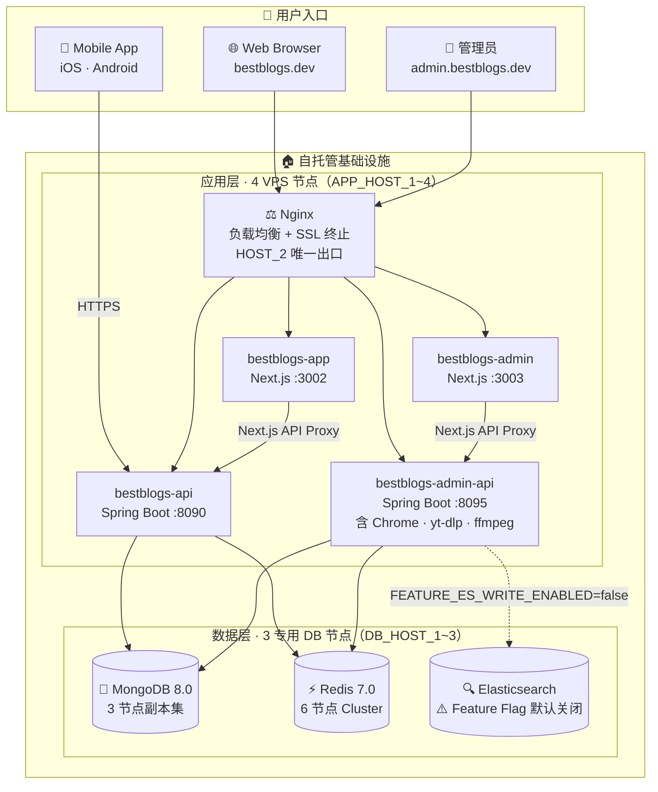
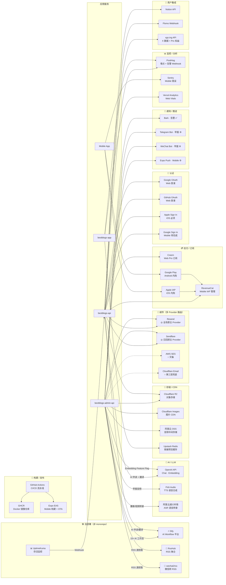

# BestBlogs 全局技术架构与外部依赖

> 扫描日期：2026-05-11 | 扫描范围：后端 Spring Boot、前端 Next.js、Mobile、Deploy 配置、Skills 层
> 维护规则：服务新增/下线时同步更新本文档；实际月支出由运营者手动填写"实际月支出"列
> **公开同步**：本文档经 `scripts/sync-to-public.sh` 同步至公开仓，禁止写入真实 IP、内网地址、密钥等私密信息；节点用 `APP_HOST_*` / `DB_HOST_*` 代号，真实映射见私有运维文档（如 `runbooks/uptime-kuma-checklist.md`）
> **版本对齐**（2026-05-19）：与 PRODUCT v2.4.0（2026-05-18 重写）兼容。定位变更（「AI 驱动的内容平台」→「AI 驱动的私人阅读助手」）与北极星切换（WQRL/WDRR → Pro 早报日开数）不影响外部依赖矩阵；PostHog 节点未来挂接新北极星看板（待 `specs/north-star-metric.md` 重写）。

---

## 一、全局架构图

### 1.1 部署拓扑图

### 1.2 外部服务依赖全景图

---

## 二、外部服务全量清单

### 2.1 自托管基础设施（monorepo 内）

| 服务 | 角色 | 节点数 | 关键说明 |
|------|------|--------|---------|
| **Nginx 7** | 负载均衡 + SSL 终止 | HOST_2 唯一 | Let's Encrypt 证书；SSE 600s 超时；RSS/OG 缓存 |
| **bestblogs-app** | Web 前台（Next.js） | 4 VPS | 端口 3002 |
| **bestblogs-admin** | 管理后台（Next.js） | 4 VPS | 端口 3003 |
| **bestblogs-api** | 用户 API（Spring Boot） | 4 VPS | 端口 8090 |
| **bestblogs-admin-api** | 管理 API + Job 宿主 | 4 VPS | 端口 8095；含 Chrome、yt-dlp、ffmpeg |
| **MongoDB 8.0** | 主数据库 | 3 专用 DB 节点 | 副本集 `bestblogs-rs`；与应用节点物理分离 |
| **Redis 7.0** | 缓存 + 分布式锁 + 限流 | 3 Master + 3 Replica | 6 节点 Cluster；与 MongoDB 共用 DB 节点 |
| **Elasticsearch** | 混合搜索 + 向量存储 | — | `FEATURE_ES_WRITE_ENABLED` 默认 false，当前未运行 |

### 2.2 自部署外部服务（monorepo 外，需单独运维）

| 服务 | 部署方式 | 用途 | 强/弱依赖 |
|------|---------|------|---------|
| **Dify** | 自部署或 SaaS | 15+ AI 工作流编排（内容分析/翻译/摘要/早报/周报） | **强**（内容处理核心链路，fail-soft 不中断 Job 但 AI 能力全失） |
| **RssHub** | 自部署 Docker | 为无 RSS 的网站生成 RSS 源 URL | **中**（仅影响依赖 RssHub 路由的订阅源抓取） |
| **wechat2rss** | 自部署 Docker | 微信公众号转 RSS | **中**（仅影响微信公众号内容入库） |
| **UptimeKuma** | 自部署 Docker（独立 VPS，状态页 `https://status.bestblogs.dev/`） | HTTP/TCP/Ping 全栈存活监控，Webhook 回调 `AlertDispatchService`；按节点拆开 42 个 monitor，详见 `runbooks/uptime-kuma-checklist.md` | **中**（运维强依赖，不影响用户功能） |

### 2.3 AI / LLM 服务

| 服务 | 用途 | 调用模块 | 配置 Key | 强/弱依赖 | Fallback |
|------|------|---------|---------|---------|---------|
| **Dify**（见 2.2） | 全链路 AI 工作流 | admin-api · api | `FILTER_FLOW_API_KEY` 等 18 个 | **强** | fail-soft，Brief 失败走规则兜底 |
| **OpenAI API**（Chat） | AI 伴读（Web/Mobile）+ 内容翻译 | api | `AI_READING_OPENAI_API_KEY`、`AI_READING_BASE_MODEL`（默认 `gpt-5.4-mini`）、`MOBILE_AI_READER_MODEL`（默认 `claude-sonnet-4-6` via compatible endpoint） | **强** | 翻译有 fallback 模型（`gpt-5.4-nano`） |
| **OpenAI API**（Embedding） | 文章向量化（ES 混合检索） | admin-api | `EMBEDDING_API_KEY`、`EMBEDDING_BASE_URL`、`EMBEDDING_MODEL_NAME`（默认 `text-embedding-3-small`）| **弱**（Feature Flag 默认关闭） | 可选依赖，不可用时跳过 |
| **Fish Audio** | 每日早报 TTS 音频生成 | admin-api（worker） | `DAILY_BRIEF_TTS_API_KEY`、`DAILY_BRIEF_TTS_VOICE_ID`、`DAILY_BRIEF_TTS_PROVIDER=fish_audio` | **中** | `NoOpTtsAdapter`（关闭功能而非降级） |
| **阿里云通义听悟** | 播客 + 视频 ASR 转录 | admin-api（worker） | `TINGWU_APP_KEY`、`TINGWU_ACCESS_KEY_ID`、`TINGWU_ACCESS_KEY_SECRET` | **中** | 无自动 fallback |

> **注**：`MOBILE_AI_READER_MODEL=claude-sonnet-4-6` 通过 OpenAI 兼容接口调用，需在 `AI_READING_OPENAI_BASE_URL` 配置支持 Claude 的代理端点（如 AWS Bedrock OpenAI 兼容层），否则调用原生 OpenAI 端点会 404。

### 2.4 存储 / CDN

| 服务 | 用途 | 调用模块 | 配置 Key | 强/弱依赖 | Fallback |
|------|------|---------|---------|---------|---------|
| **Cloudflare R2** | 图片对象存储 + 用户头像 | api · admin-api | `CF_R2_ACCESS_KEY`、`CF_R2_SECRET_KEY`、`CF_R2_BUCKET`（CDN 域名 `image.jido.dev`） | **中** | `IMAGE_STRATEGY` ConfigKey 可切换策略；`NoOpImageUploader`/`NoOpAvatarUploader` |
| **Cloudflare Images** | 图片 CDN 处理与分发 | admin-api | `CF_IMAGE_ACCOUNT`、`CF_IMAGE_API_KEY` | **中** | 可降级为 R2 Only 策略 |
| **阿里云 OSS** | TTS 音频文件中间存储（生成后上传 → 预签名 URL） | admin-api（worker） | `OSS_ENDPOINT`、`OSS_ACCESS_KEY_ID`、`OSS_ACCESS_KEY_SECRET`、`OSS_BUCKET` | **中**（播客功能依赖） | 无 fallback，不可用时抛 `BizException` |
| **Upstash Redis** | 前端 linkPreview 缓存（Next.js SSR 层，与后端 Redis 完全独立） | bestblogs-app | `UPSTASH_REDIS_REST_URL`、`UPSTASH_REDIS_REST_TOKEN` | **弱** | 失败返回空预览，不影响主流程 |

### 2.5 邮件服务（多 Provider 路由架构）

路由入口：`MailRouterService`，主开关 `FEATURE_MAIL_ROUTER_ENABLED`（false 时退回单 Resend，秒级回滚）。

| Provider | 覆盖 Channel | 路由优先级 | 配置 Key | 强/弱依赖 |
|---------|-------------|---------|---------|---------|
| **Resend** | 全部 7 个 Channel | 全 Channel 默认 | `RESEND_TOKEN`、`RESEND_FROM` | **强**（主路径，禁用则邮件功能全失） |
| **Sendflare** | DAILY_REVIEW | 第 1 优先 | `SENDFLARE_TOKEN`、`SENDFLARE_FROM`、`SENDFLARE_API_BASE` | **中** |
| **AWS SES** | 所有 Channel（灾备） | 按路由表配置 | `AWS_SES_REGION`、`AWS_SES_ACCESS_KEY_ID`、`AWS_SES_SECRET_ACCESS_KEY` | **弱**（灾备） |
| **Cloudflare Email** | 仅 DAILY_REVIEW（禁止用于登录类邮件） | 第 3 优先（兜底） | `CF_EMAIL_ACCOUNT_ID`、`CF_EMAIL_API_TOKEN` | **弱**（兜底） |

### 2.6 支付 / 订阅

| 服务 | 用途 | 调用模块 | 配置 Key | 强/弱依赖 |
|------|------|---------|---------|---------|
| **Creem** | Web 端 Pro 订阅 Checkout + Portal + Webhook | api | `CREEM_API_KEY`、`CREEM_WEBHOOK_SECRET`、`CREEM_PRODUCT_ID_STANDARD`、`CREEM_PRODUCT_ID_EARLY_BIRD` | **强**（Web Pro 购买路径） |
| **RevenueCat** | Mobile IAP 权益管理 + Creem→RC 跨平台 Pro 同步 | api | `MOBILE_REVENUECAT_REST_API_KEY`、`MOBILE_REVENUECAT_WEBHOOK_SECRET_IOS/ANDROID`、`MOBILE_REVENUECAT_ENTITLEMENT_ID` | **强**（Mobile Pro 购买路径） |
| **Apple IAP** | iOS 内购（RevenueCat 管理） | Mobile App | 通过 RevenueCat SDK | **强**（iOS Pro 购买，App Store 硬要求） |
| **Google Play** | Android 内购（RevenueCat 管理） | Mobile App | 通过 RevenueCat SDK | **强**（Android Pro 购买） |

### 2.7 认证服务

| 服务 | 用途 | 配置 Key | 强/弱依赖 | 熔断开关 |
|------|------|---------|---------|---------|
| **Apple Sign In** | iOS Mobile 登录 | `MOBILE_APPLE_BUNDLE_ID`、JWKS 从 `https://appleid.apple.com/auth/keys` 缓存 | **强**（App Store 硬要求） | `MOBILE_SIGN_IN_APPLE_ENABLED` |
| **Google Sign In** | Android/iOS Mobile 登录 | `MOBILE_GOOGLE_CLIENT_ID_IOS`、`MOBILE_GOOGLE_CLIENT_ID_ANDROID`（JWKS 从 Google） | **中**（代码未完全实现，待 #270） | `MOBILE_SIGN_IN_GOOGLE_ENABLED` |
| **Google OAuth** | Web 端第三方登录 | `OAUTH_GOOGLE_CLIENT_ID`、`OAUTH_GOOGLE_CLIENT_SECRET` | **弱**（邮箱验证码为主路径） | `FEATURE_OAUTH_LOGIN_ENABLED` |
| **GitHub OAuth** | Web 端第三方登录 | `OAUTH_GITHUB_CLIENT_ID`、`OAUTH_GITHUB_CLIENT_SECRET` | **弱** | `FEATURE_OAUTH_LOGIN_ENABLED` |
| **X (Twitter) OAuth 2.0 PKCE** | 用户绑定 X 账号（xgo.ing 集成） | `OAUTH_X_CLIENT_ID`、`OAUTH_X_CLIENT_SECRET` | **弱** | `OAUTH_X_LOGIN_ENABLED` + `XGO_INTEGRATION_ENABLED` |

### 2.8 通知 / 推送

| 服务 | 用途 | 配置 Key | 默认状态 | 强/弱依赖 |
|------|------|---------|---------|---------|
| **Bark** | 运维告警唯一通道（CRITICAL/WARNING 级） | `BARK_URL`、`BARK_KEY`、`NOTIFICATION_BARK_ENABLED` | **✅ 生产启用** | **强**（运维可观测性）；缺失时告警静默丢失 |
| **Telegram Bot** | 每日早报频道推送 | `DAILY_BRIEF_TELEGRAM_BOT_TOKEN`、`DAILY_BRIEF_TELEGRAM_CHAT_IDS` | `⚙️ DISABLED` | **弱** |
| **WeChat Bot** | 每日早报微信群推送（自部署 Bot 服务中转） | `DAILY_BRIEF_WECHAT_BOT_HOST`、`DAILY_BRIEF_WECHAT_BOT_API_KEY` | `⚙️ DISABLED` | **弱** |
| **Expo Push Service** | Mobile 每日早报推送（`https://exp.host/--/api/v2/push/send`，无鉴权） | `MOBILE_PUSH_DELIVERY_JOB_DISABLED=true` | `⚙️ DISABLED`（TestFlight 验证后开启） | **弱** |

### 2.9 监控 / 分析

| 服务 | 用途 | 配置 Key | 强/弱依赖 | 备注 |
|------|------|---------|---------|------|
| **PostHog** | 后端事件上报 + 前端埋点 + 告警 Webhook 触发 | `POSTHOG_BACKEND_API_KEY`、`FEATURE_BACKEND_POSTHOG_ENABLED`（默认 false）、`NEXT_PUBLIC_POSTHOG_KEY`、`NEXT_PUBLIC_POSTHOG_HOST`（默认 `https://t.bestblogs.dev`） | **中**（缺失时数据盲区，运营决策受影响） | 前端 SDK 默认走 PostHog managed reverse proxy；后端 NoOp 降级；告警 Webhook 路径独立，不经代理 |
| **UptimeKuma**（见 2.2） | HTTP/TCP 存活监控 | 通过 Webhook 对接 | **中**（运维） | 不在 monorepo，需单独运维 |
| **Sentry** | Mobile App 错误追踪 | `EXPO_PUBLIC_SENTRY_DSN`（Mobile）、`SENTRY_AUTH_TOKEN_MOBILE`（CI） | **弱** | DSN 为空时跳过初始化 |
| **Vercel Analytics** | Web Vitals 采集（`@vercel/analytics`） | 无 env 变量，自动检测 | **弱** | 非 Vercel 域名下静默不上报；CSP `connect-src` 未含其域名 |
| **Google Analytics 4** | — | `NEXT_PUBLIC_GOOGLE_ANALYTICS`（空值） | **无**（已注释未启用） | — |
| **Microsoft Clarity** | — | `NEXT_PUBLIC_MICROSOFT_CLARITY`（空值） | **无**（已注释未启用） | — |

### 2.10 构建 / 发布

| 服务 | 用途 | 强/弱依赖 |
|------|------|---------|
| **GitHub Actions** | CI/CD 流水线（变更检测 + 构建 + 滚动部署 SSH 4 节点） | **强**（生产部署唯一路径） |
| **GitHub Container Registry (GHCR)** | Docker 镜像存储，生产节点从此 pull | **强** |
| **Expo EAS** | Mobile 构建（iOS/Android）+ OTA 更新 | **强**（Mobile 发布唯一路径） |
| **Apple Developer Program** | iOS 应用分发、TestFlight、App Store | **强**（iOS 生产发布） |
| **Google Play Console** | Android 应用分发 | **强**（Android 生产发布） |

### 2.11 内容来源（外部数据源）

| 来源 | 类型 | 调用方式 | 影响范围 |
|------|------|---------|---------|
| **RssHub**（自部署） | RSS 聚合生成器 | HTTP RSS fetch | 依赖 RssHub 路由的订阅源 |
| **wechat2rss**（自部署） | 微信公众号 → RSS | HTTP RSS fetch | 微信公众号内容入库 |
| **YouTube / Bilibili** | 视频内容平台 | yt-dlp 下载 + YouTube Data API | 视频内容处理链路 |
| **RSS / Atom 订阅源** | 文章/播客来源 | HTTP fetch（`RssFetchService`） | 核心内容来源 |

### 2.12 用户集成（可选，用户自配置）

| 服务 | 用途 | 配置 Key / 方式 | 强/弱依赖 |
|------|------|----------------|---------|
| **Notion API** | 阅读内容同步到用户 Notion | 用户自带 Integration Token | **弱**（用户可选功能，`FEATURE_NOTION_INTEGRATION_ENABLED` 开关） |
| **Flomo** | 划线/高亮同步到 Flomo | 用户自带 API Key | **弱**（`FEATURE_FLOMO_INTEGRATION_ENABLED` 开关） |
| **xgo.ing OpenAPI** | X/Twitter 关注同步 + 跨产品 Pro 权益联动 | `XGO_API_KEY`、`XGO_INTERNAL_TOKEN`、`XGO_INTEGRATION_ENABLED` | **弱**（Pro 增值特性，`NoOpXgoAdapter` 降级） |

---

## 三、强 / 弱依赖汇总

### 强依赖（缺失影响核心用户功能）

| 服务 | 影响范围 | 熔断路径 |
|------|---------|---------|
| MongoDB | **全平台不可用** | 无，启动必填 |
| Redis | **全平台不可用**（分布式锁/缓存全失） | `FEATURE_REDIS_L2_CACHE_ENABLED` 降级 L1+L3（不推荐） |
| Dify | AI 内容处理全失（filter/analysis/translate/brief/weekly 全部停摆） | fail-soft 不中断 Job，但内容质量大幅下降 |
| OpenAI API（Chat） | AI 伴读 + 实时翻译不可用 | 翻译有 fallback 模型；伴读无自动切换 |
| Resend | 所有邮件发送失败（验证码/订阅/早报） | `FEATURE_MAIL_ROUTER_ENABLED=false` 退回 Resend 单链路 |
| Creem | Web Pro 订阅无法购买 | `CREEM_ENABLED=false` 关闭功能 |
| RevenueCat | Mobile Pro IAP 无法购买 | `MOBILE_IAP_ENABLED=false` 关闭功能 |
| Apple Sign In | iOS 用户无法登录 | `MOBILE_SIGN_IN_APPLE_ENABLED=false` 熔断 |
| GitHub Actions + GHCR | 生产部署中断 | 手动 SSH + docker pull 可应急 |
| Expo EAS | Mobile 新版本无法发布 | 本地 `eas build` 可应急 |
| Apple Developer / App Store | iOS 应用无法发布/IAP | — |
| Bark | **运维告警静默丢失**（不影响用户） | NoOp 降级，无告警仍可人工巡检 |

### 中等依赖（缺失影响特定功能，核心可用）

| 服务 | 影响功能 | 熔断/降级路径 |
|------|---------|-------------|
| Fish Audio | 早报音频无法生成（文字早报正常） | `NoOpTtsAdapter`；`DAILY_BRIEF_TTS_API_KEY` 清空 |
| 阿里云通义听悟 | 播客/视频转录停止 | 无 fallback，Job 异常告警后人工处理 |
| Cloudflare R2 / Images | 图片上传失败，已上传图片 CDN 可用 | `IMAGE_STRATEGY` 切换；`NoOp` 降级 |
| 阿里云 OSS | 音频上传失败（TTS 结果无法入库） | 无 fallback |
| RevenueCat（Creem→RC bridge） | Mobile Pro 权益未同步 | 不影响 Web 侧；`MOBILE_IAP_ENABLED=false` |
| PostHog | 数据盲区，运营决策受影响 | `NoOpPostHogAdapter`；`FEATURE_BACKEND_POSTHOG_ENABLED=false` |
| UptimeKuma | 存活监控缺失 | 人工巡检替代 |
| RssHub / wechat2rss | 依赖该源的订阅抓取失败 | 单源失败不影响其他源 |

### 弱依赖（关闭不影响主链路）

Google OAuth / GitHub OAuth / X OAuth · Google Sign In Mobile · Sendflare · AWS SES · Cloudflare Email · Telegram Bot · WeChat Bot · Expo Push · Sentry · Vercel Analytics · Upstash Redis · Elasticsearch · Notion · Flomo · xgo.ing · Google Play（Android Pro 仅）

---

## 四、费用档位

> 说明：定价档位基于代码推断的用量规模，对照官网公开定价估算。`实际月支出` 列留空，由运营者按账单填写。

### 基础设施自托管

| 资源 | 规格推断 | 费用性质 |
|------|---------|---------|
| 4 台应用节点 VPS | `APP_HOST_1` ~ `APP_HOST_4`（`APP_HOST_2` = Nginx 出口） | VPS 月费（约 $20-60/台，合计 $80-240/月） |
| 3 台 DB 节点 VPS | `DB_HOST_1` ~ `DB_HOST_3`（MongoDB 3 副本集 + Redis 6 节点） | VPS 月费（约 $20-60/台，合计 $60-180/月） |

### 外部 SaaS 费用估算

| 服务 | 计费模式 | 免费额度 | 预估档位 | 预估月费 | 实际月支出 |
|------|---------|---------|---------|---------|---------|
| **Dify** | SaaS 按座席/用量；自部署免费 | SaaS 200 工作流/月 | 自部署 / SaaS Professional | $0（自部署）或 $59/月 | _____ |
| **OpenAI Chat** | Pay-as-you-go（gpt-4o-mini 等） | — | 按 token 用量 | $5-50/月（取决于伴读/翻译量） | _____ |
| **OpenAI Embedding** | $0.02/1M tokens（text-embedding-3-small） | — | 当前关闭 | $0（关闭）或 <$1/月 | _____ |
| **Fish Audio** | 按字符数；S2 模型 | 10K 字符/天（Free） | ~150K 字符/月 → Starter | $9.9/月 | _____ |
| **阿里云通义听悟** | ¥0.3/分钟（录音文件） | 10 小时/月 | 视播客/视频量 | ¥50-200/月 | _____ |
| **Resend** | 按邮件数 | 3,000/月（Free） | Pro（≤50K/月） | $20/月 | _____ |
| **Sendflare** | 按邮件数 | — | 视日回顾发送量 | TBD | _____ |
| **AWS SES** | $0.10/1,000 封邮件 | 62K/月（Sandbox 外） | 灾备用量极低 | <$1/月 | _____ |
| **Cloudflare R2** | $0.015/GB/月；Class A $4.50/M ops | 10 GB + 1M ops Free | 轻量用量 | <$5/月 | _____ |
| **Cloudflare Images** | $5/100K 存储图片 + $1/M 变换 | — | 视图片量 | $5-20/月 | _____ |
| **阿里云 OSS** | ¥0.12/GB/月（标准存储） | — | 小容量 | ¥5-20/月 | _____ |
| **Upstash Redis** | $0.2/100K 请求 | 10K 请求/天 Free | 低频 linkPreview | Free 或 <$1/月 | _____ |
| **PostHog** | 每月 100 万事件免费 | 1M 事件/月 | 内测期 | Free | _____ |
| **Creem** | 交易手续费（类 Stripe 2.9%+） | — | 按 Pro 订阅成交量 | 按比例 | _____ |
| **RevenueCat** | MTR ≤$2,500 免费；超出 1% | MTR $2,500/月免费 | 内测初期 | Free | _____ |
| **Sentry** | 按错误数 | 5K errors/月（Free） | Mobile 初期 | Free | _____ |
| **Expo EAS** | 按构建次数 | 30 builds/月（Free） | 按发布频率 | Free 或 $99/月 | _____ |
| **GitHub Actions** | 分钟数（Private repo） | 2,000 min/月 Free | 视 CI 频率 | Free 或 $4+/月 | _____ |
| **xgo.ing API** | 内部协议（xgo.ing 自有产品） | — | — | TBD | _____ |

---

## 五、单点故障与风险分析

### 高风险单点

| 风险项 | 描述 | 建议 |
|--------|------|------|
| **Nginx 单节点** | HOST_2 是唯一 Nginx 负载均衡节点，宕机后全站不可访问 | 增加备份 Nginx 节点或启用 Cloudflare DNS Proxy 作为 CDN 层 |
| **Dify 无 Fallback** | 除 Brief AI 字段外，所有 AI 工作流无替代方案，Dify 不可用时内容处理全停 | 为核心工作流（filter/analysis）准备 Dify 备用部署或直调 LLM API 的降级方案 |
| **通义听悟无替代** | 播客/视频转录唯一提供商，无 fallback，不可用时转录 Job 全部失败 | 考虑 Whisper API / AssemblyAI 作为备选 |
| **Bark 单告警通道** | 当前 CRITICAL 告警仅靠 Bark，手机网络异常或 App 问题导致静默 | 增加 Telegram/Email 作为备份告警通道 |
| **OpenAI 模型配置风险** | `MOBILE_AI_READER_MODEL=claude-sonnet-4-6` 需要 OpenAI 兼容代理，配置错误会导致 Mobile 伴读 404 | 文档化代理配置，定期验证端点可达 |

### 成本集中风险

| 风险项 | 描述 |
|--------|------|
| **Dify LLM 成本透明度** | Dify 工作流内部调用哪个 LLM、消耗多少 token 对后端不可见；高频内容处理可能产生隐性 LLM 成本 |
| **阿里云通义听悟** | 按分钟计费，大批量视频/播客处理时成本快速增加 |

---

## 六、Skills 层依赖说明

`bestblogs-skills/` 中所有 SKILL.md 均为**薄包装层**，通过 `bestblogs-cli`（`@bestblogs/cli`）调用后端 API，**不直接持有任何 AI 服务 API Key**。

Skills 层无独立 AI 服务依赖，全部 AI 能力由后端服务提供。早期文档中提到的 Gemini、ElevenLabs 等服务**当前代码中均未实现**。

---

## 七、相关文档

- `bestblogs-docs/4-ARCHITECTURE.md` — 系统边界与链路设计
- `bestblogs-docs/11-OPERATIONS.md` — 运维 SOP、监控与告警配置
- `bestblogs-docs/runbooks/uptime-kuma-checklist.md` — UptimeKuma 配置清单
- `deploy/.env.example` — 生产环境全量变量模板
- `bestblogs-service/bestblogs-common/.../ConfigKey.java` — 所有动态参数唯一注册表
