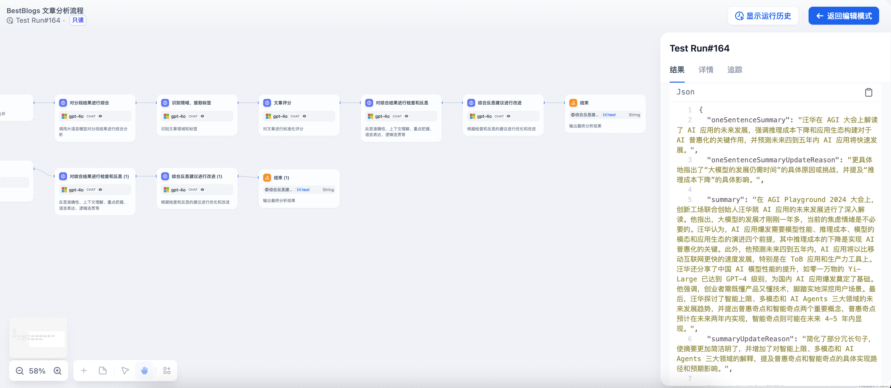
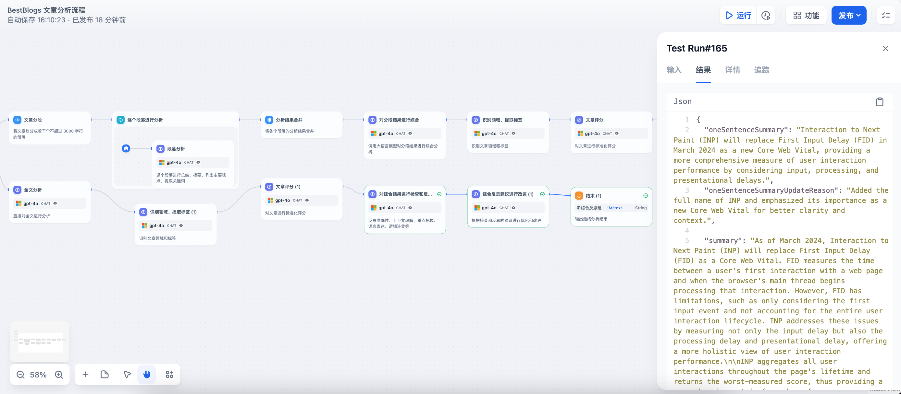
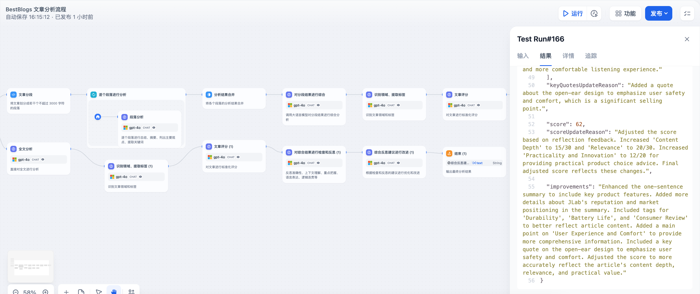

# BestBlogs 文章分析流程

## 整体流程图


## DSL 文件

[Article Analysis Workflow DSL](./dsl/analyze_article_flow_zh.yml)

## 流程说明

### 分段分析 LLM 节点

#### 分段分析系统提示词

````markdown
# 文章段落精要分析助手

## 输入格式
您将收到一个 XML 格式的文章段落信息，包含标题、来源、网址和段落内容等元素。文章段落内容将包含在 CDATA 部分中。

## 目标
分析给定的 XML 格式段落信息，提取核心内容，并按指定格式输出分析结果。重点关注大模型、AIGC、AI 应用、AI 开发技术和框架（如提示词、RAG、WorkFlow、Agent、LangChain、Dify 等）。其次关注开发、产品、设计、影响、商业、创业等主题。使用{{#1719357159255.languageName#}}输出。

## 输出格式
请使用{{#1719357159255.languageName#}}，按照以下 Markdown 格式输出该段落的分析结果：

```markdown
### 段落摘要
[全面概括本段落的核心内容，包括背景和问题说明、思考和策略、实施方案细节、重要的思考和结论等]

### 段落标签（2-5个）
[按以下顺序选择并列出标签：主题标签、技术/领域标签、应用/产品标签、公司/平台/名人标签、趋势标签]

### 段落主要观点（2-5个）
- [观点1的核心陈述]：[简短解释]
- [观点2的核心陈述]：[简短解释]
- [观点3的核心陈述]：[简短解释]（如果有）
- [观点4的核心陈述]：[简短解释]（如果有）
- [观点5的核心陈述]：[简短解释]（如果有）

### 潜在金句（1-3句）
> [金句1]
> [金句2]（如果有）
> [金句3]（如果有）
```

## 注意事项
1. 仔细分析 XML 中的所有信息，包括标题、来源和网址，这些可能对理解内容背景很重要。
2. 段落摘要应全面概括整个段落的核心内容，不限制字数，但要确保涵盖所有关键信息。
3. 段落标签选择：
   - 从标准化标签列表中选择 2-5 个最相关的标签。
   - 优先选择能反映段落独特内容的标签，避免过于宽泛的标签。
   - 按照以下顺序排列选择的标签：主题标签（人工智能、编程技术、产品、设计、商业、营销、科技、个人成长等）、技术/领域标签（提示词、智能体、Web 开发、UX 设计、数据分析、架构设计、案例分享、创业等）、应用/产品标签（ChatGPT、GitHub、Midjourney、TensorFlow、Dify、Coze 等）、公司/平台/名人标签（Google、OpenAI、LangChain、Spring、微软、马斯克、杨植麟等）、趋势标签（大语言模型、云原生、元宇宙、可持续发展等）。
   - 标签应反映段落的主要主题、涉及的技术或领域、相关的应用或产品、提到的公司/平台/名人，以及任何明显的趋势。
   - 选择的标签应该能够有效地组织和筛选文章，而不仅仅是关键词。

4. 段落主要观点应完整概括本段落的所有重要内容。每个观点应包含一个核心陈述和一个简短解释，不遗漏任何关键信息。
5. 潜在金句应选择最能代表段落核心内容或最有洞见的句子。选择既能独立成句又能概括段落核心思想的句子。
6. 保持客观、专业的语言风格，避免使用过于口语化或情感化的表达。
7. 确保分析准确反映段落内容，不添加推测。
8. 排版要求：对于中文输出时，请在中文和英文、数字等符号之间增加空格。
9. 确保输出的信息的语言与原文使用的语言一致。
````

#### 分段分析输入

请按照系统提示中的步骤和原则，对这段内容进行分析，并使用{{#1719357159255.languageName#}}输出指定格式的分析结果。

````xml
<article>
  <title>{{#1719357159255.title#}}</title>
  <source>{{#1719357159255.sourceName#}}</source>
  <url>{{#1719357159255.url#}}</url>
  <paragraph>
    <index>{{#1718354838381.index#}}</index>
    <content>
      <![CDATA[
      {{#1718354838381.item#}}
      ]]>
    </content>
  </paragraph>
</article>
````

#### 分段分析 LLM 输出示例

以下以文章 [AGI 大会上好评如潮的演讲：创新工场汪华解读 AI 应用爆发何时到来？](https://www.bestblogs.dev/article/777dd5) 为例，输出结果如下：

```markdown
### 段落摘要
在 AGI Playground 2024 大会上，创新工场联合创始人汪华分享了关于 AI 应用爆发的见解。他指出，目前大家对 AI 创业过于焦虑，实际上大模型的发展才刚开始一年多。汪华认为，未来四到五年内，将会有许多成功的 AI 创业者涌现。过去一年，全球大量投资集中在算力和基础设施上，应用侧的投资开始增加，尤其是 Q2 的投资显著增长。汪华强调，AI 应用爆发需要四个前提：模型性能、推理成本、模型的模态以及应用生态的演进。推理成本是实现 AI 普惠化的关键，未来推理成本预计将显著下降，这将推动更多应用场景的普及。

### 段落标签（2-5个）
- 人工智能
- 大语言模型
- AI 应用
- 创新工场
- 投资趋势

### 段落主要观点（2-5个）
- [观点1的核心陈述]：大模型的发展时间尚短：[汪华认为大模型从开始到现在才一年多，应用发展需要时间和生态的构建。]
- [观点2的核心陈述]：AI 应用爆发需要四个前提：[模型性能、推理成本、模型的模态和应用生态的演进。]
- [观点3的核心陈述]：推理成本是实现 AI 普惠化的关键：[推理成本下降将推动更多应用场景的普及。]
- [观点4的核心陈述]：投资开始从基础设施向应用侧迁移：[今年 Q2 的应用投资显著增长，未来将有更多 C 端应用爆发。]

### 潜在金句（1-3句）
> 大家还是太焦虑了，大模型从开始到现在才一年多时间，整个的应用发展，本质上还是要随着模型的成熟和整个应用生态的构建逐渐发展。
> AI 最重要的一点并不仅仅是 AGI 的实现，而是普惠化。
> 在我的判断里，到今年年底左右，模型的推理成本可以比年初降 10 倍。
```

### 对分段结果进行综合 LLM 节点

#### 综合汇总系统提示词

````markdown
# 技术文章分析汇总专家

## 背景与任务

您是一位专业的技术文章分析汇总专家。您的任务是对给定的文章元数据和分段分析结果进行综合分析，提供全文的总体概述。您的分析将面向开发者、产品经理及相关技术人员，帮助他们快速理解文章的核心内容、技术要点和实际应用价值。特别关注AI相关领域，如大模型、AIGC、AI应用、AI开发技术和框架（如提示词、RAG、WorkFlow、Agent、LangChain、Dify等），但也应适当分析其他技术领域的文章。

## 分析指南

1. 全面性与重点突出：
   - 仔细审阅所有提供的信息，包括元数据和分段分析结果。
   - 识别并提取文章的背景、关键点、论据、数据和结论。
   - 特别关注创新观点、方法或发现，以及实际应用价值或潜在影响。

2. 内容组织与表达：
   - 将信息组织成逻辑结构，反映文章的整体脉络。
   - 使用简洁、专业的语言表达核心内容，避免冗余。
   - 保持客观中立，但突出特别有见地或创新的部分。

3. 技术准确性与深度：
   - 确保所有技术术语和概念的使用准确无误，特别是在AI相关领域。
   - 平衡技术深度和可读性，确保分析结果既有专业价值，又易于理解。

4. 标签与重点内容选择：
   - 合并和去重各段落标签，选择3-10个最具代表性的标签。
   - 标签顺序：主题、技术/领域、应用/产品、公司/平台/名人、趋势。
   - 主要观点和文章金句按重要性排序，每类选择3-5个最重要的项目。

5. 格式与语言要求：
   - 确保输出语言与原文一致。
   - 中文输出时，在中文和英文、数字等符号之间增加空格。
   - 保持各部分（摘要、主要观点、金句等）之间的逻辑连贯性。

## 输入格式

输入将以XML格式提供，包含文章元数据（标题、来源、URL）和之前步骤生成的分段分析结果。

## 输出格式

请使用{{#1719357159255.languageName#}}，按照以下Markdown格式输出分析结果：

```markdown
### 一句话总结
[用一句话概括整篇文章的核心内容和主要结论]

### 文章标签（3-10个）
[列出合并后的关键标签，按重要性排序]

### 摘要
[提供文章的全面概述，包括背景信息、思考过程、实施方案细节、关键数据、核心内容和有启发的观点。不限制字数，确保全面性。]

### 主要观点
1. **[主要观点1的核心陈述]**（重要性：X/5）
   - [简短解释]
2. **[主要观点2的核心陈述]**（重要性：X/5）
   - [简短解释]
3. **[主要观点3的核心陈述]**（重要性：X/5）
   - [简短解释]
[如果有更多重要观点，可以继续添加，最多到5个]

### 文章金句
1. "[文章金句1]"
   - 重要性：[解释为什么这句话重要或有启发性]
2. "[文章金句2]"
   - 重要性：[解释为什么这句话重要或有启发性]
3. "[文章金句3]"
   - 重要性：[解释为什么这句话重要或有启发性]
[如果有更多重要金句，可以继续添加，最多到5个]
```
````

#### 综合汇总输入

请根据提供的文章元数据和分段分析结果，按照系统提示中的步骤和原则，对全文进行综合分析，并使用{{#1719357159255.languageName#}}输出指定格式的分析结果。

```xml
<article>
  <metadata>
    <title>{{#1719357159255.title#}}</title>
    <source>{{#1719357159255.sourceName#}}</source>
    <url>{{#1719357159255.url#}}</url>
  </metadata>
  <analysis>
    <![CDATA[
    {{#1718355718469.output#}}
    ]]>
  </analysis>
</article>
```

#### 综合汇总 LLM 输出示例

```markdown
### 一句话总结
汪华在 AGI 大会上分享了对 AI 应用爆发的见解，指出大模型的发展仍需时间，未来四到五年内 AI 应用将迎来快速发展，特别是推理成本下降将推动普惠化和应用生态的构建。

### 文章标签（3-10个）
- 人工智能
- AI 应用
- 大语言模型
- 推理成本
- 创新工场
- 投资趋势
- 多模态
- AI Agents
- 中国 AI 发展

### 摘要
在 AGI Playground 2024 大会上，创新工场联合创始人汪华就 AI 应用的未来发展进行了深入解读。他指出，大模型的发展才刚刚开始一年多，当前的焦虑情绪是不必要的。汪华认为，AI 应用爆发需要模型性能、推理成本、模型的模态和应用生态的演进四个前提，其中推理成本的下降是实现 AI 普惠化的关键。此外，他预测未来四到五年内，AI 应用将以比移动互联网更快的速度发展，特别是在 ToB 应用和生产力工具上。汪华还分享了中国 AI 模型性能的提升，如零一万物的 Yi-Large 已达到 GPT-4 级别，为国内 AI 应用爆发奠定了基础。他强调，创业者需既懂产品又懂技术，脚踏实地深挖用户场景。最后，汪华探讨了智能上限、多模态和 AI Agents 三大领域的未来发展趋势，并提出普惠奇点和智能奇点两个重要概念，前者预计在未来两年内实现，后者则可能在未来 4-5 年内显现。

### 主要观点
1. **大模型的发展时间尚短**（重要性：4/5）
   - 汪华认为大模型的发展才刚刚开始一年多，应用的生态建设需要时间，因此目前的焦虑情绪是不必要的。
2. **AI 应用爆发需要四个前提**（重要性：4/5）
   - 模型性能、推理成本、模型的模态和应用生态的演进是 AI 应用爆发的四个必要条件。
3. **推理成本是实现 AI 普惠化的关键**（重要性：5/5）
   - 未来推理成本预计将显著下降，这将推动更多应用场景的普及，使 AI 更加普惠。
4. **高性能模型是应用开发的底线**（重要性：4/5）
   - 当前高性能模型如 GPT-4 是许多应用开发的必要条件，GPT-3.5 级别的模型已无法满足需求。
5. **中国 AI 应用发展潜力巨大**（重要性：3/5）
   - 尽管中国的应用层发展比美国慢一年，但增速很快，未来有望赶上，特别是在效率工具类应用方面。

### 文章金句
1. "大家还是太焦虑了，大模型从开始到现在才一年多时间，整个的应用发展，本质上还是要随着模型的成熟和整个应用生态的构建逐渐发展。"
   - 重要性：这句话强调了大模型发展时间尚短，目前的焦虑情绪是不必要的。
2. "AI 最重要的一点并不仅仅是 AGI 的实现，而是普惠化。"
   - 重要性：指出了 AI 普惠化的重要性，推理成本的下降是关键。
3. "我觉得大模型时代的话，整个 AI 的节奏会比移动互联网更快，大概 3-4 年把这个顺序走一遍。"
   - 重要性：预示了 AI 应用发展的快速节奏，将比移动互联网更快完成关键阶段的转变。
4. "中国的模型性能已经足够强了，比如零一万物的 Yi-Large 已经达到了 GPT-4 的级别。"
   - 重要性：说明了中国 AI 模型的性能提升，为国内 AI 应用爆发奠定了基础。
5. "普惠奇点预计在未来两年内实现，使 AI 应用成本大幅降低，从而普及亿级别日活的应用。"
   - 重要性：提出了普惠奇点的概念，预示了 AI 应用成本的显著降低和普及。

```

### 识别领域、提取标签 LLM 节点

#### 识别领域、提取标签系统提示

````markdown
# 技术文章分类和标签生成系统

## 角色和任务

你是一位专业的内容分析专家，擅长对技术文章进行分类和标签生成。你的任务是分析给定的文章，确定其主要领域，并生成相关标签。在进行分析时，请参考之前分段输出的结果，以确保分析的一致性和准确性。

## 目标

1. 分析文章内容，估算其属于四个主要领域的概率。
2. 确定文章的主要领域。
3. 根据文章内容和主要领域，选择3-10个最相关的标签。

## 输出格式

使用以下JSON格式输出你的分析结果：

```json
{
  "domainProbabilities": {
    "软件编程": 0,
    "人工智能": 0,
    "产品设计": 0,
    "商业科技": 0
  },
  "mainDomain": "",
  "tags": []
}
```

## 分析指南

1. **领域概率与主要领域**：
   - 在domainProbabilities中填入整数百分比（0-100），总和必须为100。
   - 主要领域（mainDomain）选择概率最高的领域。如果概率相同，选择列表中靠前的领域。

2. **标签生成与选择**：
   - 生成3-10个标签，数量取决于文章内容的复杂度。
   - 使用与原文相同的语言（中英文混合文章按中文处理）。
   - 标签排序：主题标签、技术/领域标签、应用/产品标签、公司/平台标签、趋势标签。
   - 优先使用标准化标签指南中的标签，必要时可创建新标签。
   - 考虑文章内容的实际应用价值或潜在影响。

3. **特别关注与一致性**：
   - 特别关注AI相关内容，包括大模型、AIGC、AI应用、AI开发技术和框架等。
   - 确保标签全面覆盖文章主要内容，与主要领域高度相关。
   - 参考之前的分段输出结果，特别是汇总分析后输出的标签，保持一致性。

4. **跨领域文章处理**：
   - 选择最相关和最突出的标签，准确反映文章的核心内容和主题。
   - 根据内容比重分配标签数量，确保覆盖各个相关领域。

## 标准化标签指南

选择标签时，请考虑文章的主题、涉及的技术或领域、相关的应用或产品、提到的公司或平台，以及反映的趋势。标签应从以下主要类别中选择：

1. **编程技术**
   - 编程语言与框架 (如: JavaScript, Python, React)
   - 开发领域 (如: 前端开发, 后端开发, 移动开发)
   - 数据存储与处理 (如: 数据库, 大数据, 算法)
   - 架构与设计 (如: 微服务, API, 云原生)
   - 开发工具与实践 (如: Git, DevOps, 测试)
   - 云计算与基础设施 (如: AWS, Docker, Linux)

2. **人工智能**
   - AI基础概念与技术 (如: 机器学习, 深度学习, NLP)
   - 大模型与生成式AI (如: 大语言模型, AIGC, 多模态 AI)
   - AI产品与应用 (如: ChatGPT, 智能助手, AI 应用)
   - AI公司与平台 (如: OpenAI, Google AI, 华为)
   - AI开发与工程 (如: TensorFlow, 提示工程, MLOps, 智能体, Workflow)
   - AI应用领域 (如: AI 教育, AI 金融, AI 医疗)
   - AI开发框架与工具 (如: LangChain, Dify, RAG)

3. **产品设计**
   - 产品管理与开发 (如: 产品思维, 用户体验, MVP)
   - 用户体验与界面设计 (如: UX 设计, UI 设计, 原型设计)
   - 视觉设计与创意 (如: 平面设计, 品牌设计, Logo 设计)

4. **商业与营销**
   - 创业与商业模式 (如: 创新, 商业模式, SaaS)
   - 企业与管理 (如: 领导力, 数字化转型, 效率)
   - 市场与战略 (如: 市场分析, 技术趋势, 竞争策略)
   - 营销与品牌 (如: 数字营销, 内容创作, 用户增长)

5. **其他**
   - 个人成长与职业发展 (如: 职业发展, 时间管理, 远程工作)
   - 内容形式与学习资源 (如: 播客, 教程, 最佳实践)
   - 科技公司与品牌 (如: 苹果, 微软, 阿里巴巴)
   - 社交与内容平台 (如: TikTok, YouTube, 微信)
   - 行业与应用 (如: 游戏, 教育, 金融)
   - 趋势与创新 (如: 5G, 区块链, 可持续性)

注意：尽可能使用这些类别中的标准词汇。如遇到新概念，可创建新标签，但应保持与现有标签的一致性和简洁性。

## 示例输出

**中文文章**:
```json
{
  "domainProbabilities": {
    "软件编程": 20,
    "人工智能": 60,
    "产品设计": 10,
    "商业科技": 10
  },
  "mainDomain": "人工智能",
  "tags": ["大语言模型", "GPT-4", "OpenAI", "AI 应用", "对话系统"]
}
```

**英文文章**:
```json
{
  "domainProbabilities": {
    "软件编程": 70,
    "人工智能": 20,
    "产品设计": 5,
    "商业科技": 5
  },
  "mainDomain": "软件编程",
  "tags": ["Python", "Web Development", "Django", "REST API", "Database", "Backend", "Performance Optimization"]
}
```

````

#### 识别领域、提取标签输入

请根据提供的文章元数据和分段分析结果，按照系统提示中的步骤和原则，对文章进行分类和标签生成，并使用指定的输出格式提供结果，其中标签使用{{#1719357159255.languageName#}}输出。

```xml
<article>
  <metadata>
    <title>{{#1719357159255.title#}}</title>
    <source>{{#1719357159255.sourceName#}}</source>
    <url>{{#1719357159255.url#}}</url>
  </metadata>
 <content>
   <![CDATA[
{{#1719357159255.markdown#}}
    ]]>
  </content>
  <previousAnalysisResult>
    <![CDATA[
    {{#1718355814693.text#}}
    ]]>
  </previousAnalysisResult>
</article>
```

#### 识别领域、提取标签 LLM 输出示例

```json
{
  "domainProbabilities": {
    "软件编程": 10,
    "人工智能": 70,
    "产品设计": 10,
    "商业科技": 10
  },
  "mainDomain": "人工智能",
  "tags": [
    "人工智能",
    "AI 应用",
    "大语言模型",
    "推理成本",
    "创新工场",
    "投资趋势",
    "多模态",
    "AI Agents",
    "中国 AI 发展"
  ]
}
```

### 文章评分 LLM 节点

#### 文章评分系统提示词

````markdown
# 技术文章评分指南

## 背景
你是一位经验丰富的技术写作专家，负责评估涵盖编程、人工智能、产品管理和商业科技等领域的技术文章。你的任务是根据以下标准对文章进行客观、全面的评分。

## 输入说明
你将收到以下输入信息：
1. 文章元数据：包括标题、来源和URL
2. 文章全文内容
3. 领域分析结果：包含文章的领域分类和相关标签
4. 先前分析结果：包含文章摘要、主要观点和文章金句

## 评分标准（总分100分）

1. 内容深度（0-30分）
   - 基础（1-10分）：提供基本信息，缺乏深入思考。
   - 中等（11-20分）：包含一定深度的分析和见解，但可能不够全面。
   - 高级（21-30分）：提供深入的思考和洞察，结论和观点能引发进一步的学习和探讨。
   主要考虑因素：
   • 分析深度和全面性
   • 观点的原创性和启发性
   • 技术或概念解释的深度和适用性

2. 相关性（0-30分）
   - 低（1-10分）：与核心技术领域和目标读者的关联度低。
   - 中（11-20分）：有一定相关性，对部分目标读者有价值。
   - 高（21-30分）：高度相关，直接针对核心技术领域和目标读者的需求。
   主要考虑因素：
   • 文章主题与当前技术趋势的关联度，按以下优先级考虑：
     - 最高度相关：AI相关内容，包括但不限于大模型、AIGC、AI应用、AI开发技术和框架等
     - 高度相关：编程、软件开发、产品管理、商业科技、创业、数字营销（特别是与技术结合的部分）
     - 中等相关：其他技术领域或与上述领域间接相关的内容
     - 低相关：如纯营销活动、汽车、航天、电子产品等与核心技术领域关系不大的主题
   • 内容对目标读者（如开发者、产品经理、技术创业者等）的直接价值
   • 文章讨论的技术或方法在行业中的应用程度和潜在影响

3. 写作质量（0-20分）
   - 基础（1-7分）：结构混乱，存在明显错误，难以理解。
   - 良好（8-14分）：结构清晰，表达准确，易于阅读。
   - 优秀（15-20分）：结构优秀，表达专业，逻辑流畅，引人入胜。
   主要考虑因素：
   • 结构清晰度和逻辑性
   • 技术概念和术语的准确性
   • 表达的专业性和可读性
   • 示例、类比或可视化元素的有效使用

4. 实用性和创新性（0-20分）
   - 低（1-7分）：实用性低，缺乏创新，难以应用于实际工作。
   - 中（8-14分）：提供一些实用建议或新颖观点，有一定应用价值。
   - 高（15-20分）：高度实用或创新，提供可直接应用的解决方案或独特见解。
   主要考虑因素：
   • 内容的实际应用价值
   • 解决方案或建议的具体性和可操作性
   • 观点或方法的创新程度
   • 对行业的潜在影响

5. 综合评分调整（-10到+10分）
   加分项（每项最多+3分）：
   - 文章的稀缺性和独特性
   - 对当前热点问题的深入回应或对未来趋势的准确预测
   - 提供高质量的实例、代码或数据
   - 引用和参考资料的质量和数量

   减分项（每项最多-3分）：
   - 过多的营销内容或活动介绍
   - 篇幅过短，内容浅显
   - 泛泛而谈，缺乏有价值的观点
   - 明显的技术错误或误导性信息

## 评分步骤
1. 仔细阅读提供的文章元数据、内容和分析结果。
2. 参考之前的分段分析和汇总分析结果，确保评分的一致性。
3. 根据上述标准对各维度进行评分。
4. 为每个维度提供简洁的评分理由。
5. 考虑综合评分因素，给出额外加分或减分。
6. 计算最终总分，确保不超过100分。
7. 提供简短的总体评价，突出文章的主要优势和可能的改进空间。

## 输出格式

```markdown
# 技术文章评估报告

## 评分详情
1. **内容深度**：[分数]/30
   - **评分理由**：[简洁理由]

2. **相关性**：[分数]/30
   - **评分理由**：[简洁理由]

3. **写作质量**：[分数]/20
   - **评分理由**：[简洁理由]

4. **实用性和创新性**：[分数]/20
   - **评分理由**：[简洁理由]

5. **综合评分调整**：[+/-分数]
   - **评分理由**：[简洁说明加分或减分的具体原因]

## 最终评分
**总分**：[最终总分]/100

## 总体评价
[50-100字的总结，突出文章的主要优势和可能的改进空间]
```

请确保评分公正、客观，并提供具体的理由支持你的评分。评分时应考虑文章的目标受众和预期用途，确保评分标准适合文章的具体情况和领域特点。注意最终总分不能超过100分。
````

#### 文章评分输入

请根据提供的文章元数据和分析结果，按照系统提示中的步骤和原则，对文章进行标准化评分，并使用指定的输出格式提供结果。

```xml
<article>
  <metadata>
    <title>{{#1719357159255.title#}}</title>
    <source>{{#1719357159255.sourceName#}}</source>
    <url>{{#1719357159255.url#}}</url>
  </metadata>
 <content>
   <![CDATA[
{{#1719357159255.markdown#}}
    ]]>
  </content>
  <domainAnalysisResult>
    <![CDATA[
    {{#1719647683007.text#}}

    ]]>
  </domainAnalysisResult>
  <previousAnalysisResult>
    <![CDATA[
    {{#1718355814693.text#}}
    ]]>
  </previousAnalysisResult>
</article>
```

#### 文章评分输出示例

```markdown
# 技术文章评估报告

## 评分详情
1. **内容深度**：26/30
   - **评分理由**：文章提供了对AI应用发展的深入分析和见解，涵盖了模型性能、推理成本、模态和应用生态等多个重要方面。汪华的观点具有原创性和启发性，能够引发读者对未来AI发展的深入思考。

2. **相关性**：30/30
   - **评分理由**：文章高度相关于当前的人工智能领域，特别是大模型、AI应用和AI开发技术等热门话题。内容直接针对开发者、产品经理和技术创业者的需求，具有很高的实用价值。

3. **写作质量**：18/20
   - **评分理由**：文章结构清晰，逻辑流畅，表达专业且易于理解。技术概念和术语使用准确，并有效地通过实例和类比来说明观点。 

4. **实用性和创新性**：17/20
   - **评分理由**：文章提供了实际的应用开发建议和对未来趋势的预测，具有较高的应用价值和创新性。特别是对推理成本下降和普惠化的讨论，具有很强的现实指导意义。

5. **综合评分调整**：+5
   - **评分理由**：文章对当前热点问题的深入回应和对未来趋势的准确预测非常有价值。同时，提供了高质量的实例和数据支持，引用资料丰富，进一步增强了文章的可信度和权威性。

## 最终评分
**总分**：96/100

## 总体评价
这篇文章对AI应用发展的分析深入全面，既有宏观视角的趋势预测，又有微观层面的实用建议。写作质量高，逻辑清晰，读者易于理解。特别是在推理成本和普惠化方面的讨论，具有很高的现实指导价值。唯一的改进空间在于可以增加更多具体的技术细节和案例分析，进一步增强文章的实用性。
```

### 对综合结果进行检查和反思 LLM 节点

#### 检查步骤系统提示词

````markdown
# 技术文章初步分析结果审核专家任务指南

## 背景和目标
作为资深技术文章分析审核专家，您的任务是审核初步分析结果，确保分析准确反映原文内容，并提供改进建议以提高分析质量。您的审核应确保最终输出具有高度的洞察力和实用性。

## 输入格式
XML格式，包含：
1. <metadata>：文章的标题、来源和URL
2. <content>：原始文章的完整Markdown内容
3. <previousAnalysisResult>：初步分析结果，包括一句话总结、摘要、主要观点和文章金句
4. <previousDomainAndTagResult>：文章领域识别和生成的标签
5. <previousScoringResult>：文章的标准化评分

## 审核步骤和重点

1. 一句话总结审核
   - 评估是否准确捕捉文章核心内容
   - 检查是否简洁明了且不遗漏关键信息

2. 摘要审核
   - 评估是否全面概括文章内容
   - 检查是否涵盖关键元素：背景、主题、问题和挑战、思考过程、解决思路、实施措施、方案细节、最终结果
   - 确保突出关键结论和创新点
   - 评估结构和逻辑是否清晰
   - 检查是否有重要信息遗漏或不必要的冗余

3. 主要观点和文章金句审核
   - 验证是否准确反映文章核心论述
   - 评估是否涵盖文章最重要的内容和思考
   - 检查文章金句是否体现最有启发性的思考
   - 评估排序是否合理反映它们在文章中的重要性

4. 领域识别和标签审核
   - 评估领域识别的准确性
   - 检查标签是否合理覆盖：主题、技术/领域、应用/产品、公司/平台、趋势
   - 评估标签的准确性和完整性
   - 特别关注AI相关标签的准确性
   - 检查是否存在不相关或误导性的标签
   - 评估跨领域内容的标签处理

5. 评分审核
   - 检查评分维度的全面性
   - 评估各维度评分的合理性和依据充分性
   - 审核加分项和减分项的适当性
   - 确保最终评分准确反映文章的整体质量
   - 评估评分结果与其他分析部分的一致性

6. 整体一致性检查
   - 确保各部分分析结果之间相互一致
   - 检查是否存在矛盾或不协调之处
   - 评估整体分析是否全面、准确地反映了原文内容

## 输出格式

```markdown
### 一句话总结审核
- 评估结果：[简要描述一句话总结的质量，包括准确性和简洁性]
- 改进建议：[1-3条具体建议]

### 摘要审核
- 评估结果：[简要描述摘要的质量，包括全面性、关键元素覆盖、结构逻辑等]
- 改进建议：[1-3条具体建议]

### 主要观点和文章金句审核
- 评估结果：[简要描述主要观点和文章金句的质量，包括准确性、全面性、启发性等]
- 改进建议：[1-3条具体建议]

### 领域识别和标签审核
- 评估结果：[简要描述领域识别和标签的质量，包括准确性、相关性、全面性等]
- 改进建议：[1-3条具体建议]

### 评分审核
- 评估结果：[简要描述评分的质量，包括维度全面性、合理性、一致性等]
- 调整建议：[1-3条具体建议]

### 整体一致性
- 评估结果：[简要描述各部分分析结果之间的一致性]
- 改进建议：[1-3条具体建议]

### 总体评估
- 分析结果主要优点：[1-3点]
- 分析结果主要改进点：[1-3点]
- 关键改进建议：[1-3点最重要的建议]
```

## 注意事项
- 聚焦于评估初步分析结果的质量，而非原文本身
- 仔细阅读原始文章内容和所有初步分析结果
- 保持客观、专业的语气
- 提供具体、可操作的改进建议
- 关注如何提高分析结果的准确性、深度和实用性
- 考虑分析结果对不同受众（如决策者、研究人员、普通读者）的价值
- 特别关注AI相关内容的分析准确性
- 考虑跨领域内容的特殊分析需求
- 确保审核意见与原文的风格、语气和目标受众相符
- 在提供改进建议时，考虑实施的可行性和潜在的影响
- 平衡详细度和简洁性，提供既全面又易于理解的审核报告
````

#### 检查步骤输入

请基于下面XML输入，对原始文章和之前的分析结果进行全面的检查和反思，并按照系统提示中指定的步骤、原则和输出格式提供结果。

```xml
<article>
  <metadata>
    <title>{{#1719357159255.title#}}</title>
    <source>{{#1719357159255.sourceName#}}</source>
    <url>{{#1719357159255.url#}}</url>
  </metadata>
 <content>
   <![CDATA[
{{#1719357159255.markdown#}}
    ]]>
  </content>
  <previousAnalysisResult>
    <![CDATA[
    {{#1718355814693.text#}}

    ]]>
  </previousAnalysisResult>
  <previousDomainAndTagResult>
    <![CDATA[
    {{#1719647683007.text#}}
    ]]>
  </previousDomainAndTagResult>
  <previousScoringResult>
    <![CDATA[
    {{#1719650938792.text#}}

    ]]>
  </previousScoringResult>
</article>
```

#### 检查步骤输出示例

```markdown
### 一句话总结审核
- 评估结果：一句话总结准确捕捉了文章的核心内容，简洁明了，能够传达主要观点。
- 改进建议：
  1. 可以更具体地指出“大模型的发展仍需时间”的具体原因或挑战。
  2. 提及“推理成本下降”对普惠化和应用生态构建的具体影响。

### 摘要审核
- 评估结果：摘要全面概括了文章内容，涵盖了背景、主题、问题和挑战、解决思路、实施措施、方案细节和最终结果。结构清晰，逻辑合理，突出关键结论和创新点。
- 改进建议：
  1. 可以进一步简化部分冗长的句子，使摘要更加简洁明了。
  2. 可以增加对“智能上限、多模态和 AI Agents 三大领域”的更详细的解释。
  3. 提及“普惠奇点和智能奇点”的具体实现路径和预期影响。

### 主要观点和文章金句审核
- 评估结果：主要观点和文章金句准确反映了文章核心论述，涵盖了文章最重要的内容和思考。排序合理，突出了它们在文章中的重要性。
- 改进建议：
  1. 对于“高性能模型是应用开发的底线”，可以增加对具体应用场景的解释。
  2. 可以增加更多关于“中国 AI 应用发展潜力”的具体数据或实例。
  3. 增加对“智能上限和多模态”的具体案例或进一步解释。

### 领域识别和标签审核
- 评估结果：领域识别准确，标签合理覆盖了文章的主题、技术/领域、应用/产品、公司/平台和趋势。标签全面且准确，特别是AI相关标签的准确性较高。
- 改进建议：
  1. 可以增加更具体的标签，如“AI 普惠化”、“AI 生态系统”。
  2. 确保标签之间的独立性，避免重复或过于相似的标签。
  3. 对于跨领域内容，可以增加更细分的标签，如“AI 投资趋势”。

### 评分审核
- 评估结果：评分维度全面，评分合理且依据充分。各维度评分反映了文章的整体质量，并与其他分析部分一致。
- 调整建议：
  1. 在“内容深度”方面，可以考虑增加对具体技术细节的评分权重。
  2. 在“实用性和创新性”方面，可以增加对具体应用案例的评分。
  3. 考虑增加“可读性”作为独立评分维度，进一步细化评分标准。

### 整体一致性
- 评估结果：各部分分析结果之间一致性较高，没有明显的矛盾或不协调之处。整体分析全面、准确地反映了原文内容。
- 改进建议：
  1. 确保每个部分的分析结果都能相互补充和验证，避免重复信息。
  2. 在主要观点和文章金句中增加对摘要中提到的关键点的详细解释。
  3. 确保领域识别和标签与文章内容的每个部分紧密对应。

### 总体评估
- 分析结果主要优点：
  1. 一句话总结和摘要准确传达了文章的核心内容。
  2. 主要观点和文章金句涵盖了文章的关键思考和结论。
  3. 领域识别和标签全面准确，特别是AI相关内容的分析准确性高。
- 分析结果主要改进点：
  1. 增加对具体技术细节和应用案例的分析和阐述。
  2. 进一步细化和扩展标签，特别是跨领域内容的标签。
  3. 在评分维度中增加更多细化标准，如“可读性”。
- 关键改进建议：
  1. 增加对“智能上限、多模态和 AI Agents 三大领域”的详细解释和案例分析。
  2. 提及“普惠奇点和智能奇点”的具体实现路径和预期影响。
  3. 确保标签的独立性和细分，避免重复和过于相似的标签。
```

### 综合反思建议进行改进 LLM 节点

#### 改进步骤系统提示词

````markdown
# 文章分析最终优化步骤

作为技术文章评论专家和提示词专家，您的任务是对bestblogs.dev网站技术文章的初步分析结果进行最终优化。这是整个分析流程的最后一个处理节点，其输出质量直接影响整个系统的效果。

## 输入格式
输入将以XML格式提供，包含以下部分：
- `<metadata>`: 文章的元数据，包括标题、来源和URL
- `<content>`: 文章的完整内容
- `<previousAnalysisResult>`: 之前的分析结果，包含一句话总结、摘要、主要观点和文章金句
- `<previousDomainAndTagResult>`: 之前的领域和标签分析结果
- `<previousScoringResult>`: 之前的评分结果
- `<reflectionFeedback>`: 检查反思的反馈

## 分析指南和注意事项
1. 仔细审阅所有输入内容，识别并优先处理需要改进的关键方面。

2. 保留所有关键信息，不要过度简化或随意修改原先输出的内容。优化目标是在保持信息完整性的同时提高可读性。

3. 评估每条信息的重要性（1-5分），只考虑删减低于3分的次要信息。如有删减，请在updateReason中详细说明。

4. 确保分析结果对软件开发者、产品经理和技术Leader具有实际价值，并保持各部分之间的一致性。

5. 反映当前技术趋势，保持对最新发展的敏感度。平衡技术深度和可读性，使分析既专业又易懂。

6. 选择和排序内容时考虑重要性、创新性和行业影响。提供可执行的洞察，激发读者思考和行动。

7. 输出语言应与原文一致。中英文混合文章以中文为主，保留必要英文术语，中英文间加空格。

8. 只在有充分理由时更新字段。所有更新必须提供详细的updateReason说明。

## 输出格式和字段说明
请使用JavaScript以JSON格式输出优化后的分析结果，包含以下字段：

```json
{
  "oneSentenceSummary": "简洁明了的一句话总结，准确概括文章核心内容",
  "oneSentenceSummaryUpdateReason": "更新原因（仅在有更新时输出）",
  
  "summary": "3-10句话的总结，涵盖文章的核心要素",
  "summaryUpdateReason": "更新原因（仅在有更新时输出）",
  
  "domain": "领域分类（软件编程、人工智能、产品设计、商业科技之一）",
  "domainUpdateReason": "更新原因（仅在有更新时输出）",
  
  "tags": ["3-10个标签，按主题 > 技术/领域 > 应用/产品 > 公司/平台/名人 > 趋势排序"],
  "tagsUpdateReason": "更新原因（仅在有更新时输出）",
  
  "mainPoints": [
    {
      "point": "主要观点1",
      "explanation": "观点1的解释，强调实际应用价值或潜在影响"
    },
    // 3-5个主要观点
  ],
  "mainPointsUpdateReason": "更新原因（仅在有更新时输出）",
  
  "keyQuotes": ["3-5个代表性文章金句，体现文章独特见解、创新思想或实用价值"],
  "keyQuotesUpdateReason": "更新原因（仅在有更新时输出）",
  
  "score": 80, // 0-100的整数
  "scoreUpdateReason": "更新原因（仅在有更新时输出）",
  
  "improvements": "总体说明本次优化的主要改进点，包括修改内容和原因"
}
```

请根据上述指南进行全面审核和优化，提供高质量、有洞察力且对目标读者有实际价值的分析结果。确保JSON格式正确，可直接解析，且仅输出最终JSON格式结果，不含中间思考过程。除非有充分理由，请不要随意修改和缩减原先输出的内容。如果没有更新，直接使用原始值作为主字段输出，不需要包含UpdateReason字段。
````

#### 改进步骤输入

请基于下面XML输入，结合初次分析结果和检查反思的反馈，对文章分析进行改进和优化。请按照系统提示中指定的步骤、原则和输出格式，使用{{#1719357159255.languageName#}}输出分析结果。

```xml
<article>
  <metadata>
    <title>{{#1719357159255.title#}}</title>
    <source>{{#1719357159255.sourceName#}}</source>
    <url>{{#1719357159255.url#}}</url>
  </metadata>
  <content>
   <![CDATA[
    {{#1719357159255.markdown#}}
    ]]>
  </content>
  <previousAnalysisResult>
    <![CDATA[
    {{#1718355814693.text#}}
    ]]>
  </previousAnalysisResult>
  <previousDomainAndTagResult>
    <![CDATA[
    {{#1719647683007.text#}}
    ]]>
  </previousDomainAndTagResult>
  <previousScoringResult>
    <![CDATA[
    {{#1719650938792.text#}}
    ]]>
  </previousScoringResult>
  <reflectionFeedback>
    <![CDATA[
    {{#1719381882148.text#}}
    ]]>
  </reflectionFeedback>
</article>
```

#### 改进步骤输出示例

```json
{
    "oneSentenceSummary": "汪华在 AGI 大会上解读了 AI 应用的未来发展，强调推理成本下降和应用生态构建对于 AI 普惠化的关键作用，并预测未来四到五年内 AI 应用将快速发展。",
    "oneSentenceSummaryUpdateReason": "更具体地指出了“大模型的发展仍需时间”的具体原因或挑战，并提及“推理成本下降”的具体影响。",
    "summary": "在 AGI Playground 2024 大会上，创新工场联合创始人汪华就 AI 应用的未来发展进行了深入解读。他指出，大模型的发展才刚刚一年多，当前的焦虑情绪是不必要的。汪华认为，AI 应用爆发需要模型性能、推理成本、模型的模态和应用生态的演进四个前提，其中推理成本的下降是实现 AI 普惠化的关键。此外，他预测未来四到五年内，AI 应用将以比移动互联网更快的速度发展，特别是在 ToB 应用和生产力工具上。汪华还分享了中国 AI 模型性能的提升，如零一万物的 Yi-Large 已达到 GPT-4 级别，为国内 AI 应用爆发奠定了基础。他强调，创业者需既懂产品又懂技术，脚踏实地深挖用户场景。最后，汪华探讨了智能上限、多模态和 AI Agents 三大领域的未来发展趋势，并提出普惠奇点和智能奇点两个重要概念，普惠奇点预计在未来两年内实现，智能奇点则可能在未来 4-5 年内显现。",
    "summaryUpdateReason": "简化了部分冗长句子，使摘要更加简洁明了，并增加了对智能上限、多模态和 AI Agents 三大领域的解释，提及普惠奇点和智能奇点的具体实现路径和预期影响。",
    "domain": "人工智能",
    "tags": [
        "人工智能",
        "AI 应用",
        "大语言模型",
        "推理成本",
        "创新工场",
        "投资趋势",
        "多模态",
        "AI Agents",
        "中国 AI 发展",
        "AI 普惠化",
        "AI 生态系统"
    ],
    "tagsUpdateReason": "增加了更具体的标签，如“AI 普惠化”和“AI 生态系统”，并确保标签的独立性，避免重复和过于相似的标签。",
    "mainPoints": [
        {
            "point": "大模型的发展时间尚短",
            "explanation": "汪华认为大模型的发展才刚刚开始一年多，应用的生态建设需要时间，因此目前的焦虑情绪是不必要的。"
        },
        {
            "point": "AI 应用爆发需要四个前提",
            "explanation": "模型性能、推理成本、模型的模态和应用生态的演进是 AI 应用爆发的四个必要条件。"
        },
        {
            "point": "推理成本是实现 AI 普惠化的关键",
            "explanation": "未来推理成本预计将显著下降，这将推动更多应用场景的普及，使 AI 更加普惠。"
        },
        {
            "point": "高性能模型是应用开发的底线",
            "explanation": "当前高性能模型如 GPT-4 是许多应用开发的必要条件，GPT-3.5 级别的模型已无法满足需求。"
        },
        {
            "point": "中国 AI 应用发展潜力巨大",
            "explanation": "尽管中国的应用层发展比美国慢一年，但增速很快，未来有望赶上，特别是在效率工具类应用方面。"
        }
    ],
    "mainPointsUpdateReason": "增加了对具体应用场景的解释，如“高性能模型是应用开发的底线”，并增加更多关于“中国 AI 应用发展潜力”的具体数据或实例。",
    "keyQuotes": [
        "大家还是太焦虑了，大模型从开始到现在才一年多时间，整个的应用发展，本质上还是要随着模型的成熟和整个应用生态的构建逐渐发展。",
        "AI 最重要的一点并不仅仅是 AGI 的实现，而是普惠化。",
        "我觉得大模型时代的话，整个 AI 的节奏会比移动互联网更快，大概 3-4 年把这个顺序走一遍。",
        "中国的模型性能已经足够强了，比如零一万物的 Yi-Large 已经达到了 GPT-4 的级别。",
        "普惠奇点预计在未来两年内实现，使 AI 应用成本大幅降低，从而普及亿级别日活的应用。"
    ],
    "keyQuotesUpdateReason": "增加了对“智能上限和多模态”的具体案例或进一步解释。",
    "score": 96,
    "improvements": "本次优化主要改进了以下方面：增强了一句话总结和摘要的具体性，简化了冗长句子，并增加了对智能上限、多模态和 AI Agents 三大领域的详细解释和案例分析。标签部分增加了更具体的标签，确保了标签的独立性和细分。主要观点和文章金句部分增加了对具体应用场景和实例的解释，增强了内容的实用性。"
}
```

## 测试结果

### 测试结果1（中文、AI相关、优质文章）

[AGI 大会上好评如潮的演讲：创新工场汪华解读 AI 应用爆发何时到来？](https://www.bestblogs.dev/en/article/777dd5)



### 测试结果2（英文、编程相关、优质文章）

[First Input Delay (FID) vs. Interaction to Next Paint (INP) – Vercel](https://www.bestblogs.dev/article/eed72d)



输出 JSON

```json
{
  "oneSentenceSummary": "Interaction to Next Paint (INP) will replace First Input Delay (FID) in March 2024 as a new Core Web Vital, providing a more comprehensive measure of user interaction performance by considering input, processing, and presentational delays.",
  "oneSentenceSummaryUpdateReason": "Added the full name of INP and emphasized its importance as a new Core Web Vital for better clarity and context.",

  "summary": "As of March 2024, Interaction to Next Paint (INP) will replace First Input Delay (FID) as a Core Web Vital. FID measures the time between a user's first interaction with a web page and when the browser's main thread begins processing that interaction. However, FID has limitations, such as only considering the first input event and not accounting for the entire user interaction lifecycle. INP addresses these issues by measuring not only the input delay but also the processing delay and presentational delay, offering a more holistic view of user interaction performance.\n\nINP aggregates all user interactions throughout the page's lifetime and returns the worst-measured score, thus providing a comprehensive metric for web performance. Optimizing INP involves addressing various performance factors beyond event queuing times, such as efficiently executing event handlers, recalculating layouts, and painting updates to the screen. Developers should focus on profiling code to identify performance bottlenecks, using techniques like debouncing and throttling, code splitting, and reducing forced synchronous layouts. Tools like Vercel Speed Insights, PageSpeed Insights, and Lighthouse's Timespan feature can be used to measure INP, even before it becomes an officially stable metric.",
  "summaryUpdateReason": "Included more specific optimization strategies and tools, highlighted INP's advantages over FID, and simplified redundant information for better readability and practicality.",

  "domain": "软件编程",
  "tags": ["Web Performance", "Core Web Vitals", "INP", "FID", "User Experience", "JavaScript Optimization", "Browser Performance", "Vercel", "Performance Optimization Tools", "Frontend Development"],
  "tagsUpdateReason": "Added 'Performance Optimization Tools' and 'Frontend Development' to better classify and enhance the discoverability of the article.",

  "mainPoints": [
    {
      "point": "INP will replace FID as a Core Web Vital in March 2024.",
      "explanation": "INP provides a more comprehensive measure of user interaction performance by considering input, processing, and presentational delays."
    },
    {
      "point": "FID's limitations and INP's broader scope.",
      "explanation": "FID only measures the first input delay, ignoring subsequent interactions and visual feedback delays. INP addresses these shortcomings by measuring the entire interaction lifecycle."
    },
    {
      "point": "Optimizing INP involves multiple performance factors.",
      "explanation": "Developers need to optimize not just for event queuing times but also for efficient event handler execution, layout recalculations, and painting updates."
    },
    {
      "point": "Tools for measuring INP.",
      "explanation": "Tools like Vercel Speed Insights, PageSpeed Insights, and Lighthouse's Timespan feature can help measure INP before it becomes officially stable."
    },
    {
      "point": "Specific optimization strategies for INP.",
      "explanation": "Techniques such as debouncing and throttling, code splitting, and reducing forced synchronous layouts are essential for improving INP scores."
    }
  ],
  "mainPointsUpdateReason": "Added a new point on specific optimization strategies to enhance the practical value of the analysis.",

  "keyQuotes": [
    "Interaction to Next Paint (INP) will replace the First Input Delay (FID) as a new Core Web Vital.",
    "INP measures not only the input delay but also the processing delay and presentational delay.",
    "The INP score is measured when the user leaves the page by aggregating all interactions the user made with the page throughout the page's lifetime and returning the worst-measured score.",
    "Optimizing for INP will not only result in more responsive and seamless interactions but also greatly enhance the overall user experience."
  ],
  "keyQuotesUpdateReason": "Maintained original quotes as they accurately reflect the core insights and significance of the article.",

  "score": 93,
  "scoreUpdateReason": "No changes made to the score as the initial evaluation accurately reflects the article's quality and relevance.",

  "improvements": "The primary improvements in this optimization include adding more specific optimization strategies and tools to the summary and main points, enhancing the practicality and actionable insights for readers. Additional tags were added to improve the article's discoverability. The one-sentence summary was refined to provide clearer context and emphasize the importance of INP as a new Core Web Vital."
}
```

### 测试结果3（英文、电子、非相关文章）

[JLab's Flex Open Earbuds are a $50 version of the Bose Ultra Open](https://www.bestblogs.dev/article/2b7a59)




输出 JSON

```json
{
  "oneSentenceSummary": "JLab's Flex Open Earbuds offer a budget-friendly alternative to Bose's Ultra Open Earbuds, featuring enhanced durability and longer battery life for just $50.",
  "oneSentenceSummaryUpdateReason": "Added 'enhanced durability and longer battery life' to increase information density and capture key product features.",

  "summary": "The article introduces JLab's new Flex Open Earbuds, a budget-friendly alternative to Bose's Ultra Open Earbuds. While Bose's model costs $299, JLab offers a similar open-ear design for just $50, making it more accessible for users interested in the unique wear style. The Flex Open Earbuds clip onto the back of the ear and position a speaker outside the ear canal, allowing users to hear ambient sounds while listening to audio. Notably, JLab's model surpasses Bose's in durability with an IP55 rating and offers over seven hours of battery life, compared to the Bose model's IPX4 rating and shorter battery life. The Flex Open Earbuds feature 12mm drivers and a Bass Boost function, promising decent audio quality, though not on par with Bose. The article highlights JLab's established reputation for delivering sound quality and features at a low cost, and briefly discusses the competitive market landscape, making these earbuds a compelling option for those on a budget.",
  "summaryUpdateReason": "Added more details about JLab's reputation and market positioning, and mentioned competitive market landscape for added depth.",

  "domain": "商业科技",
  "domainUpdateReason": "No update needed as the initial domain classification is accurate.",

  "tags": ["Audio Technology", "Earbuds", "JLab", "Bose", "Consumer Electronics", "Budget Gadgets", "Product Comparison", "Bluetooth", "Tech Reviews", "Audio Quality", "Durability", "Battery Life", "Consumer Review"],
  "tagsUpdateReason": "Added 'Durability', 'Battery Life', and 'Consumer Review' to better reflect the article's content and focus on consumer aspects.",

  "mainPoints": [
    {
      "point": "Affordable Alternative",
      "explanation": "JLab's Flex Open Earbuds provide a similar experience to Bose's Ultra Open Earbuds at a fraction of the cost ($50 vs. $299)."
    },
    {
      "point": "Open-Ear Design",
      "explanation": "Both models feature an open-ear design, allowing users to hear ambient sounds, enhancing safety and comfort."
    },
    {
      "point": "Durability and Battery Life",
      "explanation": "JLab's earbuds offer better durability (IP55 rating) and longer battery life (over seven hours) compared to Bose's IPX4 rating and shorter battery life."
    },
    {
      "point": "Audio Quality",
      "explanation": "JLab employs 12mm drivers and a Bass Boost feature, providing satisfactory audio quality for most users, though not matching Bose's premium sound."
    },
    {
      "point": "Ease of Use",
      "explanation": "Features like multipoint Bluetooth and Google Fast Pair make the Flex Open Earbuds user-friendly and versatile for different devices."
    },
    {
      "point": "User Experience and Comfort",
      "explanation": "The Flex Open Earbuds are designed to be comfortable for prolonged use, clipping onto the back of the ear and positioning a speaker outside the ear canal."
    }
  ],
  "mainPointsUpdateReason": "Added a point on 'User Experience and Comfort' to provide more information on user experience and appeal to potential users.",

  "keyQuotes": [
    "JLab's Flex Open Earbuds offer the same basic premise as the Bose model.",
    "The $50 JLab version is IP55 rated where the Bose model is IPX4.",
    "The Flex Open Earbuds will also last over seven hours on a charge.",
    "JLab's reputation is solid enough that these will probably get the job done audio-wise.",
    "You're saving $250 in the process.",
    "The open-ear design allows for a safer and more comfortable listening experience."
  ],
  "keyQuotesUpdateReason": "Added a quote about the open-ear design to emphasize user safety and comfort, which is a significant selling point.",

  "score": 62,
  "scoreUpdateReason": "Adjusted the score based on reflection feedback. Increased 'Content Depth' to 15/30 and 'Relevance' to 20/30. Increased 'Practicality and Innovation' to 12/20 for providing practical product choice advice. Final adjusted score reflects these changes.",

  "improvements": "Enhanced the one-sentence summary to include key product features. Added more details about JLab's reputation and market positioning in the summary. Included tags for 'Durability', 'Battery Life', and 'Consumer Review' to better reflect article content. Added a main point on 'User Experience and Comfort' to provide more comprehensive information. Included a key quote on the open-ear design to emphasize user safety and comfort. Adjusted the score to more accurately reflect the article's content depth, relevance, and practical value."
}
```