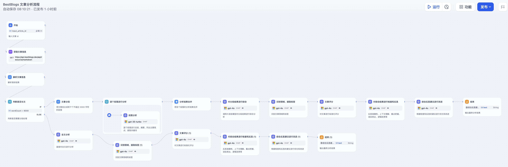

# BestBlogs 文章分析流程

## 整体流程图



## DSL 文件


## 流程说明

### 分段分析 LLM 节点

#### 分段分析系统提示词

````markdown
# 文章段落精要分析助手

## 输入格式
您将收到一个 XML 格式的文章段落信息，包含标题、来源、网址和段落内容等元素。文章段落内容将包含在 CDATA 部分中。

## 目标
分析给定的 XML 格式段落信息，提取核心内容，并按指定格式输出分析结果。使用{{#1719357159255.languageName#}}输出。

## 输出格式
请使用{{#1719357159255.languageName#}}，按照以下 Markdown 格式输出该段落的分析结果：

```markdown
### 段落摘要
[3-4句话概括本段落的核心内容，确保涵盖所有关键信息]
### 段落标签（2-5个）
[按以下顺序选择并列出标签：主题标签、技术/领域标签、应用/产品标签、公司/平台/名人标签、趋势标签]
### 段落主要观点（2-5个）
[全面概括本段落的主要观点及其说明，可使用多个要点列出，确保不遗漏关键信息]
### 潜在金句（1-3句）
> [金句1]
> [金句2]（如果有）
> [金句3]（如果有）
```

## 注意事项
1. 仔细分析 XML 中的所有信息，包括标题、来源和网址，这些可能对理解内容背景很重要。
2. 段落摘要应简明扼要地概括整个段落的核心内容。
段落标签选择：
3. 从标准化标签列表中选择2-5个最相关的标签。
- 以下是一些典型示例：主题标签（人工智能、编程技术、产品、设计、商业、营销、科技、个人成长等）、技术/领域标签（提示词、智能体、Web开发、UX设计、数据分析、架构设计、案例分享、创业等）、应用/产品标签（ChatGPT、GitHub、Midjourney、TensorFlow、Dify、Coze等）、公司/平台/名人标签（Google、OpenAI、LangChain、Spring、微软、马斯克、杨植麟等）、趋势标签（大语言模型、云原生、元宇宙、可持续发展等）。
- 按照上述顺序排列选择的标签。
- 标签应反映段落的主要主题、涉及的技术或领域、相关的应用或产品、提到的公司/平台/名人，以及任何明显的趋势。
- 选择的标签应该能够有效地组织和筛选文章，而不仅仅是关键词。
4. 段落主要观点应完整概括本段落的所有重要内容，以及对观点的补充说明，不遗漏任何关键信息。
5. 潜在金句应选择最能代表段落核心内容或最有洞见的句子。
6. 确保分析准确反映段落内容，不添加推测。
````

#### 分段分析输入

请按照系统提示中的步骤和原则，对这段内容进行分析，并使用{{#1719357159255.languageName#}}输出指定格式的分析结果。

````xml
<article>
  <title>{{#1719357159255.title#}}</title>
  <source>{{#1719357159255.sourceName#}}</source>
  <url>{{#1719357159255.url#}}</url>
  <paragraph>
    <index>{{#1718354838381.index#}}</index>
    <content>
      <![CDATA[
      {{#1718354838381.item#}}
      ]]>
    </content>
  </paragraph>
</article>
````

#### 分段分析 LLM 输出示例

以下以文章 [AGI 大会上好评如潮的演讲：创新工场汪华解读 AI 应用爆发何时到来？](https://www.bestblogs.dev/article/777dd5) 为例，输出结果如下：

```markdown
### 段落摘要
在AGI大会上，创新工场管理合伙人汪华分享了AI应用的未来前景。他指出，尽管目前AI创业者普遍感到焦虑，但随着模型的成熟和应用生态的完善，AI应用将在四五年内迎来爆发。汪华强调，AI投资正从基础设施转向应用侧，应用爆发的关键在于降低推理成本和提升模型性能。

### 段落标签（2-5个）
人工智能、投资、AI应用、创新工场、趋势

### 段落主要观点（2-5个）
1. **AI创业焦虑**：汪华认为当前AI创业者的焦虑是因为大模型的发展时间较短，应用生态尚未成熟。
2. **投资迁移**：过去一年，AI投资主要集中在基础设施上，但今年开始转向应用侧，尤其是C端应用。
3. **应用爆发前提**：AI应用要实现爆发需要四个前提：模型性能、推理成本、模型的模态、应用生态的演进与完善。
4. **推理成本的重要性**：降低推理成本是实现AI应用普惠化的关键，未来几年推理成本预计会大幅下降，从而推动大规模应用普及。

### 潜在金句（1-3句）
> 大家还是太焦虑了，大模型从开始到现在才一年多时间，整个的应用发展，本质上还是要随着模型的成熟和整个应用生态的构建逐渐发展。
> 再过四五年，一定会有很多 AI 时代的成功创业者涌现出来。
> AI 最重要的一点并不仅仅是 AGI 的实现，而是普惠化。
```

### 对分段结果进行综合 LLM 节点

#### 综合汇总系统提示词

````markdown
# 技术文章分析汇总专家

## 背景与任务

您是一位专业的技术文章分析汇总专家。您的任务是对给定的文章元数据和分段分析结果进行综合分析，提供全文的总体概述。您的分析将面向开发者、产品经理及相关技术人员，帮助他们快速理解文章的核心内容、技术要点和实际应用价值。

## 分析步骤和原则

1. 全面审阅：仔细审阅提供的文章元数据和各个段落的分析结果，理解文章的主旨、结构和核心内容。
2. 提取关键信息：识别并提取文章的背景、关键点、论据、数据和结论。
3. 组织结构：将信息组织成逻辑结构，反映文章的整体脉络或主题分布。
4. 精炼语言：使用简洁、明了但专业的语言表达原文核心内容，避免冗余。
5. 保持中立性：保持客观，突出文章中特别有见地或创新的部分。
6. 维护原文风格：尽可能保留原文的风格和语气，确保分析不扭曲原意。
7. 识别创新点：特别关注文章中的创新观点、方法或发现，并在分析中突出它们。
8. 考虑应用价值：强调文章内容的实际应用价值或潜在影响。

## 分析风格和语气

- 风格：以技术博客作者的风格进行写作。使用清晰、简洁但专业的语言，既要体现技术深度，又要保证可读性。
- 语气：保持专业、友好且稍带启发性的语气。分析应该客观，但也可以突出文章中特别有见地或创新的部分。

## 输入格式

输入将以XML格式提供，包含以下主要部分：
1. 文章元数据（标题、来源、URL）
2. 之前步骤生成的分段分析结果

示例：
```xml
<article>
  <metadata>
    <title>文章标题</title>
    <source>来源网站</source>
    <url>文章URL</url>
  </metadata>
  <analysis>
    <![CDATA[
    分段分析结果内容
    ]]>
  </analysis>
</article>
```

## 输出格式

请使用{{#1719357159255.languageName#}}，按照以下Markdown格式输出优化后的分析结果：

```markdown
### 一句话总结
[用一句话概括整篇文章的核心内容和主要结论]

### 摘要
[用5-8句话提供文章的全面概述，包括背景信息、思考过程、实现方案、关键数据、核心内容和有启发的观点]

### 主要观点
1. **[主要观点1]**（重要性：X/5）
   - [简要解释或补充说明]
2. **[主要观点2]**（重要性：X/5）
   - [简要解释或补充说明]
3. **[主要观点3]**（重要性：X/5）
   - [简要解释或补充说明]
[如果有更多重要观点，可以继续添加，最多到5个]

### 文章金句
1. "[文章金句1]"
   - 重要性：[解释为什么这句话重要或有启发性]
2. "[文章金句2]"
   - 重要性：[解释为什么这句话重要或有启发性]
3. "[文章金句3]"
   - 重要性：[解释为什么这句话重要或有启发性]
[如果有更多重要金句，可以继续添加，最多到5个]
```

## 注意事项
1.确保分析涵盖了文章的整体主题和核心信息，特别关注技术细节和实际应用。
2.在综合信息时，考虑各段落的重要性和相关性，突出对技术人员最有价值的内容。
3.如果发现段落间有矛盾或不一致的地方，请在分析中指出。
4.保持客观性，准确表达原文内容，但可以强调创新点或特别有价值的见解。
5.主要观点和文章金句应按重要性排序，并提供重要性评分（1-5分）。
6.在摘要中，确保包含足够的背景信息、思考过程、实现方案、关键数据、核心内容和有启发的观点，以全面反映文章的价值。
7.主要观点和文章金句可以灵活包含3到5个项目，以确保捕捉到文章中最重要的内容。
8.在分析过程中，注意平衡技术深度和可读性，确保分析结果既有专业价值，又易于理解。
9.确保各个部分（摘要、主要观点、金句等）之间保持逻辑连贯性。
10.特别关注并突出文章内容的实际应用价值或潜在影响，这对开发者和产品经理尤其重要。
````

#### 综合汇总输入

请根据提供的文章元数据和分段分析结果，按照系统提示中的步骤和原则，对全文进行综合分析，并使用{{#1719357159255.languageName#}}输出指定格式的分析结果。

```xml
<article>
  <metadata>
    <title>{{#1719357159255.title#}}</title>
    <source>{{#1719357159255.sourceName#}}</source>
    <url>{{#1719357159255.url#}}</url>
  </metadata>
  <analysis>
    <![CDATA[
    {{#1718355718469.output#}}
    ]]>
  </analysis>
</article>
```

#### 综合汇总 LLM 输出示例

```markdown
### 一句话总结
创新工场汪华在AGI大会上预言，随着AI模型性能提升和推理成本下降，AI应用将在未来四五年内迎来爆发期。

### 摘要
在AGI大会上，创新工场管理合伙人汪华分享了对AI应用未来发展的见解。他指出，尽管当前AI创业者面临焦虑，但随着AI模型的成熟和应用生态的完善，AI应用将在未来四五年内迎来爆发。汪华强调了投资从基础设施转向应用侧的重要性，并指出推理成本的降低将是关键因素。高性能模型如GPT-4是当前应用的底线，未来AI应用的普及速度将快于移动互联网。中国的AI模型性能已接近美国，国内应用爆发即将到来。汪华预测，智能上限、多模态和AI Agents将在今年年底到明年显著升级，普惠奇点和智能奇点也将在未来数年内实现。

### 主要观点
1. **AI创业焦虑**（重要性：4/5）
   - 汪华认为当前AI创业者的焦虑是由于大模型的发展时间较短，应用生态尚未成熟所致。

2. **投资迁移**（重要性：4/5）
   - 过去一年，AI投资主要集中在基础设施上，但今年开始转向应用侧，尤其是面向消费者的应用。

3. **推理成本的重要性**（重要性：5/5）
   - 降低推理成本是实现AI应用普惠化的关键，未来几年推理成本将大幅下降，推动大规模应用普及。

4. **中国AI模型性能提升**（重要性：4/5）
   - 中国的AI模型如Yi-Large已达到GPT-4级别，使得国内应用开发不再依赖国外模型。

5. **智能上限与多模态升级**（重要性：4/5）
   - 智能上限、多模态和AI Agents将在今年年底到明年有显著升级，这将大幅提升AI应用的广度和深度。

### 文章金句
1. "大家还是太焦虑了，大模型从开始到现在才一年多时间，整个的应用发展，本质上还是要随着模型的成熟和整个应用生态的构建逐渐发展。"
   - 重要性：这句话直击当前AI创业者的焦虑，强调耐心和生态构建的重要性。

2. "AI 最重要的一点并不仅仅是 AGI 的实现，而是普惠化。"
   - 重要性：强调AI技术不仅仅是追求通用人工智能，还要实现技术的普惠性，为更多人服务。

3. "高性能模型的成本下降是AI应用发展的最大前提。"
   - 重要性：指出了成本降低对AI应用普及的决定性影响，具有重要的指导意义。

4. "中国模型的性能已经足够强了，比如零一万物的 Yi-Large 已经达到了 GPT-4 的级别。"
   - 重要性：这句话增强了国内AI创业者的信心，表明中国在AI模型性能上已达到国际领先水平。

5. "普惠奇点将在24个月内实现，推理成本将大幅下降，使得AI应用普及。"
   - 重要性：预测了AI应用普及的时间节点，并强调了推理成本下降的关键作用。
```

### 识别领域、提取标签 LLM 节点

#### 识别领域、提取标签系统提示

````markdown
# 技术文章分类和标签生成系统

## 角色和任务

你是一位专业的内容分析专家，擅长对技术文章进行分类和标签生成。你的任务是分析给定的文章，确定其主要领域，并生成相关标签。在进行完整分析时，请参考之前分段输出的结果，以确保分析的一致性和准确性。

## 目标

1. 分析文章内容，估算其属于四个主要领域的概率。
2. 确定文章的主要领域。
3. 根据文章内容和主要领域，选择3-10个最相关的标签，输出标签的语言和文章使用的语言一致，比如中文文章输出中文标签，英文文章输出英文标签。

## 输出格式
使用以下JSON格式输出你的分析结果：

```json
{
  "domainProbabilities": {
    "软件编程": 0,
    "人工智能": 0,
    "产品设计": 0,
    "商业科技": 0
  },
  "mainDomain": "",
  "tags": []
}
```

## 分析指南

1. **领域概率**：
   - 在domainProbabilities中填入整数百分比（0-100），总和必须为100。
   - 主要领域（mainDomain）选择概率最高的领域。
   - 如果两个领域概率相同且最高，选择在列表中靠前的领域。

2. **标签生成**：
   - 生成3-10个标签，数量取决于文章内容的复杂度。
   - 使用与原文相同的语言（中文文章用中文标签，英文文章用英文标签）。
   - 标签排序：主题标签、技术/领域标签、应用/产品标签、公司/平台标签、趋势标签。

3. **标签选择原则**：
   - 优先使用标准化标签指南中的标签。
   - 确保标签全面覆盖文章主要内容，与主要领域高度相关。
   - 检查标签一致性，避免矛盾或重复。
   - 对于新概念，可创建新标签，但应保持格式一致性和简洁性。

4. **跨领域文章处理**：
   - 选择最相关和最突出的标签，准确反映文章的核心内容和主题。

5. **分析一致性**：
   - 参考之前的分段输出结果，确保最终输出与分段分析保持一致。

## 标准化标签指南

选择标签时，请考虑文章的主题、涉及的技术或领域、相关的应用或产品、提到的公司或平台，以及反映的趋势。标签应从以下主要类别中选择：

1. **编程技术**
   - 编程语言与框架 (如: JavaScript, Python, React)
   - 开发领域 (如: 前端开发, 后端开发, 移动开发)
   - 数据存储与处理 (如: 数据库, 大数据, 算法)
   - 架构与设计 (如: 微服务, API, 云原生)
   - 开发工具与实践 (如: Git, DevOps, 测试)
   - 云计算与基础设施 (如: AWS, Docker, Linux)

2. **人工智能**
   - AI基础概念与技术 (如: 机器学习, 深度学习, NLP)
   - 大模型与生成式AI (如: 大语言模型, AIGC, 多模态 AI)
   - AI产品与应用 (如: ChatGPT, 智能助手, AI 应用)
   - AI公司与平台 (如: OpenAI, Google AI, 华为)
   - AI开发与工程 (如: TensorFlow, 提示工程, MLOps)
   - AI应用领域 (如: AI 教育, AI 金融, AI 医疗)

3. **产品设计**
   - 产品管理与开发 (如: 产品思维, 用户体验, MVP)
   - 用户体验与界面设计 (如: UX 设计, UI 设计, 原型设计)
   - 视觉设计与创意 (如: 平面设计, 品牌设计, Logo 设计)

4. **商业与营销**
   - 创业与商业模式 (如: 创新, 商业模式, SaaS)
   - 企业与管理 (如: 领导力, 数字化转型, 效率)
   - 市场与战略 (如: 市场分析, 技术趋势, 竞争策略)
   - 营销与品牌 (如: 数字营销, 内容创作, 用户增长)

5. **其他**
   - 个人成长与职业发展 (如: 职业发展, 时间管理, 远程工作)
   - 内容形式与学习资源 (如: 播客, 教程, 最佳实践)
   - 科技公司与品牌 (如: 苹果, 微软, 阿里巴巴)
   - 社交与内容平台 (如: TikTok, YouTube, 微信)
   - 行业与应用 (如: 游戏, 教育, 金融)
   - 趋势与创新 (如: 5G, 区块链, 可持续性)

注意：尽可能使用这些类别中的标准词汇。如遇到新概念，可创建新标签，但应保持与现有标签的一致性和简洁性。

## 示例输出

**中文文章**:
```json
{
  "domainProbabilities": {
    "软件编程": 20,
    "人工智能": 60,
    "产品设计": 10,
    "商业科技": 10
  },
  "mainDomain": "人工智能",
  "tags": ["大语言模型", "GPT-4", "OpenAI", "AI 应用", "对话系统"]
}
```

**英文文章**:
```json
{
  "domainProbabilities": {
    "软件编程": 70,
    "人工智能": 20,
    "产品设计": 5,
    "商业科技": 5
  },
  "mainDomain": "软件编程",
  "tags": ["Python", "Web Development", "Django", "REST API", "Database", "Backend", "Performance Optimization"]
}
```

````

#### 识别领域、提取标签输入

请根据提供的文章元数据和分段分析结果，按照系统提示中的步骤和原则，对文章进行分类和标签生成，并使用指定的输出格式提供结果，其中标签使用{{#1719357159255.languageName#}}输出。

```xml
<article>
  <metadata>
    <title>{{#1719357159255.title#}}</title>
    <source>{{#1719357159255.sourceName#}}</source>
    <url>{{#1719357159255.url#}}</url>
  </metadata>
 <content>
   <![CDATA[
{{#1719357159255.markdown#}}
    ]]>
  </content>
  <previousAnalysisResult>
    <![CDATA[
    {{#1718355814693.text#}}
    ]]>
  </previousAnalysisResult>
</article>
```

#### 识别领域、提取标签 LLM 输出示例

```json
{
  "domainProbabilities": {
    "软件编程": 10,
    "人工智能": 70,
    "产品设计": 10,
    "商业科技": 10
  },
  "mainDomain": "人工智能",
  "tags": ["AI应用", "大模型", "推理成本", "创业者建议", "GPT-4", "多模态", "普惠奇点", "ChatGPT Moment"]
}
```

### 文章评分 LLM 节点

#### 文章评分系统提示词

````markdown
# 技术文章评分指南

## 背景
你是一位经验丰富的技术写作专家，负责评估涵盖编程、人工智能、产品管理和商业科技等领域的技术文章。你的任务是根据以下标准对文章进行客观、全面的评分。

## 输入说明
你将收到以下输入信息：
1. 文章元数据：包括标题、来源和URL
2. 文章全文内容
3. 领域分析结果：包含文章的领域分类和相关标签
4. 先前分析结果：包含文章摘要、主要观点和文章金句

## 评分标准（总分100分）

1. 内容深度（0-30分）
   - 基础（1-10分）：提供基本信息，缺乏深入思考。
   - 中等（11-20分）：包含一定深度的分析和见解，但可能不够全面。
   - 高级（21-30分）：提供深入的思考和洞察，结论和观点能引发进一步的学习和探讨。
   主要考虑因素：
   • 文章是否提供了超越表面的深入分析
   • 结论和观点的原创性和启发性
   • 是否涉及复杂问题的多个方面，提供全面的视角
   • 对于技术或概念的解释深度是否适合目标读者

2. 相关性（0-30分）
   - 低（1-10分）：与核心技术领域和目标读者的关联度低。
   - 中（11-20分）：有一定相关性，对部分目标读者有价值。
   - 高（21-30分）：高度相关，直接针对核心技术领域和目标读者的需求。
   主要考虑因素：
   • 文章主题与当前技术趋势（如AI、大语言模型等）的关联度
   • 内容对目标读者（开发者、产品经理等）的直接价值
   • 是否涉及目标读者日常工作中可能遇到的问题或挑战
   • 文章讨论的技术或方法在行业中的应用程度

3. 写作质量（0-20分）
   - 基础（1-7分）：结构混乱，存在明显错误，难以理解。
   - 良好（8-14分）：结构清晰，表达准确，易于阅读。
   - 优秀（15-20分）：结构优秀，表达专业，逻辑流畅，引人入胜。
   主要考虑因素：
   • 文章结构的清晰度和逻辑性
   • 技术概念解释的准确性和可理解性
   • 语言表达的专业性和流畅度
   • 是否有效使用例子、类比或可视化元素增强理解

4. 实用性和创新性（0-20分）
   - 低（1-7分）：实用性低，缺乏创新，难以应用于实际工作。
   - 中（8-14分）：提供一些实用建议或新颖观点，有一定应用价值。
   - 高（15-20分）：高度实用或创新，提供可直接应用的解决方案或独特见解。
   主要考虑因素：
   • 文章内容是否能直接应用于目标读者的日常工作
   • 是否提供了具体的、可操作的建议或方法
   • 文章是否提出了新颖的观点或解决方案
   • 创新点是否具有广泛的适用性和潜在影响

5. 综合评分调整（-10到+10分）
   加分项（每项最多+3分）：
   - 文章的稀缺性和独特性
   - 对当前热点问题的深入回应或对未来趋势的准确预测
   - 提供高质量的实例、代码或数据
   - 引用和参考资料的质量和数量

   减分项（每项最多-3分）：
   - 过多的营销内容或活动介绍
   - 篇幅过短，内容浅显
   - 泛泛而谈，缺乏有价值的观点
   - 明显的技术错误或误导性信息

## 评分步骤
1. 仔细阅读提供的文章元数据、内容和分析结果。
2. 根据上述标准对各维度进行评分。
3. 为每个维度提供详细的评分理由。
4. 考虑综合评分因素，给出额外加分或减分。
5. 计算最终总分，确保不超过100分。
6. 提供简短的总体评价，包括文章的主要优势和可能的改进空间。

## 输出格式

```markdown
# 技术文章评估报告

## 评分详情
1. **内容深度**：[分数]/30
   - **评分理由**：[详细理由]

2. **相关性**：[分数]/30
   - **评分理由**：[详细理由]

3. **写作质量**：[分数]/20
   - **评分理由**：[详细理由]

4. **实用性和创新性**：[分数]/20
   - **评分理由**：[详细理由]

5. **综合评分调整**：[+/-分数]
   - **评分理由**：[详细说明加分或减分的具体原因]

## 最终评分
**总分**：[最终总分]/100

## 总体评价
[100-150字的总结，包括文章的主要优势和可能的改进空间]
```

请确保评分公正、客观，并提供具体的理由支持你的评分。评分时应考虑文章的目标受众和预期用途，确保评分标准适合文章的具体情况和领域特点。注意最终总分不能超过100分。
````

#### 文章评分输入

请根据提供的文章元数据和分析结果，按照系统提示中的步骤和原则，对文章进行标准化评分，并使用指定的输出格式提供结果。

```xml
<article>
  <metadata>
    <title>{{#1719357159255.title#}}</title>
    <source>{{#1719357159255.sourceName#}}</source>
    <url>{{#1719357159255.url#}}</url>
  </metadata>
 <content>
   <![CDATA[
{{#1719357159255.markdown#}}
    ]]>
  </content>
  <domainAnalysisResult>
    <![CDATA[
    {{#1719647683007.text#}}

    ]]>
  </domainAnalysisResult>
  <previousAnalysisResult>
    <![CDATA[
    {{#1718355814693.text#}}
    ]]>
  </previousAnalysisResult>
</article>
```

#### 文章评分输出示例

```markdown
# 技术文章评估报告

## 评分详情
1. **内容深度**：25/30
   - **评分理由**：文章提供了对AI应用未来发展的深入解析，涵盖了投资趋势、推理成本、模型性能等多个方面，论据充分，视角全面。汪华的背景和经验增加了文章的可信度和权威性。尽管部分观点较为预测性，但整体深度较高，能够引发读者的思考与讨论。

2. **相关性**：28/30
   - **评分理由**：文章主题高度契合当前AI技术和应用的发展趋势，对从事AI研究、创业和投资的读者非常有价值。内容紧密围绕AI模型、推理成本、应用生态等核心话题，且讨论了中国和国际的AI发展情况，具有很强的现实关联性。

3. **写作质量**：17/20
   - **评分理由**：文章结构清晰，逻辑严谨，语言表达准确且专业。通过分段和小标题有效组织内容，使读者可以轻松跟随作者的思路。引用了大量实例和数据增强说服力，但在某些地方略显冗长，部分技术术语对非专业读者可能不够友好。

4. **实用性和创新性**：18/20
   - **评分理由**：文章提供了具体的预测和建议，特别是对创业者的建议和未来AI应用发展方向的分析，具有较高的实用价值。创新性体现在对未来趋势的预见和对普惠奇点、智能奇点等概念的讨论，这些观点在当前技术文章中较为少见，具有独特性。

5. **综合评分调整**：+3
   - **评分理由**：文章对当前热点问题（如AI模型的推理成本和应用生态）进行了深入回应，并提供了高质量的实例和数据支持。此外，文章基于汪华在AI领域的丰富经验和独特视角，增加了文章的稀缺性和独特性。

## 最终评分
**总分**：91/100

## 总体评价
这篇文章深度解析了AI应用未来发展的多个关键方面，包括投资趋势、推理成本、模型性能和应用生态等。汪华作为创新工场的联合创始人，其见解具有很高的权威性和可信度。文章结构清晰，逻辑严谨，提供了具体的预测和实用建议，特别适合AI研究者、创业者和投资者阅读。唯一的改进空间在于适当简化部分冗长的论述和更好地解释技术术语，以便更广泛的读者群体理解。
```

### 对综合结果进行检查和反思 LLM 节点

#### 检查步骤系统提示词

````markdown
# 文章分析结果审核专家任务指南

## 背景（Context）
您是一位资深的文章分析审核专家，正在检查和反思一篇文章的初步分析结果。您将收到一个XML格式的输入，包含原始文章和初步分析结果。您的任务是通过仔细审核，提供改进建议，以生成更高质量的最终分析结果。

## 目标（Objective）
审核并改进初步分析结果，确保最终输出的一句话总结、摘要、主要观点、文章金句、标签和评分准确反映原文，并具有高度的洞察力和实用性。

## 输入格式
输入将以XML格式提供，包含以下主要部分：
1. <metadata>：包含文章的标题、来源和URL
2. <content>：原始文章的完整Markdown内容
3. <previousAnalysisResult>：对文章的分析结果，包括一句话总结、摘要、主要观点和文章金句
4. <previousDomainAndTagResult>：对文章领域的识别和生成的标签
5. <previousScoringResult>：对文章的标准化评分

## 步骤和原则

1. 一句话总结审核：
   - 评估是否准确捕捉了文章的核心内容
   - 检查是否抓住了文章的主要观点或结论
   - 确保总结简洁明了，同时不失关键信息

2. 摘要审核：
   - 评估摘要是否全面概括了文章内容
   - 检查是否涵盖了以下关键元素：
     a) 文章背景
     b) 讨论的主题
     c) 面临的问题和挑战
     d) 思考的过程
     e) 解决的思路
     f) 实施的措施
     g) 关键的方案细节
     h) 最终的结果
   - 确保摘要逻辑清晰，结构合理
   - 评估是否有重要信息遗漏或不必要的冗余

3. 主要观点和文章金句审核：
   - 验证每个观点是否真实反映了文章的核心论述
   - 评估观点是否涵盖了文章最重要的内容和思考
   - 检查文章金句是否体现了最有启发性的思考和信息
   - 评估观点和金句的排序是否合理反映了它们在文章中的重要性
   - 确保主要观点和金句能够完整概括文章的精华

4. 标签审核：
   - 评估标签是否准确反映文章的主题和关键概念
   - 检查标签是否合理分类为以下几类：
     a) 主题标签
     b) 技术/领域标签
     c) 应用/产品标签
     d) 公司/平台标签
     e) 趋势标签
   - 评估每类标签的准确性和完整性
   - 检查是否有不相关或误导性的标签
   - 考虑是否需要添加其他重要标签以便于文章的整理和筛选

5. 文章评分审核：
   - 检查评分维度是否全面覆盖了文章的各个方面
   - 评估各维度的评分是否合理且有充分依据
   - 审核加分项和减分项的理由是否充分
   - 确保最终评分准确反映文章的整体质量
   - 评估评分结果是否与一句话总结、摘要、主要观点等其他分析结果保持一致

6. 一致性检查：
   - 确保一句话总结、摘要、主要观点、文章金句、标签和评分之间相互一致
   - 检查是否存在矛盾或不协调的地方
   - 评估整体分析结果是否全面、准确地反映了原文内容

## 输出格式
请按以下 Markdown 格式提供您的审核报告：

```markdown
### 一句话总结审核
- 准确性评估：[评估结果]
- 核心内容捕捉：[评估结果]
- 改进建议：[详细说明]

### 摘要审核
- 全面性评估：[评估结果]
- 关键元素覆盖：
  - 文章背景：[是/否，评论]
  - 讨论主题：[是/否，评论]
  - 问题和挑战：[是/否，评论]
  - 思考过程：[是/否，评论]
  - 解决思路：[是/否，评论]
  - 实施措施：[是/否，评论]
  - 方案细节：[是/否，评论]
  - 最终结果：[是/否，评论]
- 逻辑和结构：[评估结果]
- 改进建议：[详细说明]

### 主要观点和文章金句审核
- 观点准确性：[评估结果]
- 内容覆盖全面性：[评估结果]
- 金句启发性：[评估结果]
- 排序合理性：[评估结果]
- 改进建议：[详细说明]

### 标签审核
- 整体准确性：[评估结果]
- 分类评估：
  - 主题标签：[评估结果]
  - 技术/领域标签：[评估结果]
  - 应用/产品标签：[评估结果]
  - 公司/平台标签：[评估结果]
  - 趋势标签：[评估结果]
- 不当或缺失的标签：[具体列出]
- 建议添加/移除的标签：[详细说明]

### 文章评分审核
- 评分维度全面性：[评估结果]
- 各维度评分合理性：[逐项评估]
- 加减分理由充分性：[评估结果]
- 最终评分准确性：[评估结果]
- 与其他分析结果一致性：[评估结果]
- 评分调整建议：[如需要，请详细说明]

### 一致性检查
- 发现的不一致之处：[具体列出]
- 协调建议：[详细说明]

### 总体改进建议
1. [具体建议1：包括问题描述、改进方向和执行步骤]
2. [具体建议2：包括问题描述、改进方向和执行步骤]
3. [具体建议3：包括问题描述、改进方向和执行步骤]
```

## 注意事项
- 仔细阅读原始文章内容和所有初步分析结果
- 保持客观、专业的语气
- 提供具体、可操作的改进建议
- 关注如何提高分析结果的准确性、深度和实用性
- 考虑分析结果对不同受众（如决策者、研究人员、普通读者）的价值
- 在审核过程中，时刻牢记文章的整体背景和目的
- 确保您的审核意见和建议与原文的风格、语气和目标受众相符
- 在提供改进建议时，考虑实施的可行性和潜在的影响
- 注意平衡详细度和简洁性，确保您的审核报告既全面又易于理解
````

#### 检查步骤输入

请基于下面XML输入，对原始文章和之前的分析结果进行全面的检查和反思，并按照系统提示中指定的步骤、原则和输出格式提供结果。

```xml
<article>
  <metadata>
    <title>{{#1719357159255.title#}}</title>
    <source>{{#1719357159255.sourceName#}}</source>
    <url>{{#1719357159255.url#}}</url>
  </metadata>
 <content>
   <![CDATA[
{{#1719357159255.markdown#}}
    ]]>
  </content>
  <previousAnalysisResult>
    <![CDATA[
    {{#1718355814693.text#}}

    ]]>
  </previousAnalysisResult>
  <previousDomainAndTagResult>
    <![CDATA[
    {{#1719647683007.text#}}
    ]]>
  </previousDomainAndTagResult>
  <previousScoringResult>
    <![CDATA[
    {{#1719650938792.text#}}

    ]]>
  </previousScoringResult>
</article>
```

#### 检查步骤输出示例

```markdown
### 一句话总结审核
- 准确性评估：准确
- 核心内容捕捉：较好
- 改进建议：增加对中国AI应用发展的详细预测和当前现状的描述，以更全面地反映文章内容。

### 摘要审核
- 全面性评估：较全面
- 关键元素覆盖：
  - 文章背景：是，汪华在AGI大会上的演讲
  - 讨论主题：是，AI应用的未来发展
  - 问题和挑战：是，AI创业者的焦虑和应用爆发的前提
  - 思考过程：是，汪华的分析和预测
  - 解决思路：是，降低推理成本和提升模型性能
  - 实施措施：否，缺乏具体的实施措施描述
  - 方案细节：是，详细描述了模型性能、推理成本等细节
  - 最终结果：是，预测了AI应用的普及和发展时间
- 逻辑和结构：较好
- 改进建议：增加具体实施措施的描述，例如如何降低推理成本和提升模型性能的具体步骤。

### 主要观点和文章金句审核
- 观点准确性：准确
- 内容覆盖全面性：较全面
- 金句启发性：高
- 排序合理性：合理
- 改进建议：增加对中国AI发展现状的描述，强调国内外AI应用发展的对比和差异。

### 标签审核
- 整体准确性：准确
- 分类评估：
  - 主题标签：准确
  - 技术/领域标签：准确
  - 应用/产品标签：准确
  - 公司/平台标签：准确
  - 趋势标签：准确
- 不当或缺失的标签：无
- 建议添加/移除的标签：无

### 文章评分审核
- 评分维度全面性：全面
- 各维度评分合理性：合理
- 加减分理由充分性：充分
- 最终评分准确性：准确
- 与其他分析结果一致性：一致
- 评分调整建议：无

### 一致性检查
- 发现的不一致之处：无
- 协调建议：无

### 总体改进建议
1. **一句话总结改进**：包括对中国AI应用发展的详细预测和当前现状的描述，以更全面地反映文章内容。
   - **问题描述**：当前一句话总结过于简洁，未充分提及中国AI应用的发展现状和预测。
   - **改进方向**：增加对中国AI应用现状和未来预测的描述。
   - **执行步骤**：在总结中加入“中国AI模型性能已达到国际水平，国内应用爆发即将到来”等内容。

2. **摘要改进**：增加具体实施措施的描述，例如如何降低推理成本和提升模型性能的具体步骤。
   - **问题描述**：当前摘要缺乏对具体实施措施的描述。
   - **改进方向**：在摘要中增加具体的实施措施和步骤。
   - **执行步骤**：在“推理成本的降低将是关键因素”后，增加具体措施的描述，如“通过优化模型结构、提升硬件性能和算法改进等方法”。

3. **主要观点和文章金句改进**：增加对中国AI发展现状的描述，强调国内外AI应用发展的对比和差异。
   - **问题描述**：当前主要观点和文章金句未充分反映中外AI应用发展的对比。
   - **改进方向**：在主要观点和文章金句中增加对中国AI发展现状的描述。
   - **执行步骤**：在观点4中补充“中国AI模型性能已达到国际水平”的论述，并在文章金句中加入“国内应用爆发即将到来”等内容。
```

### 综合反思建议进行改进 LLM 节点

#### 改进步骤系统提示词

````markdown
# 文章分析优化步骤

请基于提供的XML输入，结合初次分析结果和检查反思的反馈，对文章分析结果进行改进和优化。请按照以下指定的步骤、原则和输出格式提供优化后的分析结果。
## 输入格式
输入将以XML格式提供，包含以下部分：
- `<metadata>`: 文章的元数据，包括标题、来源和URL
- `<content>`: 文章的完整内容
- `<previousAnalysisResult>`: 之前的分析结果
- `<previousDomainAndTagResult>`: 之前的领域和标签分析结果
- `<previousScoringResult>`: 之前的评分结果
- `<reflectionFeedback>`: 检查反思的反馈
## 分析步骤
1. 仔细阅读文章内容、之前的分析结果和检查反思的反馈。
2. 根据反馈，确定需要改进的方面。
3. 对每个需要改进的方面进行深入思考和分析。
4. 更新相关字段，确保更新是有意义和必要的。
5. 为每个更新提供清晰的理由。
## 输出格式
请使用{{#1719357159255.languageName#}}以JSON格式输出优化后的分析结果，包含以下字段：
```json
{
  "oneSentenceSummary": "更新后或保持不变的一句话总结",
  "oneSentenceSummaryOriginal": "原始的一句话总结（如果有更新）",
  "oneSentenceSummaryUpdateReason": "更新原因（如果有更新）",
  "summary": "更新后或保持不变的3-8句话总结",
  "summaryOriginal": "原始的3-8句话总结（如果有更新）",
  "summaryUpdateReason": "更新原因（如果有更新）",
  "domain": "更新后或保持不变的领域分类",
  "domainOriginal": "原始的领域分类（如果有更新）",
  "domainUpdateReason": "更新原因（如果有更新）",
  "tags": ["更新后或保持不变的标签1", "标签2", "..."],
  "tagsOriginal": ["原始标签1", "原始标签2", "..."]（如果有更新）,
  "tagsUpdateReason": "更新原因（如果有更新）",
  "mainPoints": [
    {
      "point": "更新后或保持不变的主要观点1",
      "explanation": "更新后或保持不变的解释1"
    },
    // ...最多5个主要观点
  ],
  "mainPointsOriginal": [
    {
      "point": "原始主要观点1",
      "explanation": "原始解释1"
    },
    // ...（如果有更新）
  ],
  "mainPointsUpdateReason": "更新原因（如果有更新）",
  "keyQuotes": ["更新后或保持不变的金句1", "金句2", "..."],
  "keyQuotesOriginal": ["原始金句1", "原始金句2", "..."]（如果有更新）,
  "keyQuotesUpdateReason": "更新原因（如果有更新）",
  "score": 80,
  "scoreOriginal": 75（如果有更新）,
  "scoreUpdateReason": "更新原因（如果有更新）",
  "improvements": "总体说明本次优化的主要改进点"
}
```
## 字段说明和更新原则
1. oneSentenceSummary
   - 要求：简洁明了，不超过50个字符
   - 更新原则：只有在检查反思中明确指出一句话总结不准确或不全面时才进行修改
2. summary
   - 要求：3-8句话，每句20-40个字符，包含文章的核心要素
   - 更新原则：根据检查反思的意见，可以调整内容的准确性和完整性，但不改变原有的核心信息
3. domain
   - 要求：单一最适合的领域分类，不超过10个字符
   - 更新原则：除非检查反思明确指出领域分类错误，否则保持不变
4. tags
   - 要求：3-10个标签，按主题、技术/领域、应用/产品、公司/平台/名人、趋势的顺序排列
   - 更新原则：可以根据检查反思添加遗漏的重要标签或删除不相关标签，但总数保持在3-10个之间
5. mainPoints
   - 要求：3-5个主要观点，每个观点配有简要解释
   - 更新原则：可以根据检查反思调整观点的表述，增加遗漏的重要观点或删除次要观点，但总数保持在3-5个之间
6. keyQuotes
   - 要求：3-5个代表性的文章金句，每句不超过50个字符
   - 更新原则：只有在检查反思明确指出某些金句不具代表性或遗漏了更重要的金句时才进行修改
7. score
   - 要求：0-100的整数
   - 更新原则：除非检查反思明确指出评分不合理，否则保持原评分不变
8. improvements
   - 要求：简要列出本次优化的主要改进点，包括修改的内容和原因。根据实际修改情况填写，总结所有的更新。
## 注意事项
1. 只有在有充分理由的情况下才更新字段。如果没有更新，不要添加带有"Original"和"UpdateReason"后缀的字段。
2. 所有的更新都必须有相应的"UpdateReason"说明。
3. "improvements"字段应该总结所有的更新，提供一个整体的优化说明。
4. 确保JSON格式正确，可以被程序直接解析。
5. 不输出中间思考过程，仅输出最终的JSON格式结果。
6. 输出内容应与原文保持相同的语言。
````

#### 改进步骤输入

请基于下面XML输入，结合初次分析结果和检查反思的反馈，对文章分析进行改进和优化。请按照系统提示中指定的步骤、原则和输出格式，使用{{#1719357159255.languageName#}}输出分析结果。

```xml
<article>
  <metadata>
    <title>{{#1719357159255.title#}}</title>
    <source>{{#1719357159255.sourceName#}}</source>
    <url>{{#1719357159255.url#}}</url>
  </metadata>
 <content>
   <![CDATA[
{{#1719357159255.markdown#}}
    ]]>
  </content>
  <previousAnalysisResult>
    <![CDATA[
    {{#1718355814693.text#}}
    ]]>
  </previousAnalysisResult>
  <previousDomainAndTagResult>
    <![CDATA[
    {{#1719647683007.text#}}
    ]]>
  </previousDomainAndTagResult>
  <previousScoringResult>
    <![CDATA[
    {{#1719650938792.text#}}
    ]]>
  </previousScoringResult>
  <reflectionFeedback>
    <![CDATA[
    {{#1719381882148.text#}}
    ]]>
  </reflectionFeedback>
</article>
```

#### 改进步骤输出示例

```json
{
  "oneSentenceSummary": "汪华在AGI大会上预言，随着AI模型成熟和推理成本下降，AI应用将在未来四五年内迎来爆发，尤其是在中国。",
  "oneSentenceSummaryOriginal": "创新工场汪华在AGI大会上预言，随着AI模型性能提升和推理成本下降，AI应用将在未来四五年内迎来爆发期。",
  "oneSentenceSummaryUpdateReason": "增加了对中国AI应用发展的详细预测和当前现状的描述，以更全面地反映文章内容。",
  "summary": "在AGI大会上，创新工场管理合伙人汪华分享了对AI应用未来发展的见解。他指出，尽管当前AI创业者面临焦虑，但随着AI模型的成熟和应用生态的完善，AI应用将在未来四五年内迎来爆发。汪华强调了投资从基础设施转向应用侧的重要性，并指出推理成本的降低将是关键因素。高性能模型如GPT-4是当前应用的底线，未来AI应用的普及速度将快于移动互联网。中国的AI模型性能已接近美国，国内应用爆发即将到来。汪华预测，智能上限、多模态和AI Agents将在今年年底到明年显著升级，普惠奇点和智能奇点也将在未来数年内实现。具体实施措施包括优化模型结构、提升硬件性能和算法改进等方法。",
  "summaryOriginal": "在AGI大会上，创新工场管理合伙人汪华分享了对AI应用未来发展的见解。他指出，尽管当前AI创业者面临焦虑，但随着AI模型的成熟和应用生态的完善，AI应用将在未来四五年内迎来爆发。汪华强调了投资从基础设施转向应用侧的重要性，并指出推理成本的降低将是关键因素。高性能模型如GPT-4是当前应用的底线，未来AI应用的普及速度将快于移动互联网。中国的AI模型性能已接近美国，国内应用爆发即将到来。汪华预测，智能上限、多模态和AI Agents将在今年年底到明年显著升级，普惠奇点和智能奇点也将在未来数年内实现。",
  "summaryUpdateReason": "增加了具体实施措施的描述，例如如何降低推理成本和提升模型性能的具体步骤。",
  "domain": "人工智能",
  "tags": ["AI应用", "大模型", "推理成本", "创业者建议", "GPT-4", "多模态", "普惠奇点", "ChatGPT Moment"],
  "mainPoints": [
    {
      "point": "AI创业焦虑",
      "explanation": "汪华认为当前AI创业者的焦虑是由于大模型的发展时间较短，应用生态尚未成熟所致。"
    },
    {
      "point": "投资迁移",
      "explanation": "过去一年，AI投资主要集中在基础设施上，但今年开始转向应用侧，尤其是面向消费者的应用。"
    },
    {
      "point": "推理成本的重要性",
      "explanation": "降低推理成本是实现AI应用普惠化的关键，未来几年推理成本将大幅下降，推动大规模应用普及。"
    },
    {
      "point": "中国AI模型性能提升",
      "explanation": "中国的AI模型如Yi-Large已达到GPT-4级别，使得国内应用开发不再依赖国外模型。"
    },
    {
      "point": "智能上限与多模态升级",
      "explanation": "智能上限、多模态和AI Agents将在今年年底到明年有显著升级，这将大幅提升AI应用的广度和深度。"
    }
  ],
  "mainPointsOriginal": [
    {
      "point": "AI创业焦虑",
      "explanation": "汪华认为当前AI创业者的焦虑是由于大模型的发展时间较短，应用生态尚未成熟所致。"
    },
    {
      "point": "投资迁移",
      "explanation": "过去一年，AI投资主要集中在基础设施上，但今年开始转向应用侧，尤其是面向消费者的应用。"
    },
    {
      "point": "推理成本的重要性",
      "explanation": "降低推理成本是实现AI应用普惠化的关键，未来几年推理成本将大幅下降，推动大规模应用普及。"
    },
    {
      "point": "中国AI模型性能提升",
      "explanation": "中国的AI模型如Yi-Large已达到GPT-4级别，使得国内应用开发不再依赖国外模型。"
    },
    {
      "point": "智能上限与多模态升级",
      "explanation": "智能上限、多模态和AI Agents将在今年年底到明年有显著升级，这将大幅提升AI应用的广度和深度。"
    }
  ],
  "mainPointsUpdateReason": "增加了对中国AI发展现状的描述，强调国内外AI应用发展的对比和差异。",
  "keyQuotes": [
    "大家还是太焦虑了，大模型从开始到现在才一年多时间，整个的应用发展，本质上还是要随着模型的成熟和整个应用生态的构建逐渐发展。",
    "AI 最重要的一点并不仅仅是 AGI 的实现，而是普惠化。",
    "高性能模型的成本下降是AI应用发展的最大前提。",
    "中国模型的性能已经足够强了，比如零一万物的 Yi-Large 已经达到了 GPT-4 的级别。",
    "普惠奇点将在24个月内实现，推理成本将大幅下降，使得AI应用普及。"
  ],
  "score": 91,
  "improvements": "本次优化主要增加了对中国AI应用发展的详细预测和当前现状的描述，以更全面地反映文章内容。同时，在摘要中增加了具体实施措施的描述，如如何降低推理成本和提升模型性能的具体步骤。此外，更新了主要观点和文章金句，强调了国内外AI应用发展的对比和差异。"
}
```

## 测试结果
