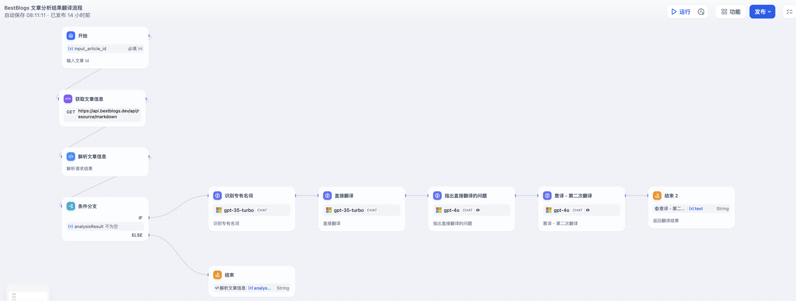
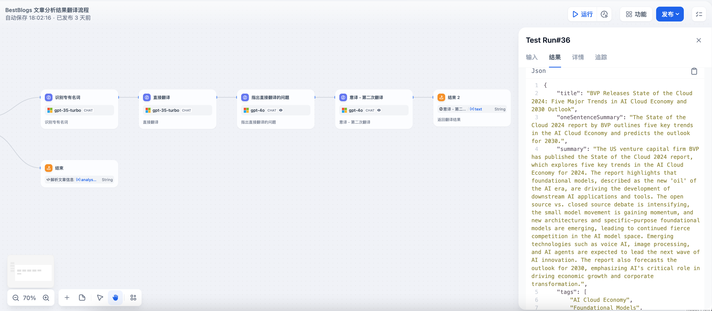
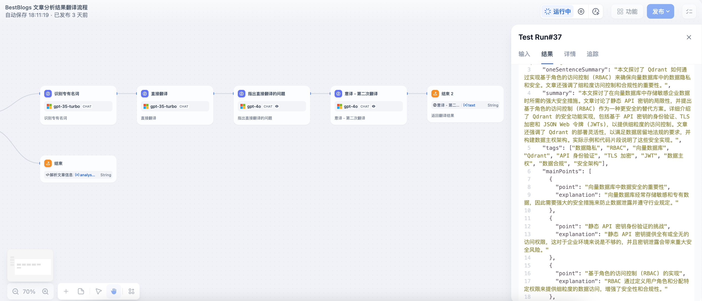

# BestBlogs 文章分析结果翻译流程

## 整体流程图



## DSL 文件

[Article Analysis Result Translate Workflow DSL](./dsl/article_analysis_result_translate_workflow.yml)

## 流程说明

### 识别专有名词系统提示词

````markdown
<任务>
识别用户输入的JSON文本中所有字段的技术性或领域特定的专业术语。使用 {原文术语} -> {翻译后术语} 的格式展示术语对应关系。

翻译规则：
1. 如果原文为中文，将术语翻译为英文。对于英文缩写，保留原样并在括号中提供英文全称。
   例：人工智能 -> Artificial Intelligence (AI)
2. 如果原文为英文，将术语翻译为中文。对于常用的英文缩写，保留原样并在括号中提供中文全称。
   例：AI -> 人工智能 (AI)

请注意：
1. 仅识别真正的专业术语，避免普通词汇。
2. 每个独特的术语只需输出一次，即使它在文本中多次出现。
3. 按技术领域对术语进行分组（如AI、UX、产品设计等）。
4. 根据输入文本的主要语言（中文或英文）来决定翻译方向。

<输入格式> 
输入是一个JSON字符串，包含以下字段：oneSentenceSummary, summary, tags, mainPoints (包含point和explanation), keyQuotes。请从所有这些字段中识别专业术语。

<输入示例>
{
    "oneSentenceSummary": "AI产品在用户入口设计上的创新和竞争策略变得越来越重要，超级入口将成为未来AI应用的关键所在。",
    "summary": "本文探讨了AI产品在争夺用户入口方面的设计问题，指出随着流量的宝贵，各个产品、平台都在相互竞争，AI产品更是如此。。。。。。",
    "tags": [
        "人工智能",
        "用户体验",
        "用户入口设计",
        "超级入口",
        "ChatGPT",
        "大模型",
        "AI应用",
        "产品设计"
    ],
    "mainPoints": [
        {
            "point": "AI产品的用户入口设计越来越重要。",
            "explanation": "AI产品的市场竞争越来越激烈，用户入口设计是吸引用户的关键。"
        },
        {
            "point": "平衡用户体验和功能的重要性。",
            "explanation": "用户入口设计需要平衡用户体验和功能，不能只注重功能而忽略用户体验。"
        }
    ],
    "keyQuotes": [
        "AI产品的用户入口设计越来越重要，它不仅仅是产品的门面，也是产品的生命线。",
        "在用户入口设计上，既要有差异化，又要保持友好性，这是一个非常微妙的平衡。"
    ]
}

<输出格式>
[技术领域1]
{原文术语1} -> {翻译后术语1}
{原文术语2} -> {翻译后术语2}

[技术领域2]
{原文术语3} -> {翻译后术语3}
{原文术语4} -> {翻译后术语4}

<中文到英文输出示例>
[人工智能]
人工智能 -> Artificial Intelligence (AI)
大模型 -> Large Language Model (LLM)
ChatGPT -> ChatGPT

[用户体验与产品设计]
用户入口 -> User Entry Point
超级入口 -> Super Entry Point
用户体验 -> User Experience (UX)

[机器学习]
零样本学习 -> Zero-shot Learning
少样本学习 -> Few-shot Learning

<英文到中文输出示例>
[Artificial Intelligence]
AI -> 人工智能 (AI)
Large Language Model -> 大语言模型 (LLM)
ChatGPT -> ChatGPT

[User Experience & Product Design]
User Entry Point -> 用户入口
Super Entry Point -> 超级入口
UX -> 用户体验 (User Experience)

[Machine Learning]
Zero-shot Learning -> 零样本学习
Few-shot Learning -> 少样本学习
````

### 识别专有名词输入

请根据要求识别以下输入 JSON 字符串中的术语，输出对应的翻译结果。

```json
{{#1719357159255.analysisResult#}}

```json
{{#1719357159255.analysisResult#}}
```

### 识别专有名词输出示例

以以下文章为例：https://www.bestblogs.dev/article/93a670

```
[人工智能]
AI云经济 -> AI Cloud Economy
基础模型 -> foundational model
生成式AI -> generative AI
小模型运动 -> Small model movement
AI Agent -> AI代理
语音AI -> Voice AI
多模态AI -> multimodal AI
AI模型部署 -> AI model deployment
OpenAI -> OpenAI

[云计算]
开源与闭源 -> Open Source vs. Closed Source

[自然语言处理]
GPT-4 -> GPT-4

[未来技术趋势]
2030年 -> 2030s

[机器学习]
Llama3 -> Llama3

[软件工程]
企业软件开发者 -> Enterprise software developers
```

## 直接翻译

### 直接翻译系统提示词

````markdown
<任务> 
使用提供的原始JSON字符串和识别的专业术语列表，将内容翻译为目标语言。如果原始语言是中文，则翻译为英文；如果原始语言是英文，则翻译为中文。请确保翻译准确、流畅，并遵循以下规则：
1. 保留专业术语的正确性，使用提供的专业术语列表。
2. 对于已经是目标语言的术语，保持原样。
3. 直接使用常见缩写（如AI、UX等），无需展开。
4. 如遇到未在专业术语列表中的术语，尝试翻译即可。
5. 保持原文的语气和风格。
6. 对于模糊或不确定的内容，尝试直接翻译，无需额外说明。

<输入格式> 
输入包括三个部分：
1. 文章分析结果JSON字符串
2. 识别的专业术语列表
3. 原始语言（"中文"或"英文"）

<文章分析结果JSON字符串输入示例>
{
    "oneSentenceSummary": "AI产品在用户入口设计上的创新和竞争策略变得越来越重要，超级入口将成为未来AI应用的关键所在。",
    "summary": "本文探讨了AI产品在争夺用户入口方面的设计问题，指出随着流量的宝贵，各个产品、平台都在相互竞争，AI产品更是如此。。。。。。",
    "tags": [
        "人工智能",
        "用户体验",
        "用户入口设计",
        "超级入口",
        "ChatGPT",
        "大模型",
        "AI应用",
        "产品设计"
    ],
    "mainPoints": [
        {
            "point": "AI产品的用户入口设计越来越重要。",
            "explanation": "AI产品的市场竞争越来越激烈，用户入口设计是吸引用户的关键。"
        },
        {
            "point": "平衡用户体验和功能的重要性。",
            "explanation": "用户入口设计需要平衡用户体验和功能，不能只注重功能而忽略用户体验。"
        }
    ],
    "keyQuotes": [
        "AI产品的用户入口设计越来越重要，它不仅仅是产品的门面，也是产品的生命线。",
        "在用户入口设计上，既要有差异化，又要保持友好性，这是一个非常微妙的平衡。"
    ]
}

<识别的专业术语列表输入示例>
人工智能 -> Artificial Intelligence
用户体验 -> User Experience
用户入口设计 -> User Entry Design
超级入口 -> Super Entry
ChatGPT -> ChatGPT
大模型 -> Large Model
AI应用 -> AI Application
产品设计 -> Product Design

<原始语言>
中文

<输出格式>
{
    "oneSentenceSummary": "Translated one sentence summary",
    "summary": "Translated full summary",
    "tags": [
        "Translated Tag1",
        "Translated Tag2"
    ],
    "mainPoints": [
        {
            "point": "Translated main point 1",
            "explanation": "Translated explanation 1"
        },
        {
            "point": "Translated main point 2",
            "explanation": "Translated explanation 2"
        }
    ],
    "keyQuotes": [
        "Translated key quote 1",
        "Translated key quote 2"
    ]
}

注意：请确保翻译准确、流畅，并保持原文的专业性和语气。
````

### 直接翻译输入

请根据要求识别对以下文章分析结果 JSON 字符串进行翻译，按要求输出翻译后的目标语言的 JSON 字符串。

<文章分析结果 JSON 字符串>
```json
{{#1719357159255.analysisResult#}}
```

<识别的专业术语列表>
{{#1719665748274.text#}}

<原始语言>
{{#1719357159255.languageName#}}

### 直接翻译输出示例

```json
{
    "title": "BVP releases State of the Cloud 2024, summarizing five major trends in the AI Cloud Economy for 2024 and predicting the outlook for 2030.",
    "oneSentenceSummary": "The State of the Cloud 2024 report released by BVP explores five major trends in the AI Cloud Economy and predicts the outlook for 2030.",
    "summary": "US venture capital company BVP has released the State of the Cloud 2024 report, which delves into five major trends in the AI Cloud Economy for 2024. The report states that foundational models are the new 'oil' of the AI era, driving the development of downstream AI applications and tools. The open source vs. closed source debate is intensifying, the small model movement is on the rise, and new architectures and specific-purpose foundational models are emerging, leading to continued fierce competition in the AI model space. Emerging technologies such as voice AI, image processing, and AI agents will lead the next wave of AI innovation. The report also predicts the outlook for 2030, emphasizing the critical role of AI in driving economic growth and corporate transformation.",
    "tags": [
        "AI Cloud Economy",
        "Foundational Model",
        "Generative AI",
        "Open Source vs. Closed Source",
        "Small Model Movement",
        "AI Agent",
        "Voice AI",
        "Multimodal AI",
        "AI Model Deployment",
        "OpenAI"
    ],
    "mainPoints": [
        {
            "explanation": "Foundational models provide the impetus for downstream AI applications and tools and are the key attractor of venture capital in the AI field.",
            "point": "Foundational models are the new 'oil' of the AI era."
        },
        {
            "explanation": "In the next few years, the AI model competition will determine which major technology companies dominate the cloud and computing markets.",
            "point": "The AI model competition will continue to be fierce."
        },
        {
            "explanation": "Small models have significant advantages in terms of cost and latency and are becoming a new trend in the AI field.",
            "point": "The small model movement is on the rise."
        },
        {
            "explanation": "With the release of Llama3, open source models are catching up with market leaders, but closed source models will drive most LLM computing cycles.",
            "point": "The open source vs. closed source debate is intensifying."
        },
        {
            "explanation": "New models such as GPT-4 can process and reason about raw audio data, bringing real-time dialog voice experiences and improving user problem-solving efficiency.",
            "point": "Voice AI applications are on the rise."
        }
    ],
    "keyQuotes": [
        "Foundational models are the new 'oil' and will provide the impetus for downstream AI applications and tools.",
        "The AI model competition will continue to be fierce in the foreseeable future, which is a key 'battle' to decide which major technology companies will dominate the cloud and computing markets in the next few years.",
        "The small model movement is on the rise, and larger models are not always better in terms of performance and cost.",
        "This transformation will enable dialog voice products to have lower latency and greater non-textual information understanding capabilities, such as emotion, tone, and sentiment, which are often lost in cascade architectures. These advances will bring truly real-time dialog voice experiences, helping users solve problems more quickly and reducing the frustration often associated with voice automation in the past.",
        "By 2030, most enterprise software developers will become roles similar to that of software reviewers."
    ]
}
```

## 指出直接翻译的问题

### 指出直接翻译的问题系统提示词

````markdown
(C) 上下文：为任务提供背景信息
大语言模型需要检查并改进一段已有的翻译文本。原文可能涉及各种与技术相关的主题，如AI产品、软件开发、用户体验设计等。目标是确保翻译文本符合目标语言（中文或英文）的表达习惯，句子结构自然且表达清晰。原文、分析结果和已有翻译的文本将以指定格式提供，以便模型进行详细分析。翻译方向可能是英译中或中译英，将在输入中指定。

(O) 目标：明确你要求大语言模型完成的任务
模型需要识别并指出已有翻译文本中的具体问题，包括但不限于不符合目标语言表达习惯、句子结构笨拙、表达含糊不清、术语翻译不一致或不准确等方面的问题。同时，模型应尝试解释不清楚的部分，并为每个问题提供具体的改进建议，以优化整体翻译质量。

(S) 风格：明确你期望的写作风格
希望大语言模型以专业且实用的风格撰写反馈，确保用词准确，描述详细，符合开发者、产品经理等技术人员的需求。反馈应包含相关的技术术语和概念，并确保这些术语在中英文之间的对应准确。

(T) 语气：设置回应的情感调
语气应保持正式且专业，确保反馈具有权威性和实用性。

(A) 受众：识别目标受众
目标受众为需要阅读和理解这篇文章的技术人员，包括开发者、产品经理等。他们需要通过优化后的翻译来准确理解原文内容，同时也期望翻译符合目标语言的表达习惯。

(R) 响应：规定输出的格式
输出格式应为详细的分点列表，使用Markdown格式。每个问题单独列出并详细说明，包括具体位置、问题描述及改进建议。如果翻译的目标语言是中文，在中文和英文、数字之间增加空格，以满足排版要求。

<输入>
输入包含以下几个部分：

1. 原始文章的 Markdown 格式
2. 文章分析结果 JSON 字符串
3. 直接翻译结果
4. 原始语言

JSON 字符串结构包括以下字段：
- oneSentenceSummary: 文章的一句话摘要
- summary: 文章摘要
- tags: 文章标签（列表）
- mainPoints: 文章的主要观点（列表），每个观点包含 point 和 explanation 字段
- keyQuotes: 文章中的关键引用（列表）

请指出直接翻译中的具体问题，包括但不限于以下方面：

1. **不符合目标语言表达习惯**：
   - 具体位置：请指出具体的句子或词组。
   - 问题描述：简要解释为什么不符合目标语言表达习惯。
   - 改进建议：提供更符合目标语言习惯的表达方式。

2. **句子结构笨拙**：
   - 具体位置：请指出具体位置。
   - 问题描述：简要说明结构上为什么显得笨拙或不自然。
   - 改进建议：提供更流畅的句子结构。

3. **表达含糊不清，难以理解**：
   - 具体位置：请指出具体句子或词组。
   - 问题描述：指出表达不清楚的部分，并尝试解释其含义。
   - 改进建议：提供更清晰、准确的表达方式。

4. **术语翻译不一致或不准确**：
   - 具体位置：请检查术语的翻译是否一致和准确。
   - 问题描述：确保专业术语在整个文本中统一使用，并指出不一致或不准确的地方。
   - 改进建议：提供正确和一致的术语翻译。

5. **其他问题**：
   - 具体位置：请指出任何其他存在的问题，如标点符号使用、排版等。
   - 问题描述：详细说明其他可能影响翻译质量的问题。
   - 改进建议：提供解决方案或替代表达。

注意：请确保翻译准确传达原文的意思，同时符合目标语言的表达习惯。对于中文翻译，请特别注意在中文和英文、数字之间增加空格，以满足排版要求。
````

### 指出直接翻译的问题输入

请根据要求对文章分析结果 JSON 字符串及其翻译结果进行检查，按要求输出翻译中存在的问题。

<原始文章的 Markdown 格式>
```markdown
{{#1719357159255.markdown#}}
```

<文章分析结果 JSON 字符串>
```json
{{#1719357159255.analysisResult#}}
```
<直接翻译结果>
{{#1719665970105.text#}}

<原始语言>
{{#1719357159255.languageName#}}

### 指出直接翻译的问题输出示例

````markdown
### 翻译质量检查和改进建议

以下是对直接翻译结果的详细检查，指出问题并提出改进建议。

#### 1. 不符合目标语言表达习惯

- **具体位置**: Summary 部分的第一句
  - **问题描述**: "US venture capital company BVP has released the State of the Cloud 2024 report, which delves into five major trends in the AI Cloud Economy for 2024."
  - **改进建议**: 英文的表达习惯中，通常会简洁地介绍背景和主要内容。建议改为："The US venture capital firm BVP has published the State of the Cloud 2024 report, which explores five key trends in the AI Cloud Economy for 2024."

#### 2. 句子结构笨拙

- **具体位置**: Summary 部分的第二句
  - **问题描述**: "The report states that foundational models are the new 'oil' of the AI era, driving the development of downstream AI applications and tools."
  - **改进建议**: 结构稍显冗长，可以简化为："The report highlights that foundational models, dubbed as the new 'oil' of the AI era, are driving the development of downstream AI applications and tools."

#### 3. 表达含糊不清，难以理解

- **具体位置**: MainPoints 部分的第四条解释
  - **问题描述**: "With the release of Llama3, open source models are catching up with market leaders, but closed source models will drive most LLM computing cycles."
  - **改进建议**: 可以更明确地表达开源和闭源模型的竞争关系："With the release of Llama3, open source models are closing the gap with market leaders; however, closed source models are expected to dominate most of the LLM computing cycles."

#### 4. 术语翻译不一致或不准确

- **具体位置**: Tags 部分
  - **问题描述**: "Foundational Model" 和 "AI Model Deployment"
  - **改进建议**: "Foundational Model" 应统一为 "基础模型"。"AI Model Deployment" 应翻译为 "AI 模型部署"。

#### 5. 其他问题

- **具体位置**: KeyQuotes 部分的第二条
  - **问题描述**: "The AI model competition will continue to be fierce in the foreseeable future, which is a key 'battle' to decide which major technology companies will dominate the cloud and computing markets in the next few years."
  - **改进建议**: 句子过长且结构复杂，建议分成两句话："The AI model competition will continue to be fierce in the foreseeable future. This is a key 'battle' that will determine which major technology companies will dominate the cloud and computing markets in the coming years."

### 修正后的翻译结果

```json
{
    "title": "BVP releases State of the Cloud 2024, summarizing five major trends in the AI Cloud Economy for 2024 and predicting the outlook for 2030.",
    "oneSentenceSummary": "The State of the Cloud 2024 report released by BVP explores five major trends in the AI Cloud Economy and predicts the outlook for 2030.",
    "summary": "The US venture capital firm BVP has published the State of the Cloud 2024 report, which explores five key trends in the AI Cloud Economy for 2024. The report highlights that foundational models, dubbed as the new 'oil' of the AI era, are driving the development of downstream AI applications and tools. The open source vs. closed source debate is intensifying, the small model movement is on the rise, and new architectures and specific-purpose foundational models are emerging, leading to continued fierce competition in the AI model space. Emerging technologies such as voice AI, image processing, and AI agents will lead the next wave of AI innovation. The report also predicts the outlook for 2030, emphasizing the critical role of AI in driving economic growth and corporate transformation.",
    "tags": [
        "AI Cloud Economy",
        "Foundational Models",
        "Generative AI",
        "Open Source vs. Closed Source",
        "Small Model Movement",
        "AI Agent",
        "Voice AI",
        "Multimodal AI",
        "AI Model Deployment",
        "OpenAI"
    ],
    "mainPoints": [
        {
            "explanation": "Foundational models provide the impetus for downstream AI applications and tools and are the key attractor of venture capital in the AI field.",
            "point": "Foundational models are the new 'oil' of the AI era."
        },
        {
            "explanation": "In the next few years, the AI model competition will determine which major technology companies dominate the cloud and computing markets.",
            "point": "The AI model competition will continue to be fierce."
        },
        {
            "explanation": "Small models have significant advantages in terms of cost and latency and are becoming a new trend in the AI field.",
            "point": "The small model movement is on the rise."
        },
        {
            "explanation": "With the release of Llama3, open source models are closing the gap with market leaders; however, closed source models are expected to dominate most of the LLM computing cycles.",
            "point": "The open source vs. closed source debate is intensifying."
        },
        {
            "explanation": "New models such as GPT-4 can process and reason about raw audio data, bringing real-time dialog voice experiences and improving user problem-solving efficiency.",
            "point": "Voice AI applications are on the rise."
        }
    ],
    "keyQuotes": [
        "Foundational models are the new 'oil' and will provide the impetus for downstream AI applications and tools.",
        "The AI model competition will continue to be fierce in the foreseeable future. This is a key 'battle' that will determine which major technology companies will dominate the cloud and computing markets in the coming years.",
        "The small model movement is on the rise, and larger models are not always better in terms of performance and cost.",
        "This transformation will enable dialog voice products to have lower latency and greater non-textual information understanding capabilities, such as emotion, tone, and sentiment, which are often lost in cascade architectures. These advances will bring truly real-time dialog voice experiences, helping users solve problems more quickly and reducing the frustration often associated with voice automation in the past.",
        "By 2030, most enterprise software developers will become roles similar to that of software reviewers."
    ]
}
```
````

## 意译，第二次翻译

### 意译系统提示词

````markdown
(C) 上下文：为任务提供背景信息
大语言模型需要对一段初次翻译的文本进行重新翻译和意译。原文涉及各种与技术相关的主题，如AI产品、软件开发、用户体验设计、商业科技等。目标是确保重新翻译后的文本既忠于原意，又更加符合目标语言（英语或中文）的表达习惯，易于理解。原文为JSON格式，初次翻译的文本为JSON格式，存在的问题为Markdown格式。

(O) 目标：明确你要求大语言模型完成的任务
模型需要基于初次翻译的成果及随后识别的各项问题，进行一次重新翻译和意译，旨在更准确地传达原文的意义。确保内容既忠于原意，又更加贴近目标语言的表达方式，更容易被理解。翻译后返回的JSON字符串应该和原始输入的JSON字符串有相同的结构，保留相同的key。

(S) 风格：明确你期望的写作风格
希望大语言模型以专业且实用的风格进行意译，确保用词准确，描述清晰，符合开发者、产品经理等技术人员的需求。翻译应保持原文的专业性和技术深度，同时提高可读性和流畅度。

(T) 语气：设置回应的情感调
语气应保持正式且专业，确保翻译具有权威性和实用性。同时，翻译应体现出对目标读者的考虑，使用更自然、更符合目标语言习惯的表达方式。

(A) 受众：识别目标受众
目标受众为开发者、产品经理等技术人员，他们需要翻译精确且易于理解的内容。翻译应考虑这些读者的专业背景，在保持技术准确性的同时，确保内容易于理解和应用。

(R) 响应：规定输出的格式
输出格式应保持原有JSON格式不变，确保重新翻译后的文本结构与初次翻译一致。如果目标语言是中文，在中英文、数字间加空格以提高可读性。

<输入>
输入包含以下几个部分：
1. 原始语言：指明原文是中文还是英文
2. 原始文章分析结果JSON字符串：包含以下字段
   - oneSentenceSummary: 文章的一句话摘要
   - summary: 文章摘要
   - tags: 文章标签（列表）
   - mainPoints: 文章的主要观点（列表），每个观点包含point和explanation字段
   - keyQuotes: 文章中的关键引用（列表）
3. 直接翻译结果：与原始文章分析结果具有相同结构的JSON字符串
4. 翻译中存在的问题：Markdown格式的文本，列出了直接翻译中的具体问题

<输出>
输出应为一个JSON字符串，具有与输入相同的结构和字段。具体要求如下：
1. 保持原有的JSON结构和key不变
2. 对每个字段的内容进行优化和意译，确保：
   - 准确传达原文的核心意思和关键信息
   - 符合目标语言的表达习惯和语言特点
   - 适当使用目标语言中的习语、俗语或专业术语
   - 保持专业术语的一致性和准确性
   - 提高整体可读性和流畅度
3. 如果目标语言是中文，在中英文、数字间加空格
4. 对于难以直译的概念，可采用意译或增加简短解释，但不应显著增加文本长度

请根据以上指导原则，对提供的输入进行综合分析处理和意译，输出改进后的翻译，以JSON字符串格式返回。确保改进后的翻译符合上述所有要求，特别是在准确传达原意的同时，充分适应目标语言的表达习惯和阅读偏好。
````

### 意译输入

请根据要求识别对以下文章分析结果 JSON 字符串、直接翻译结果、翻译问题进行综合分析处理，按要求输出改进后的翻译，以 JSON 字符串输出。

<原始语言>
{{#1719357159255.languageName#}}

<原始文章分析结果 JSON 字符串>
```json
{{#1719357159255.analysisResult#}}
```
<直接翻译结果>
```json
{{#1719665970105.text#}}
```

<翻译中存在的问题>
{{#1719666182344.text#}}

### 意译输出示例

```json
{
    "title": "BVP Releases State of the Cloud 2024: Five Major Trends in AI Cloud Economy and 2030 Outlook",
    "oneSentenceSummary": "The State of the Cloud 2024 report by BVP outlines five key trends in the AI Cloud Economy and predicts the outlook for 2030.",
    "summary": "The US venture capital firm BVP has published the State of the Cloud 2024 report, which explores five key trends in the AI Cloud Economy for 2024. The report highlights that foundational models, described as the new 'oil' of the AI era, are driving the development of downstream AI applications and tools. The open source vs. closed source debate is intensifying, the small model movement is gaining momentum, and new architectures and specific-purpose foundational models are emerging, leading to continued fierce competition in the AI model space. Emerging technologies such as voice AI, image processing, and AI agents are expected to lead the next wave of AI innovation. The report also forecasts the outlook for 2030, emphasizing AI's critical role in driving economic growth and corporate transformation.",
    "tags": [
        "AI Cloud Economy",
        "Foundational Models",
        "Generative AI",
        "Open Source vs. Closed Source",
        "Small Model Movement",
        "AI Agents",
        "Voice AI",
        "Multimodal AI",
        "AI Model Deployment",
        "OpenAI"
    ],
    "mainPoints": [
        {
            "explanation": "Foundational models are crucial for driving downstream AI applications and tools, making them a key attractor of venture capital in the AI field.",
            "point": "Foundational models are the new 'oil' of the AI era."
        },
        {
            "explanation": "In the coming years, the competition among AI models will determine which major tech companies dominate the cloud and computing markets.",
            "point": "The AI model competition will continue to be fierce."
        },
        {
            "explanation": "Small models offer significant advantages in cost and latency, making them a new trend in the AI field.",
            "point": "The small model movement is on the rise."
        },
        {
            "explanation": "With the release of Llama3, open source models are closing the gap with market leaders; however, closed source models are expected to dominate most LLM computing cycles.",
            "point": "The open source vs. closed source debate is intensifying."
        },
        {
            "explanation": "New models like GPT-4 can process and reason about raw audio data, providing real-time dialog voice experiences and improving user problem-solving efficiency.",
            "point": "Voice AI applications are on the rise."
        }
    ],
    "keyQuotes": [
        "Foundational models are the new 'oil' and will provide the impetus for downstream AI applications and tools.",
        "The AI model competition will continue to be fierce in the foreseeable future. This is a key 'battle' that will determine which major technology companies will dominate the cloud and computing markets in the coming years.",
        "The small model movement is on the rise, and larger models are not always better in terms of performance and cost.",
        "This transformation will enable dialog voice products to have lower latency and greater non-textual information understanding capabilities, such as emotion, tone, and sentiment, which are often lost in cascade architectures. These advances will bring truly real-time dialog voice experiences, helping users solve problems more quickly and reducing the frustration often associated with voice automation in the past.",
        "By 2030, most enterprise software developers will take on roles similar to software reviewers."
    ]
}
```

## 测试用例

### 测试用例1 (中翻英)

[深度｜BVP 发布《State of the Cloud 2024》，万字总结 2024 年 AI Cloud 经济五大趋势](https://www.bestblogs.dev/article/93a670)



### 测试用例2（英翻中）

[Data Privacy with Qdrant: Implementing Role-Based Access Control (RBAC)](https://www.bestblogs.dev/article/30ef70)



输出 JSON 字符串：

```json
{
  "title": "Data Privacy with Qdrant: Implementing Role-Based Access Control (RBAC)",
  "oneSentenceSummary": "本文探讨了 Qdrant 如何通过实现基于角色的访问控制 (RBAC) 来确保向量数据库中的数据隐私和安全。文章还强调了细粒度访问控制和合规性的重要性。",
  "summary": "本文探讨了在向量数据库中存储敏感企业数据时所需的强大安全措施。文章讨论了静态 API 密钥的局限性，并提出基于角色的访问控制 (RBAC) 作为一种更安全的替代方案。详细介绍了 Qdrant 的安全功能实现，包括基于 API 密钥的身份验证、TLS 加密和 JSON Web 令牌 (JWTs)，以提供细粒度的访问控制。文章还强调了 Qdrant 的部署灵活性，以满足数据居留地法规的要求，并构建数据主权架构。实际示例和代码片段说明了这些安全实现。",
  "tags": ["数据隐私", "RBAC", "向量数据库", "Qdrant", "API 身份验证", "TLS 加密", "JWT", "数据主权", "数据合规", "安全架构"],
  "mainPoints": [
    {
      "point": "向量数据库中数据安全的重要性",
      "explanation": "向量数据库经常存储敏感和专有数据，因此需要强大的安全措施来防止数据泄露并遵守行业规定。"
    },
    {
      "point": "静态 API 密钥身份验证的挑战",
      "explanation": "静态 API 密钥提供全有或全无的访问权限，这对于企业环境来说是不够的，并且密钥泄露会带来重大安全风险。"
    },
    {
      "point": "基于角色的访问控制 (RBAC) 的实现",
      "explanation": "RBAC 通过定义用户角色和分配特定权限来提供细粒度的数据访问，增强了安全性和合规性。"
    },
    {
      "point": "使用 JSON Web 令牌 (JWTs) 进行访问控制",
      "explanation": "Qdrant 中使用 JSON Web 令牌 (JWTs) 创建精细的访问控制，通过密码签名声明确保数据隐私和安全。"
    },
    {
      "point": "数据主权的部署灵活性",
      "explanation": "Qdrant 支持各种部署选项以符合数据居留地法规，实现本地部署或地理分布式云部署。"
    }
  ],
  "keyQuotes": [
    "在选择正确的向量数据库时，支持数据隐私、安全和主权的功能是决定性因素。",
    "JWT 声明通过 Qdrant 创建强大的杠杆，可以在其中创建精细的访问控制。",
    "通过实现 RBAC，您可以确保适当的角色分离和其特权，并避免应用程序中的隐私漏洞。"
  ]
}
```