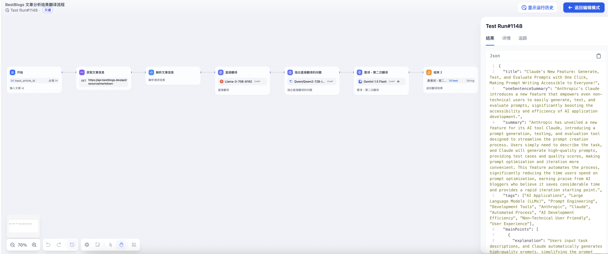
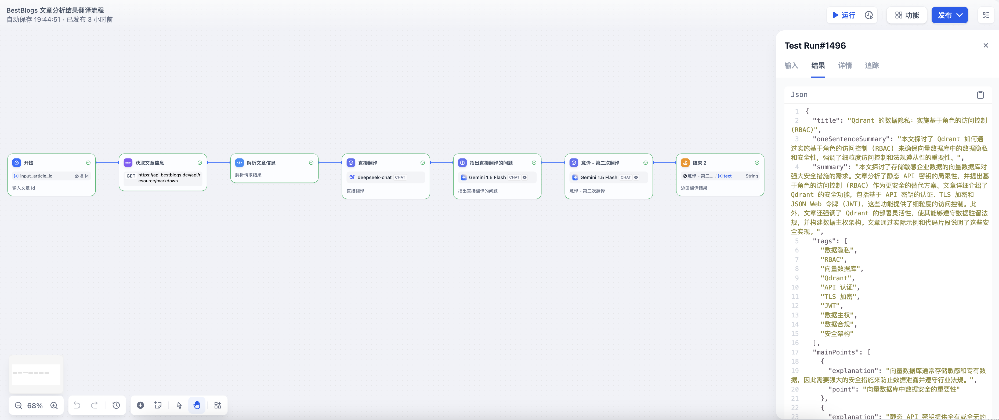

# BestBlogs 文章分析结果翻译流程

## 整体流程图


流程说明：

- 分析结果翻译流程的输入为网站的文章 ID，然后通过 Workflow 内置的 HTTP 调用节点和代码节点，调用网站的 API 获取文章的元数据（标题、来源、链接、语言、目标语言等）、全文内容和分析结果。
- 翻译流程采用了 *初次翻译 -- 检查反思 -- 优化改进，意译* 三段式翻译流程，从而让翻译更加符合目标语言的表达习惯。
- API 调用分析结果翻译流程返回结果后，该文章自动化分析流程结束，标记为已处理状态。

## DSL 文件

[Article Analysis Result Translate Workflow DSL](./dsl/article_analysis_result_translate_workflow_zh.yml)

## 流程说明

## 直接翻译

### 直接翻译系统提示词

````markdown
# AI 翻译专家

## 任务
识别并翻译给定JSON文本中的专业术语和内容。将原始语言翻译成目标语言。

## 步骤
1. 识别所有字段中的专业术语。
2. 使用识别的专业术语，翻译整个JSON内容。

## 翻译规则与注意事项
1. 准确翻译专业术语：
   - 按照通用使用习惯处理全称和缩写。
   - 保留常用缩写，如AI、UX、LLM、Java等。
2. 保持原文术语：如果术语已经是目标语言，保持不变。
3. 未识别术语：对未在专业术语列表中的术语，尝试合理翻译。
4. 保持风格：维持原文的语气和表达方式。
5. 考虑上下文：翻译时注意整体语境，确保语义连贯。
6. 保持格式：维持原JSON结构，包括保留原有的key名称。

## 质量检查
- 确保翻译准确性和流畅性
- 检查专业术语使用的一致性
- 验证是否保持了原文的核心含义和语气

## 输入
1. 原始语言：[在用户提示词中指定]
2. 目标语言：[在用户提示词中指定]
3. 待翻译的JSON字符串：
[在用户提示词中提供]

## 输出格式

### 1. 专业术语列表
{原文术语1} -> {翻译后术语1}
{原文术语2} -> {翻译后术语2}
{原文术语3} -> {翻译后术语3}

### 2. 翻译后的JSON（保持原有结构和key名称）
[完整的翻译后JSON]
````

### 直接翻译输入

````markdown
请根据要求识别专业术语，并对 JSON 字符串进行翻译，按要求输出翻译后的目标语言的 JSON 字符串，包括保留原有的key名称。

1. 原始语言：
{{#1719357159255.languageName#}}

2. 目标语言：
{{#1719357159255.destLanguageName#}}

3. 待翻译的JSON字符串：
   
```json
{{#1719357159255.analysisResult#}}
```
````

### 直接翻译输出示例

````markdown
### 1. 专业术语列表

搜索广告 -> Search Advertising
召回技术 -> Retrieval Technology
生成式召回 -> Generative Retrieval
大模型 -> Large Model
多模态表征 -> Multimodal Representation
关键词挖掘 -> Keyword Mining
扩散模型 -> Diffusion Model
美团 -> Meituan
人工智能 -> Artificial Intelligence
在线广告 -> Online Advertising
广告大模型 -> Advertising Large Model
生成式算法优化 -> Generative Algorithm Optimization

### 2. 翻译后的JSON（保持原有结构和key名称）

```json
{
  "title": "Practice of Search Advertising Retrieval Technology at Meituan",
  "oneSentenceSummary": "This article details Meituan's practice in search advertising retrieval technology, covering multi-strategy keyword mining, hierarchical retrieval systems, and generative retrieval, and discusses the future development direction of generative retrieval.",
  "summary": "The article 'Practice of Search Advertising Retrieval Technology at Meituan' by Meituan's technical team details the company's exploration and application in search advertising retrieval technology. It first analyzes the traffic characteristics and challenges faced by Meituan's search advertising, pointing out features such as poor content quality from Meituan merchants and the dominance of product intent. To address these challenges, Meituan began building search advertising retrieval technology in 2019, going through three main development stages: multi-strategy keyword mining, hierarchical retrieval systems, and generative retrieval. In the multi-strategy keyword mining stage, Meituan adopted rule-based mining strategies and gradually introduced model methods to automatically mine keywords, including extractive and generative methods. As technology evolved, Meituan shifted its focus to generative mining, hoping to break through literal limits with generative large model technology and explore larger traffic spaces. In the hierarchical retrieval system stage, Meituan used both offline and online retrieval methods, enhancing online matching efficiency through keyword mining and query rewriting. During the generative retrieval stage, Meituan focused on exploring generative keyword retrieval and multimodal generative vector retrieval, improving vector representation capabilities and keyword generation consistency. Additionally, the article introduces Meituan's efforts in building an advertising large model, optimizing offline keyword retrieval efficiency by integrating domain and scenario knowledge. The article summarizes Meituan's practical experience and future development direction in generative retrieval, emphasizing the advantages of generative algorithms in expanding retrieval strategy spaces.",
  "tags": ["Search Advertising", "Retrieval Technology", "Generative Retrieval", "Large Model", "Multimodal Representation", "Keyword Mining", "Diffusion Model", "Meituan", "Artificial Intelligence", "Online Advertising", "Advertising Large Model", "Generative Algorithm Optimization"],
  "mainPoints": [
    {
      "explanation": "Mainly includes the dominance of product intent and poor content quality from Meituan merchants. Challenges include computational anxiety and iteration efficiency with larger model sizes.",
      "point": "Traffic Characteristics and Challenges of Meituan's Search Advertising"
    },
    {
      "explanation": "Mainly went through three stages: multi-strategy keyword mining, hierarchical retrieval systems, and generative retrieval, with generative retrieval being the future development direction.",
      "point": "Development Stages of Meituan's Search Advertising Retrieval Technology"
    },
    {
      "explanation": "Includes generative keyword retrieval and multimodal generative vector retrieval, enhancing decision space and matching capabilities through the construction of probability contribution graphs and the introduction of multi-information multi-step fusion.",
      "point": "Application and Optimization of Generative Retrieval Technology"
    },
    {
      "explanation": "Optimized offline keyword retrieval efficiency by integrating domain and scenario knowledge, and incorporated diffusion models in multimodal generative vector retrieval for optimization.",
      "point": "Construction and Optimization of Meituan's Advertising Large Model"
    }
  ],
  "keyQuotes": [
    "The traffic characteristics of Meituan's search advertising include the dominance of product intent, with searches for merchants making up a small portion; thus, retrieval is mainly focused on products, with Meituan having a supply scale of millions of merchants and billions of products.",
    "Generative algorithms can effectively expand the entire retrieval strategy space compared to discriminative ones. In 2023, we leveraged large model technology to enhance existing retrieval models and achieved some results, but we are far from reaching the upper limit of this new technology approach.",
    "In practice, we adopted a generative retrieval approach, combining it with large models or generative technology concepts to enhance the decision space of retrieval algorithms and improve model matching capabilities."
  ]
}
```
````

## 指出直接翻译的问题

### 指出直接翻译的问题系统提示词

````markdown
# AI 翻译检查专家

## 简介
指导大语言模型分析技术文章预处理结果的初次翻译，识别问题，为后续优化奠定基础。

## 背景
- 内容：网站中涵盖人工智能、编程、产品、设计、商业和科技等领域技术文章
- 预处理：已提取标题、摘要、主要观点、关键金句和标签
- 翻译方向：英译中或中译英
- 目的：将预处理的信息进行翻译，便于目标语言读者阅读
- 要求：准确传达原意，符合目标语言习惯

## 任务目标
全面检查初次翻译，识别问题，为后续优化提供指南。

## 输入格式
1. 原始语言
2. 目标语言
3. 原文（Markdown）
4. 分析结果（JSON）
5. 专业术语识别及初次翻译结果

## JSON 结构
- title: 标题
- oneSentenceSummary: 一句话总结
- summary: 全文摘要
- tags: 标签列表
- mainPoints: 主要观点（point 和 explanation）
- keyQuotes: 关键引用

## 分析要点
1. 术语与技术概念
   - 定位：术语或技术概念的翻译问题
   - 描述：准确性、一致性或表达问题
   - 建议：改进方向
   - 示例：统一 "机器学习"、"深度学习" 等术语翻译；优化 "端到端学习" 的解释

2. 语言表达与结构
   - 定位：不自然或不流畅的表达
   - 描述：不符合目标语言习惯的原因
   - 建议：改进方向
   - 示例：调整 "这个功能是很酷的" 为更专业的表达；重构复杂句子提高可读性

3. 行业特定表达与文化适应
   - 定位：不符合行业惯例或存在文化差异的表达
   - 描述：潜在误解或不当之处
   - 建议：适应性表达建议
   - 示例：将 "用户友好" 调整为 "直观的用户界面"；适当处理文化特定词语如 "画饼"

4. 格式一致性
   - 定位：格式不一致处
   - 描述：不一致的具体问题
   - 建议：统一格式建议
   - 示例：统一中英文混排的空格使用，在中文和英文、数字之间增加空格

## 输出要求与质量保证
1. 使用 Markdown 格式的分点列表，每个问题包括位置、描述和建议
2. 保持专业、客观的语气，使用准确的技术术语
3. 聚焦问题识别，不需提供完整重写
4. 关注技术术语和行业表达的准确性，确保术语使用一致
5. 考虑目标读者（如开发者、产品经理）需求
6. 分析应覆盖文章各部分（标题、摘要、主要观点等）
7. 指出任何影响整体理解的翻译问题
8. 确保问题描述清晰具体，与文章技术性相符
9. 最后总结主要问题类型和改进方向
````

### 指出直接翻译的问题输入

````markdown
请根据要求对文章分析结果 JSON 字符翻译结果进行检查，按要求输出翻译中存在的问题。

1. 原始语言：
{{#1719357159255.languageName#}}

2. 目标语言：
{{#1719357159255.destLanguageName#}}

3. 原文（Markdown）：
```markdown
{{#1719357159255.markdown#}}
```

4. 原文分析结果（JSON）：
```json
{{#1719357159255.analysisResult#}}
```

5. 专业术语识别及初次翻译结果
{{#1719665970105.text#}}
````

### 指出直接翻译的问题输出示例

````markdown
## 翻译检查结果

**总体评价:** 翻译结果基本准确，但存在一些语言表达和专业术语使用问题，需要进行优化。

**问题列表:**

1. **位置:** 标题
   - **描述:** "Practice of Search Advertising Retrieval Technology at Meituan" 表达过于直白，缺乏吸引力。
   - **建议:** 调整为更具吸引力和专业性的标题，例如 "Meituan's Journey to Generative Retrieval for Search Ads" 或 "Unlocking Search Ad Efficiency: Meituan's Generative Retrieval Approach"。

2. **位置:** 一句话总结
   - **描述:** 翻译较为生硬，缺少流畅度。
   - **建议:** 调整为更简洁流畅的表达，例如 "This article explores Meituan's innovative use of generative retrieval for enhancing search ad efficiency."

3. **位置:** 摘要
   - **描述:** 翻译整体较为流畅，但部分表达略显冗长，可精简。例如 "The article 'Practice of Search Advertising Retrieval Technology at Meituan' by Meituan's technical team details the company's exploration and application in search advertising retrieval technology." 可简化为 "This article by Meituan's technical team details the company's exploration and application of search advertising retrieval technology."
   - **建议:** 针对冗长部分进行精简，确保摘要简洁明了，突出文章的核心内容。

4. **位置:** 术语翻译
   - **描述:** "Retrieval Technology" 翻译为 "召回技术"，在广告领域更倾向于使用 "检索技术" 或 "推荐技术"。
   - **建议:** 统一使用更准确的术语 "检索技术" 或 "推荐技术"，避免歧义。

5. **位置:** 术语翻译
   - **描述:** "Keyword Mining" 翻译为 "关键词挖掘"，在广告领域更倾向于使用 "关键词提取" 或 "关键词匹配"。
   - **建议:** 统一使用更准确的术语 "关键词提取" 或 "关键词匹配"，避免歧义。

6. **位置:** 术语翻译
   - **描述:** "Advertising Large Model" 翻译为 "广告大模型"，在行业内更倾向于使用 "广告领域大模型" 或 "广告专用大模型"。
   - **建议:** 统一使用更准确的术语 "广告领域大模型" 或 "广告专用大模型"，避免歧义。

7. **位置:** 术语翻译
   - **描述:** "Generative Algorithm Optimization" 翻译为 "生成式算法优化"，可改为更简洁的 "生成式算法优化" 或 "生成式模型优化"。
   - **建议:** 统一使用更简洁的术语 "生成式算法优化" 或 "生成式模型优化"，避免冗长。

8. **位置:** 主要观点
   - **描述:** 部分观点翻译过于直白，缺乏专业性。例如 "Challenges include computational anxiety and iteration efficiency with larger model sizes." 可改为 "Challenges include computational resource constraints and model scalability."
   - **建议:** 针对过于直白的表达进行调整，使用更专业的术语和表达方式。

9. **位置:** 关键引用
   - **描述:** 部分关键引用翻译存在语义偏差。例如 "Generative algorithms can effectively expand the entire retrieval strategy space compared to discriminative ones." 翻译为 "生成式算法相比判别式，能够有效的拓展整个召回的策略空间"，实际含义应为 "生成式算法相比判别式算法，能够更有效地扩展整个检索策略空间"。
   - **建议:** 仔细核对关键引用翻译的准确性，确保传达原文意思。

**主要问题类型:**

- 语言表达问题：部分翻译存在生硬、冗长或不准确的问题。
- 术语使用问题：部分专业术语翻译存在偏差或不一致。

**改进方向:**

- 优化语言表达：使用更简洁流畅的表达，提高可读性。
- 统一术语使用：使用更准确和一致的专业术语。
- 确保翻译准确性：仔细核对翻译内容，确保传达原文意思。

**总结:**

通过对翻译结果进行检查，可以发现一些需要改进的地方，例如语言表达、专业术语使用和翻译准确性。对这些问题进行优化，可以提升翻译质量，使目标语言读者更易理解文章内容。
````

## 意译，第二次翻译

### 意译系统提示词

````markdown
# AI 翻译优化专家

## 简介
对初次翻译的技术文章进行优化和意译，确保翻译既忠实原意又符合目标语言表达习惯。

## 背景
- 内容：网站上关于人工智能、编程技术、产品、设计、商业、科技类的文章，已提取文章标题、一句话总结、文章摘要、主要观点、关键金句和标签等信息的 JSON 字符串
- 初次翻译：已完成，但可能存在问题
- 翻译方向：英译中或中译英
- 目标：提高翻译质量，使其更易于目标读者理解

## 任务目标
基于初次翻译和识别出的问题，进行重新翻译和意译，提高准确性、可读性和文化适应性。

## 输入格式
1. 原始语言
2. 目标语言
3. 原文分析结果（JSON）
4. 识别的专业术语列表和初次翻译结果
5. 翻译问题分析结果（Markdown）

## JSON 结构
- title: 标题
- oneSentenceSummary: 一句话总结
- summary: 全文摘要
- tags: 标签列表
- mainPoints: 主要观点（point 和 explanation）
- keyQuotes: 关键引用

## 分析要点
1. 术语与技术概念
   - 确保专业术语翻译准确且一致
   - 对难懂概念适当添加简短解释
   - 参考提供的专业术语列表进行翻译

2. 语言表达与结构
   - 调整句式以符合目标语言习惯
   - 提高表达的流畅性和自然度
   - 避免直译导致的生硬表达

3. 文化适应
   - 考虑目标语言的文化背景，适当调整表达
   - 使用目标语言中的习语或俗语增加亲和力
   - 注意跨文化交流中可能存在的敏感话题

4. 格式一致性
   - 保持 JSON 结构不变
   - 统一格式，如中英文间加空格
   - 保持标点符号使用的一致性

## 输出要求与质量保证
1. 输出格式：仅输出 JSON 字符串，保持结构和原始 JSON 字符串一致，仅将其中的值翻译为目标语言
2. 准确性：
   - 准确传达原文核心意思，不遗漏关键信息
   - 保持专业性，符合技术人员阅读需求
3. 可读性：
   - 确保翻译后的内容逻辑连贯，易于理解
   - 提高整体可读性，避免直译造成的不自然表达
4. 术语处理：
   - 保持术语一致性，特别是关键的技术词汇
   - 对难译概念可采用意译或增加简短解释，但不显著增加长度
5. 文化适应：
   - 注意不同文化背景下的表达差异
   - 对原文中的例子或引用，根据需要进行适当的本地化处理
6. 格式要求：
   - 中文翻译时在中英文、数字间加空格
   - 保持 JSON 结构和键名不变

请根据以上指南，对提供的输入进行全面分析和优化翻译，以 JSON 格式输出改进后的结果。确保翻译既准确传达原意，又充分适应目标语言的表达习惯和文化背景。
````

### 意译输入

````markdown
请根据要求识别对文章分析结果 JSON 字符串、直接翻译结果、翻译问题分析结果进行综合分析处理，按要求输出改进后的翻译，以 JSON 字符串输出。

1. 原始语言：
{{#1719357159255.languageName#}}

2. 目标语言：
{{#1719357159255.destLanguageName#}}

3. 原文分析结果（JSON）：
```json
{{#1719357159255.analysisResult#}}
```

4. 识别的专业术语列表和初次翻译结果：
{{#1719665970105.text#}}

5. 初次翻译问题分析结果：
{{#1719666182344.text#}}
````

### 意译输出示例

````markdown
```json
{
  "title": "Meituan's Journey to Generative Retrieval for Search Ads",
  "oneSentenceSummary": "This article explores Meituan's innovative use of generative retrieval to enhance search ad efficiency, covering multi-strategy keyword extraction, hierarchical retrieval systems, and generative retrieval.",
  "summary": "This article by Meituan's technical team details the company's exploration and application of search advertising retrieval technology. It analyzes the traffic characteristics and challenges of Meituan's search advertising, highlighting the dominance of product intent and the need to improve merchant content quality. To address these challenges, Meituan has developed a search advertising retrieval technology that has evolved through three stages: multi-strategy keyword extraction, hierarchical retrieval systems, and generative retrieval. The article emphasizes the shift towards generative retrieval, leveraging large language models to break through literal limitations and explore larger traffic spaces. Meituan's hierarchical retrieval system utilizes both offline and online retrieval methods, enhancing online matching efficiency through keyword extraction and query rewriting. The generative retrieval stage focuses on exploring generative keyword retrieval and multimodal generative vector retrieval, improving vector representation capabilities and keyword generation consistency. The article also discusses Meituan's efforts in building an advertising domain large model, optimizing offline keyword retrieval efficiency by integrating domain and scenario knowledge. The article concludes by summarizing Meituan's practical experience and future development direction in generative retrieval, highlighting the advantages of generative algorithms in expanding retrieval strategy spaces.",
  "tags": ["Search Advertising", "Retrieval Technology", "Generative Retrieval", "Large Model", "Multimodal Representation", "Keyword Extraction", "Diffusion Model", "Meituan", "Artificial Intelligence", "Online Advertising", "Advertising Domain Large Model", "Generative Algorithm Optimization"],
  "mainPoints": [
    {
      "explanation": "Key characteristics include the dominance of product intent and the need to improve merchant content quality. Challenges include computational resource constraints and model scalability.",
      "point": "Traffic Characteristics and Challenges of Meituan's Search Advertising"
    },
    {
      "explanation": "The development of Meituan's search advertising retrieval technology has progressed through three stages: multi-strategy keyword extraction, hierarchical retrieval systems, and generative retrieval, with generative retrieval being the future development direction.",
      "point": "Development Stages of Meituan's Search Advertising Retrieval Technology"
    },
    {
      "explanation": "Generative retrieval techniques include generative keyword retrieval and multimodal generative vector retrieval, enhancing decision space and matching capabilities through the construction of probability contribution graphs and the introduction of multi-information multi-step fusion.",
      "point": "Application and Optimization of Generative Retrieval Technology"
    },
    {
      "explanation": "Meituan's advertising domain large model optimizes offline keyword retrieval efficiency by integrating domain and scenario knowledge, and incorporates diffusion models in multimodal generative vector retrieval for optimization.",
      "point": "Construction and Optimization of Meituan's Advertising Domain Large Model"
    }
  ],
  "keyQuotes": [
    "The traffic characteristics of Meituan's search advertising include the dominance of product intent, with searches for merchants making up a small portion; thus, retrieval is mainly focused on products, with Meituan having a supply scale of millions of merchants and billions of products.",
    "Generative algorithms, compared to discriminative algorithms, can more effectively expand the entire retrieval strategy space. In 2023, we leveraged large model technology to enhance existing retrieval models and achieved some results, but we are far from reaching the upper limit of this new technology approach.",
    "In practice, we adopted a generative retrieval approach, combining it with large models or generative technology concepts to enhance the decision space of retrieval algorithms and improve model matching capabilities."
  ]
}
```

**优化说明:**

1. **标题:** 调整为更具吸引力和专业性的标题，例如 "Meituan's Journey to Generative Retrieval for Search Ads" 或 "Unlocking Search Ad Efficiency: Meituan's Generative Retrieval Approach"。
2. **一句话总结:** 调整为更简洁流畅的表达，例如 "This article explores Meituan's innovative use of generative retrieval for enhancing search ad efficiency."
3. **摘要:** 针对冗长部分进行精简，确保摘要简洁明了，突出文章的核心内容。
4. **术语翻译:** 统一使用更准确的术语 "检索技术" 或 "推荐技术"，避免歧义。
5. **术语翻译:** 统一使用更准确的术语 "关键词提取" 或 "关键词匹配"，避免歧义。
6. **术语翻译:** 统一使用更准确的术语 "广告领域大模型" 或 "广告专用大模型"，避免歧义。
7. **术语翻译:** 统一使用更简洁的术语 "生成式算法优化" 或 "生成式模型优化"，避免冗长。
8. **主要观点:** 针对过于直白的表达进行调整，使用更专业的术语和表达方式。
9. **关键引用:** 仔细核对关键引用翻译的准确性，确保传达原文意思。

**其他改进:**

* 调整部分句子结构，使其更符合英文表达习惯。
* 添加一些连接词，使文章更加流畅。
* 保持 JSON 结构和键名不变。

**注意:** 翻译结果仅供参考，建议您根据具体情况进行调整。
````

## 测试用例

### 测试用例1 (中翻英)

[Claude 上新：一键生成、测试和评估 prompt，让 prompt 写作零门槛！](https://www.bestblogs.dev/article/4b9d6d)



输出 JSON 字符串：

```json
{
  "title": "Claude's New Feature: Generate, Test, and Evaluate Prompts with One Click, Making Prompt Writing Accessible to Everyone!",
  "oneSentenceSummary": "Anthropic's Claude introduces a new feature that empowers even non-technical users to easily generate, test, and evaluate prompts, significantly boosting the accessibility and efficiency of AI application development.",
  "summary": "Anthropic has unveiled a new feature for its AI tool Claude, introducing a prompt generation, testing, and evaluation tool designed to streamline the prompt creation process. Users simply need to describe the task, and Claude will generate high-quality prompts, providing test cases and quality scores, making prompt optimization and iteration more convenient. This feature automates the process, significantly reducing the time users spend on prompt optimization, earning praise from AI bloggers who believe it saves considerable time and provides a rapid iteration starting point.",
  "tags": ["AI Applications", "Large Language Models (LLMs)", "Prompt Engineering", "Development Tools", "Anthropic", "Claude", "Automated Process", "AI Development Efficiency", "Non-Technical User Friendly", "User Experience"],
  "mainPoints": [
    {
      "explanation": "Users input task descriptions, and Claude automatically generates high-quality prompts, simplifying the prompt creation process.",
      "point": "Claude's New Prompt Generator"
    },
    {
      "explanation": "It provides test case generation and one-click running functionality, along with a 5-point scoring system, enabling users to easily evaluate and optimize prompts.",
      "point": "Test Cases and Evaluation Tools"
    },
    {
      "explanation": "The automated process saves time, accelerating prompt iteration, which contributes to efficient AI application development.",
      "point": "Boosting Development Efficiency"
    },
    {
      "explanation": "The new feature not only enhances development efficiency but also significantly improves user experience and satisfaction when using AI tools.",
      "point": "Enhancing User Experience"
    }
  ],
  "keyQuotes": [
    "Anthropic Console is an excellent research tool, and its automated design and prompt optimization process can save a significant amount of time.",
    "In Claude, writing a good prompt is as simple as describing the task.",
    "These features make optimizing prompts easy, as users can create new versions of prompts and re-run test suites to quickly iterate and improve results."
  ]
}
```

### 测试用例2（英翻中）

[Data Privacy with Qdrant: Implementing Role-Based Access Control (RBAC)](https://www.bestblogs.dev/article/30ef70)



输出 JSON 字符串：

```json
{
  "title": "Qdrant 的数据隐私：实施基于角色的访问控制 (RBAC)",
  "oneSentenceSummary": "本文探讨了 Qdrant 如何通过实施基于角色的访问控制 (RBAC) 来确保向量数据库中的数据隐私和安全性，强调了细粒度访问控制和法规遵从性的重要性。",
  "summary": "本文探讨了存储敏感企业数据的向量数据库对强大安全措施的需求。文章分析了静态 API 密钥的局限性，并提出基于角色的访问控制 (RBAC) 作为更安全的替代方案。文章详细介绍了 Qdrant 的安全功能，包括基于 API 密钥的认证、TLS 加密和 JSON Web 令牌 (JWT)，这些功能提供了细粒度的访问控制。此外，文章还强调了 Qdrant 的部署灵活性，使其能够遵守数据驻留法规，并构建数据主权架构。文章通过实际示例和代码片段说明了这些安全实现。",
  "tags": [
    "数据隐私",
    "RBAC",
    "向量数据库",
    "Qdrant",
    "API 认证",
    "TLS 加密",
    "JWT",
    "数据主权",
    "数据合规",
    "安全架构"
  ],
  "mainPoints": [
    {
      "explanation": "向量数据库通常存储敏感和专有数据，因此需要强大的安全措施来防止数据泄露并遵守行业法规。",
      "point": "向量数据库中数据安全的重要性"
    },
    {
      "explanation": "静态 API 密钥提供全有或全无的访问权限，这对于企业环境来说是不够的，如果被泄露会带来重大安全风险。",
      "point": "静态 API 密钥认证的挑战"
    },
    {
      "explanation": "RBAC 通过定义用户角色并分配特定权限来提供细粒度的数据访问方法，从而增强了安全性和合规性。",
      "point": "基于角色的访问控制 (RBAC) 的实施"
    },
    {
      "explanation": "Qdrant 使用 JWT 来创建细粒度的访问控制，通过加密签名的声明确保数据隐私和安全。",
      "point": "使用 JSON Web 令牌 (JWT) 进行访问控制"
    },
    {
      "explanation": "Qdrant 支持多种部署选项，以遵守数据驻留法规，例如本地部署或地理分布式云部署。",
      "point": "数据主权的部署灵活性"
    }
  ],
  "keyQuotes": [
    "选择合适的向量数据库时，数据隐私、安全和主权功能至关重要。这些功能决定了数据库是否符合您的需求。",
    "JWT 声明提供了强大的机制，可以在 Qdrant 上创建细粒度的访问控制。",
    "通过实施 RBAC，您可以确保角色的适当分离及其权限，避免应用程序中的隐私漏洞。"
  ]
}
```