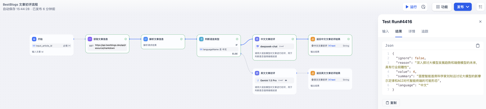
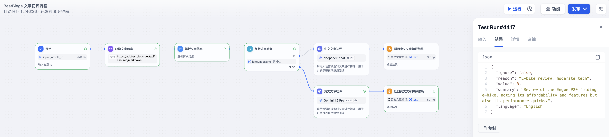

# BestBlogs 文章初评流程

> ⚠️ Issue #564 改造（2026-05）：评分尺度从 **0-5 改为 0-100**（与 analysis totalScore 同尺度），
> 输入字段扩展为 source / category / language / publish_time / original_summary 等富元信息。
> **提示词事实来源**：`bestblogs-docs/workflows/prompts/article-filter.md`（中英双版）。
> 完整契约见 `bestblogs-docs/specs/content-pipeline-filter.md`。

## 整体流程图



流程说明：

- 网站应用通过 Dify Workflow 开放的 API 传入文章元信息（标题、来源、分类、语言、发布时间、截断摘要），由文章初评 LLM 节点输出初评结果。
- 为中文和英文文章采用不同的模型和提示词，可以更加灵活地调整和优化。
- 文章初评 LLM 节点通过 CO-STAR 提示词框架定义上下文、目标、分析步骤、输入输出格式，提供输出示例。
- 网站应用根据返回的 `ignore` 与 `value`（0-100）判断是否继续往下处理：`value ≥ FILTER_MIN_SCORE_ARTICLE`（默认 30）放行进入分析阶段。

## DSL File

[Filter Article Workflow DSL](./dsl/filter_article_workflow_zh.yml)

> 注：DSL 中内嵌的历史 v1 提示词为 0-5 尺度，仅作 graph 结构参考。线上实际提示词以
> `workflows/prompts/article-filter.md` 为准，由运维在 Dify 平台编辑发布 0-100 schema。

## 输入契约（Issue #564）

Java 入口 `DifyWorkflowAdapter.runFilterFlow` 透传以下字段：

| 字段 | 说明 |
|------|------|
| `input_article_id` | 资源短 ID |
| `input_article_title` | 文章标题 |
| `source_name` | 订阅源名称 |
| `source_url` | 源 RSS URL（兜底） |
| `source_category` | 源分类 |
| `resource_type` | 资源类型（`ARTICLE`） |
| `language` | 资源语言 code（`zh_CN` / `en_US`） |
| `publish_time` | 发布时间（ISO 字符串） |
| `original_summary` | 文章摘要（≤ `FILTER_INPUT_SUMMARY_MAX_CHARS`，默认 200 字符截断） |

## 输出契约

LLM 节点末端输出 JSON（与 `ResourceFilterResult` 一致）：

```json
{
  "ignore": false,
  "reason": "高质量技术内容，含详细算法说明",
  "value": 88,
  "summary": "详细介绍协同过滤算法构建推荐系统",
  "language": "英文"
}
```

- `value`：**0-100 整数**初评分（关键阈值字段，与 analysis totalScore 同尺度）
- 评分分段与判断标准详见 `workflows/prompts/article-filter.md`

## 测试示例

### 中文文章测试结果


### 英文文章测试结果


