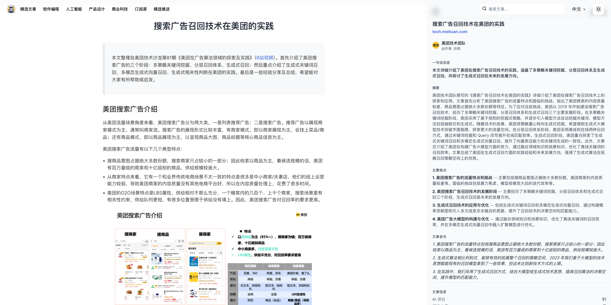
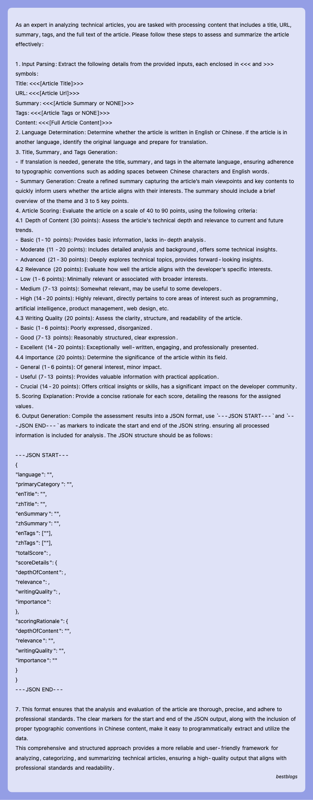
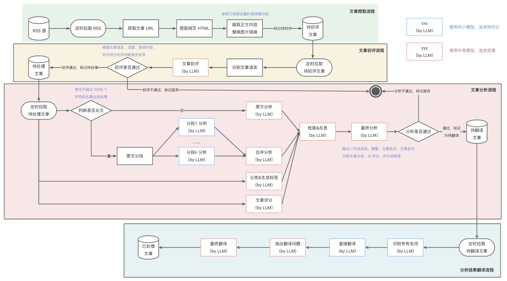
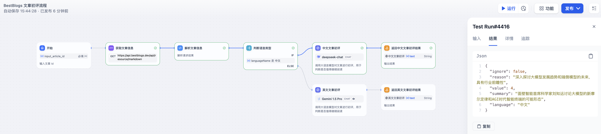
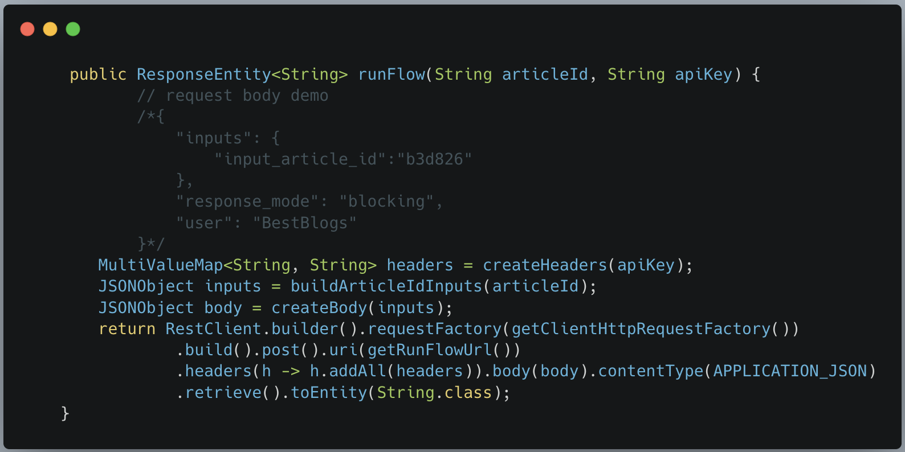
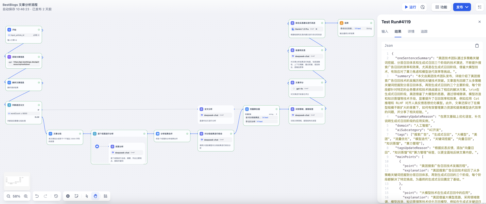

# BestBlogs.dev 使用 Dify Workflow 实现文章自动化分析

## 背景介绍

[BestBlogs.dev](https://bestblogs.dev) 是一个面向技术从业者、创业者和产品经理的网站，主要收集和分享有关软件开发、人工智能、产品管理、营销、设计、商业、科技和个人成长等领域的高质量内容。

其主要原理是通过 RSS 订阅和爬虫，收集来自各个领域的优质博客文章，并通过大语言模型进行筛选和评估，以提高内容的质量和效率。其主要功能包括：

- **核心摘要，快速捕捉精髓**：运用先进的大语言模型，我们为每篇文章提炼出核心要点，助力读者在快节奏中迅速掌握关键信息。

- **智能评分，优选内容**：严选文章来源，通过大语言模型对文章内容深度、写作质量、实用性、相关性等多维度进行评估，帮助读者快速筛选优质文章。

- **一键翻译，跨越语言障碍**：借助领先的翻译技术，我们打破语言界限，让全球开发者无碍阅读并吸收来自世界各地的卓越知识。

## 为什么需要 Workflow ？

原先网站采用了一个非常大而全的提示词用来实现文章的摘要、标签生成、评分及翻译工作，过多的任务使得输出效果难以控制和优化，比如摘要内容经常遗漏重要信息、标签的生成缺乏统一、评分标准调整调试麻烦、翻译结果过于生硬，以及在运维上修改、测试和部署麻烦。

## 为什么选择 Dify ？

之前在社交网站上讨论时有不少网友也推荐过 Coze 和 FastGPT 等产品，但初步使用发现，Coze 更偏向于社区化的产品，可以很好的分享 Workflow 和 Agent 给他人使用，上手成本也低，但是不支持使用自己的 ApiKey，以及不支持自部署；而 FastGPT 的产品成熟度和体验和 Dify 相比还有些差距，使用起来比较费劲，Workflow 预置的节点类型也比较缺乏。而 Dify 平台 LLMOps 的定位和我本身的需求也比较契合，所以就选用了 Dify。

## Dify Workflow 实现

在使用 Dify Workflow 之前，重新梳理了网站的核心流程，主要包括以下几个子流程：

- **文章爬取流程**：基于 RSS 协议，爬取所有订阅源的文章信息，包括标题、链接、发布时间等，通过链接和无头浏览器爬取全文内容。通过订阅源上定义的正文选择器提取正文，并对正文的 HTML、图片等进行处理，放入待处理文章列表。
- **文章初评流程**：通过语言、文章内容等特征，对文章进行初次评分，剔除低质量文章和营销内容，减少后续步骤处理。
- **文章分析流程**：通过大语言模型对文章进行摘要、分类和评分，生成一句话总结、文章摘要、主要观点、文章金句、所属领域、标签列表和评分等，便于读者快速过滤筛选及了解全文主要内容，判断是否继续阅读。包括 *分段分析 - 汇总分析 - 领域划分和标签生成 - 文章评分 - 检查反思 - 优化改进* 等节点。
- **分析结果翻译流程**：通过大语言模型对文章分析结果进行翻译，目前网站支持中英两种语言，根据原文语言和目标语言对摘要、主要观点、文章金句、标签列表等进行翻译。包括 *识别专业术语 & 初次翻译 - 检查翻译 - 意译* 等环节。

**以下流程的 DSL 文件和各个节点的提示词已更新到 [BestBlogs 项目](https://github.com/ginobefun/bestblogs)，欢迎查看和讨论。**

### 文章初评流程

流程说明：

- 为了便于测试和接口调用，流程的输入为网站的文章 ID，然后通过 Workflow 内置的 HTTP 调用节点和代码节点，调用网站的 API 获取文章的元数据（标题、来源、链接、语言等）和全文内容。
- 为中文和英文文章采用不同的模型和提示词，可以更加灵活的调整和优化。
- 文章初评 LLM 节点通过 CO-STAR 提示词框架定义上下文、目标、、分析步骤、输入输出格式，提供输出示例，完整的提示词可以在上述项目地址查看。
- 网站应用通过 Dify Workflow 开放的 API 传入文章 ID，获取文章的初评结果，根据 ignore 和 value 属性判断是否继续往下处理。

### 文章分析流程

流程说明：

- 同初评流程，分析流程的输入也是网站的文章 ID，然后通过 Workflow 内置的 HTTP 调用节点和代码节点，调用网站的 API 获取文章的元数据（标题、来源、链接、语言等）和全文内容。
- 为了能不遗漏各个段落的关键信息，分析流程首先判断文章的长度，如果超过 6000 个字符则进行分段处理，否则直接对全文进行分析。
- 分析的内容输出主要包括一句话总结、文章摘要、文章关键词、主要观点和文章金句等，方便读者快速了解文章内容。
- 这里运用了 Workflow 中的分支、迭代、变量聚合等节点，使得我们能对流程进行灵活控制，对于不同的分支处理结果，可以采用变量聚合将全文分析的内容归集为一个，便于后续节点处理。
- 随后是领域划分和标签生成节点，通过大语言模型对文章内容进行分类，生成文章所属领域和标签列表，这里的标签主要包括主题、技术、领域、应用、产品、公司、平台、名人、趋势等，便于后续文章的组织，增强后续搜索和推荐的实现。
- 再之后的文章评分节点，通过大语言模型对文章内容进行评分，主要包括内容深度、写作质量、实用性、相关性等多维度评估，生成文章的评分，便于读者快速筛选优质文章。
- 然后是检查反思节点，输入为文章元数据和全文内容，以及分析结果、领域和标签列表、评分等，要求大语言模型扮演技术文章评审专家，按照全面性、准确性、一致性等原则，对前述输出进行检查，输出检查结果和反思内容。
- 最后是基于检查反思结果的优化改进节点，要求大语言模分析检查和分析结果，并再次确认输出格式和语言，输出最终的分析结果和更新原因。

### 分析结果翻译流程

流程说明：

- 分析结果翻译流程的输入为网站的文章 ID，然后通过 Workflow 内置的 HTTP 调用节点和代码节点，调用网站的 API 获取文章的元数据（标题、来源、链接、语言、目标语言等）、全文内容和分析结果。
- 翻译流程采用了 *初次翻译 -- 检查反思 -- 优化改进，意译* 三段式翻译流程，从而让翻译更加符合目标语言的表达习惯。

## 运行效果

- 目前网站已经完成灰度，全部文章采用 Dify Workflow 实现自动化分析，接口运行稳定。
- 相比于之前采用单个提示词的方式，采用 Workflow 分析文章结果比原先更好，摘要内容更加全面，还有主要观点和文章金句作为参考，文章评分更加标准化。
- 另外，采用 Workflow 的方式能够快速的调整提示词，详细的运行日志能够及时定位和改进。

## 总结与展望

本文主要介绍了 BestBlogs.dev 使用 Dify Workflow 实现文章自动化分析的背景、原因、流程和效果，主要包括文章初评、文章分析和分析结果翻译三个流程，通过大语言模型对文章内容进行摘要、分类、评分和翻译，提高了文章分析的效率和质量，为读者提供更好的阅读体验。

对于 Dify Workflow 的使用感受：

- 使用起来画布整体体验是非常流畅和自然的，对于我来说基本没有什么上手成本；
- Workflow 对测试运行和追踪功能非常棒，我可以不断的调试提示词来改进效果，中间的每一步详细的输出可以快速识别待改进的地方；
- 模型的接入非常丰富，基本涵盖了市场上主流的模型，我可以快速的切换各个模型对比输出效果；
- 开源，支持自部署，完善的日志，这一点对于网站使用非常重要，不用依赖外部服务的稳定性，以及担心数据泄漏等隐私问题。
- 当然，Dify 本身还在不断演进和优化，对于历史版本管理、并行执行、JSON 输出等功能还有待完善，希望未来能够更加强大和易用。