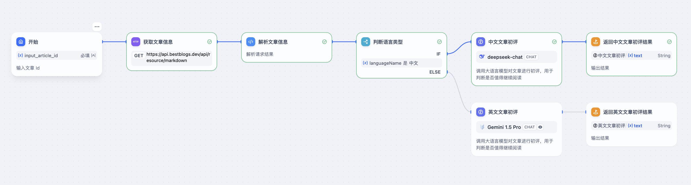

# BestBlogs.dev 使用 Dify Workflow 实现文章自动化分析

## 背景介绍

[BestBlogs.dev](https://bestblogs.dev) 是一个面向技术从业者、创业者和产品经理的网站，主要收集和分享有关软件开发、人工智能、产品管理、营销、设计、商业、科技和个人成长等领域的高质量内容。

其主要原理是通过 RSS 订阅和爬虫，收集来自各个领域的优质博客文章，并通过大语言模型进行筛选和评估，以提高内容的质量和效率。其主要功能包括：

- **核心摘要，快速捕捉精髓**：运用先进的大语言模型，我们为每篇文章提炼出核心要点，助力读者在快节奏中迅速掌握关键信息。

- **智能评分，优选内容**：严选文章来源，通过大语言模型对文章内容深度、写作质量、实用性、相关性等多维度进行评估，帮助读者快速筛选优质文章。

- **一键翻译，跨越语言障碍**：借助领先的翻译技术，我们打破语言界限，让全球开发者无碍阅读并吸收来自世界各地的卓越知识。

## 为什么需要 Workflow ？

原先网站采用了一个非常大而全的提示词用来实现文章的摘要、标签生成、评分及翻译工作，过多的任务使得输出效果难以控制和优化，比如摘要内容经常遗漏重要信息、标签的生成缺乏统一、评分标准调整调试麻烦、翻译结果过于生硬，以及在运维上修改、测试和部署麻烦。

## 为什么选择 Dify ？

之前在社交网站上讨论时有不少网友也推荐过 Coze 和 FastGPT 等产品，但初步使用发现，Coze 更偏向于社区化的产品，可以很好的分享 Workflow 和 Agent 给他人使用，上手成本也低，但是不支持使用自己的 ApiKey，以及不支持自部署；而 FastGPT 的产品成熟度和体验和 Dify 相比还有些差距，使用起来比较费劲，Workflow 预置的节点类型也比较缺乏。而 Dify 平台 LLMOps 的定位和我本身的需求也比较契合，所以就选用了 Dify。

## Dify Workflow 实现

在使用 Dify Workflow 之前，重新梳理了网站的核心流程，主要包括以下几个子流程：

- **文章爬取流程**：基于 RSS 协议，爬取所有订阅源的文章信息，包括标题、链接、发布时间等，通过链接和无头浏览器爬取全文内容。通过订阅源上定义的正文选择器提取正文，并对正文的 HTML、图片等进行处理，放入待处理文章列表。
- **文章初评流程**：通过语言、文章内容等特征，对文章进行初次评分，剔除低质量文章和营销内容，减少后续步骤处理。
- **文章分析流程**：通过大语言模型对文章进行摘要、分类和评分，生成一句话总结、文章摘要、主要观点、文章金句、所属领域、标签列表和评分等，便于读者快速过滤筛选及了解全文主要内容，判断是否继续阅读。包括 *分段分析 - 汇总分析 - 领域划分和标签生成 - 文章评分 - 检查反思 - 优化改进* 等节点。
- **分析结果翻译流程**：通过大语言模型对文章分析结果进行翻译，目前网站支持中英两种语言，根据原文语言和目标语言对摘要、主要观点、文章金句、标签列表等进行翻译。包括 *识别专业术语 & 初次翻译 - 检查翻译 - 意译* 等环节。

**以下流程的 DSL 文件和各个节点的提示词已更新到 [BestBlogs 项目](https://github.com/ginobefun/bestblogs)，欢迎查看和讨论。**

### 文章初评流程

### 文章分析流程

### 分析结果翻译流程

## 运行效果

## 总结与展望

