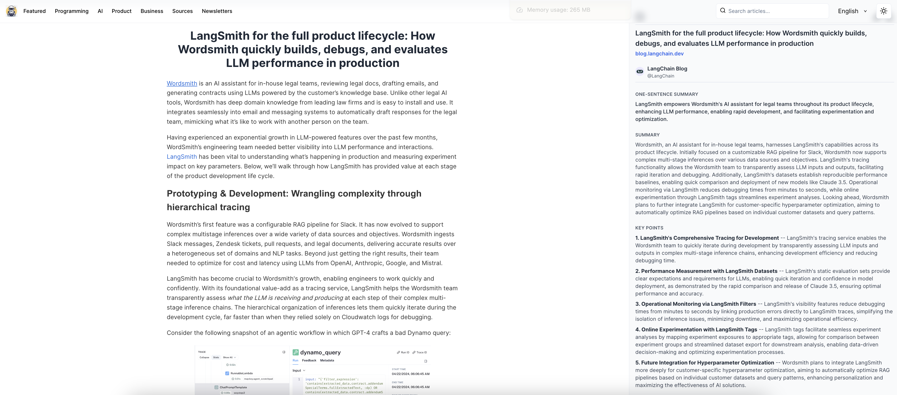
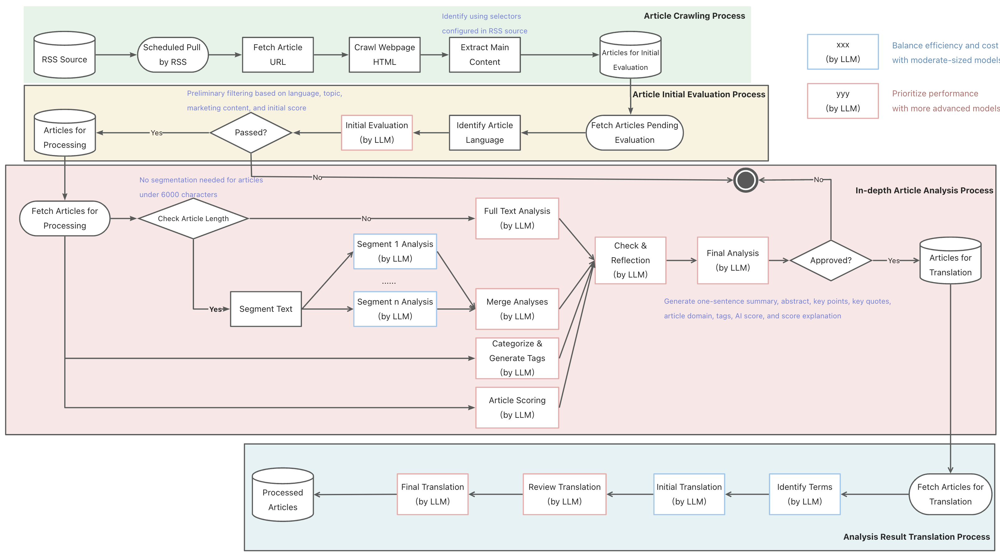
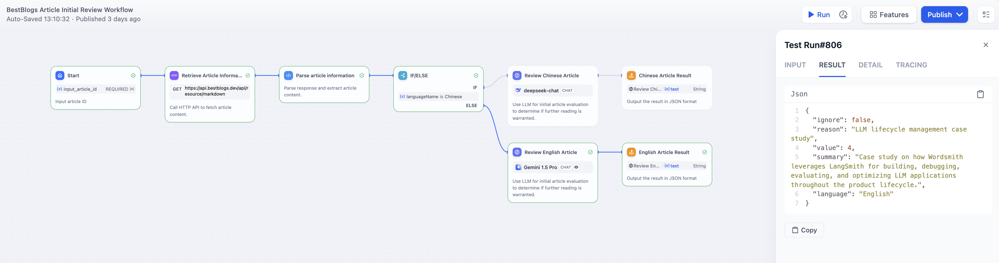
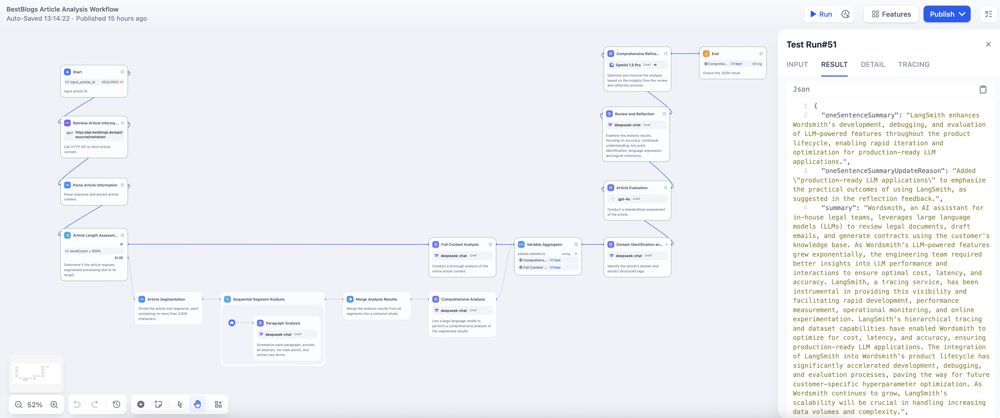
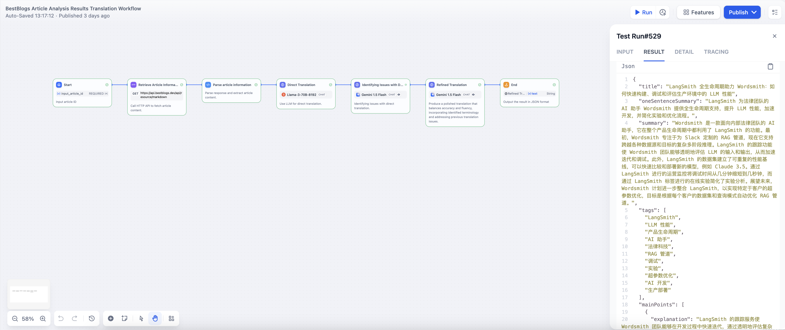
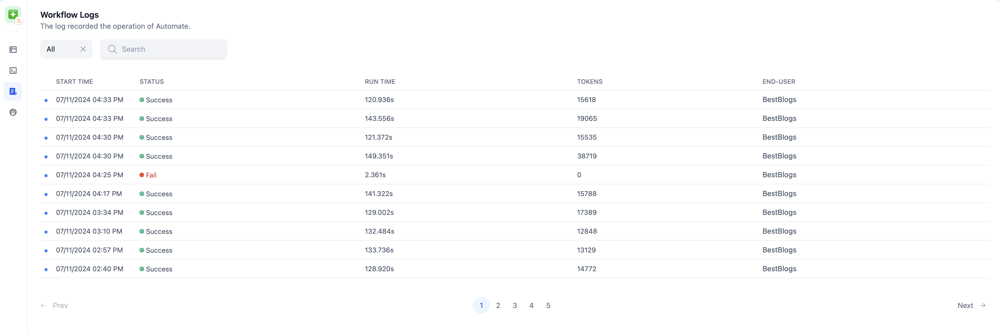

# Intelligent Article Analysis at BestBlogs.dev: A Case Study Using Dify Workflow

## Abstract

This case study explores how BestBlogs.dev leverages Dify Workflow to implement an automated article analysis process. We detail the journey from initial article evaluation to in-depth analysis and multilingual translation. By adopting the Dify platform, we've significantly enhanced our content processing efficiency and quality, delivering a superior reading experience. We share our implementation insights and Dify Workflow user experience, providing valuable reference for developers facing similar challenges.

## Background

[BestBlogs.dev](https://bestblogs.dev) is a curated content platform targeting tech professionals, entrepreneurs, and product managers. We aggregate high-quality content across software development, artificial intelligence, product management, marketing, design, business, technology, and personal growth.

Our core methodology involves collecting premium blog articles via RSS feeds and web crawlers, then employing large language models (LLMs) for content evaluation and filtering. This approach significantly enhances content quality and processing efficiency. Key features include:

- **Intelligent Summarization**: We utilize advanced LLMs to extract key points from each article, enabling readers to quickly grasp crucial information in today's fast-paced environment.

- **AI-Powered Content Scoring**: Our system carefully evaluates articles across multiple dimensions including depth, writing quality, practicality, and relevance. This helps readers efficiently identify high-value content.

- **Cross-Language Accessibility** (In Development): Leveraging cutting-edge translation technology, we aim to break language barriers, allowing global tech enthusiasts to access knowledge without linguistic constraints.

### Dify Workflow: An Overview

Dify Workflow is a robust LLMOps platform designed for constructing complex AI-driven processes. It offers:

- An intuitive, drag-and-drop interface for workflow creation and management
- Support for multiple LLMs
- A rich set of pre-configured node types (e.g., conditional logic, loops, HTTP calls)
- Comprehensive debugging, logging, and API integration capabilities

These features make Dify particularly well-suited for building sophisticated content processing systems like BestBlogs.dev.

## The Need for Workflow

Our initial approach relied on a monolithic prompt to handle article summarization, tag generation, scoring, and translation. This method presented several challenges:

- Difficulty in controlling and optimizing output
- Frequent omission of critical information in summaries
- Inconsistent tag generation
- Cumbersome adjustment of scoring standards
- Rigid translation results
- Complicated maintenance, testing, and deployment processes

## Choosing Dify

We evaluated several leading AI workflow platforms before selecting Dify:

1. Coze:
   Pros:
   - Community-oriented with easy sharing of workflows and agents
   - User-friendly with a low learning curve
   Cons:
   - No support for custom API keys
   - Lack of self-deployment options, raising potential data security concerns

2. FastGPT:
   Pros:
   - Open-source with self-deployment support
   - Established user base
   Cons:
   - Emerging platform with a developing ecosystem
   - Limited pre-configured node types, restricting flexibility

3. Dify:
   Pros:
   - Comprehensive LLMOps functionality, ideal for complex AI applications
   - Intuitive visual interface
   - Wide range of supported LLMs
   - Extensive pre-configured node types, boosting development efficiency
   - Open-source with self-deployment options, ensuring data security
   - Robust debugging and logging features
   Cons:
   - Evolving community ecosystem
   - Some advanced features limited to the enterprise version

Dify's alignment with our needs for flexibility, customization, and data security made it our top choice. It not only meets our current requirements but also provides ample room for future scalability and optimization.

## Implementing Dify Workflow

We redesigned our core processes before implementing Dify Workflow, focusing on these key areas:

1. **Article Crawling**: We use RSS protocols to fetch article metadata (title, link, publication date) and employ headless browsers for full-content retrieval. Content is then processed and queued for analysis.

2. **Initial Evaluation**: This stage involves preliminary scoring based on language and content characteristics, filtering out low-quality or overly promotional articles.

3. **In-depth Analysis**: LLMs generate comprehensive article metadata, including summaries, key points, quotes, domain classification, tags, and quality scores. This process enhances content discoverability and reader engagement.

4. **Translation**: For multilingual support, we translate analysis results using a three-stage process: initial translation, quality check, and idiomatic refinement.

> Note: Detailed DSL files and node-specific prompts are available in the [BestBlogs project repository](https://github.com/ginobefun/bestblogs).

### Initial Evaluation Workflow

Key aspects of this workflow:

- Input: Article ID for easy testing and API integration
- Data retrieval: Utilizes Dify's HTTP call and code nodes to fetch article metadata and content
- Language-specific processing: Employs different models and prompts for Chinese and English content
- Evaluation framework: Implements the CO-STAR prompt structure for context, objectives, steps, and output formatting
- Integration: Our application uses Dify's API to process articles, determining further actions based on evaluation results

### Comprehensive Analysis Workflow

This workflow encompasses:

- Segmented processing for longer articles (>6000 characters) to ensure thorough analysis
- Generation of concise summaries, key points, and notable quotes
- Utilization of branching, iteration, and variable aggregation for flexible process control
- Domain classification and tag generation to enhance content organization and discoverability
- Multi-dimensional quality scoring to facilitate content curation
- A reflection and optimization stage to refine analysis outputs

### Translation Workflow

Our translation process involves:

- Retrieval of article metadata, content, and analysis results via Dify's API
- A three-stage translation approach: initial translation, quality assessment, and idiomatic refinement
- Optimization for natural expression in the target language

## Results and Impact

The implementation of Dify Workflow has yielded significant improvements:

- Successful deployment across our entire article base with stable API performance
- Enhanced analysis quality compared to our previous monolithic approach
- More comprehensive summaries and the addition of key points and memorable quotes
- Standardized article scoring
- Improved workflow adaptability and easier prompt refinement
- Enhanced debugging capabilities through detailed operational logs

## Conclusion and Future Directions

Our integration of Dify Workflow has substantially improved BestBlogs.dev's article processing capabilities. The platform now offers more efficient and higher-quality content analysis, enhancing the overall user experience.

Key benefits of Dify Workflow include:

- Intuitive design with a minimal learning curve
- Excellent testing and tracking functionalities
- Flexible model integration
- Open-source architecture with self-deployment options
- Comprehensive logging for enhanced security and troubleshooting

While Dify continues to evolve, addressing areas like version control and parallel processing, it has proven to be a powerful tool for our needs.

Looking ahead, we're exploring several enhancements:

1. **Intelligent Search**: Leveraging Dify to develop more precise, intent-based search functionality.

2. **Personalized Recommendations**: Creating an AI-driven system for tailored content suggestions.

3. **Interactive Q&A**: Implementing an article-based Q&A system to enhance reader engagement and comprehension.

4. **Full-Text Translation**: Expanding our translation capabilities to enable immersive reading experiences across multiple languages.

These future developments aim to further elevate BestBlogs.dev's user experience, offering more intelligent and personalized content delivery. We're excited to continue exploring Dify's capabilities and contributing our insights to the broader tech community.